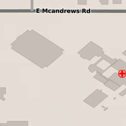
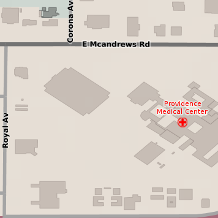

Gutter
======

GeoWebCache can be configured to add a :term:`gutter` to each tile to further reduce features being rendered incorrectly. The gutter, measured in pixels, is the amount of extra space that will be requested when generating the tile.

For example, with a gutter size of 50 and a tile size of 256×256 pixels, GeoWebCache will request an image of 356×356 pixels from GeoServer but will return the 256×256 tile to the client.

Gutters are usually used in conjunction with metatiling.

Symbols and labeling
--------------------

Adding a gutter is important when large symbols or labels would otherwise not be placed due to a tile or metatile boundary.

For example, in the following image, no label is displayed for this single tile because GeoServer could not find the correct location to place the label.

   Tile without gutter

.. note::

   The styling rules constrain where the label must be placed. In this case it is directly above the hospital symbol.

Adding the gutter, however, there is sufficient room to place the label, although it will be partially cut off when the tile is clipped to the requested size.

   Tile with gutter (356×356)

.. figure:: images/gutter_on_box.png

   Tile with gutter, showing what will be cut off
