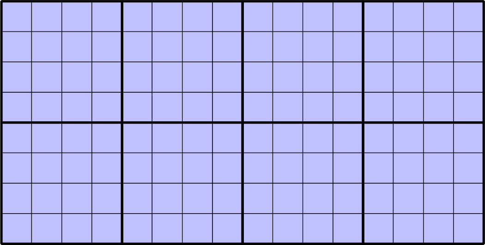

Metatiling
==========

Metatiling is used to improve performance and to avoid certain cartographic artifacts that can result from using tiles rather than single (larger) images.

Metatiles
---------

A :term:`metatile` is a group of several individual tiles that are combined to form one large image. When a tile request arrives in GeoWebCache, that request will be translated into a single metatile request from GeoServer.

For example, if we take the previously introduced gridset for EPSG:4326 and apply 4×4 metatiling, the following metatiles will be used:

   Gridset broken into 4×4 metatiles
   
   
Requests for any tile will result in GeoWebCache requesting a single metatile, which will be split into 16 tiles, each of which will be cached. A request for any of the other 15 tiles that comprised the metatile would be able to be immediately handled by GeoWebCache without needing the back-end WMS server.

Performance
-----------

Metatiling has the advantage of usually improving GeoServer performance. It is almost always faster to make one metatile request and then split the image into tiles than it would be to make 16 individual tile requests.

The performance benefits, however, may be offset by excessive memory requirements if the metatile is too large. Continuing the example above, the metatile would be 16 times larger than the single tiles and would likely contain many more features.

Additionally, if a client only needs a single tile, the entire metatile will still need to be generated by GeoServer, leading to slower response times.

It is, therefore, important to ensure that metatiles are not configured to be too large. **By default, GeoServer's embedded GeoWebCache uses 4×4 metatiles.**

Labeling
--------

There is a second, important reason for using metatiling: avoiding labeling problems. Without metatiling, you may encounter a single feature being labeled on each tile.

In this example using `OpenStreetMap <http://www.openstreetmap.org/>`_ data, *West Country Road F* appears on each of the three tiles since GeoServer has rendered each of them individually.

.. figure:: images/osm.png

   Three tiles without metatiling
   
With metatiling, it is not necessary to render each tile individually. Extra labeling does not occur since **all three tiles are part of the same metatile**, so the road will have been drawn and labeled just once.

.. figure:: images/osm_metatiling.png

   Three tiles with metatiling
   
Also note how *Boston Scientific Drive* also only appears with metatiling enabled because there was not sufficient space on a single tile for the label.

.. admonition:: Explore

   Find other differences between the two images and explain why metatiling might have been responsible.

   .. only:: instructor
     
      .. admonition:: Instructor Notes
     
         Some interesting differences:

         * *Innovation Way*. Because of *Boston Scientific Drive*, it does not appear with metatiling.
         * *Hamline Avenue N* and *Lexington Ave N* do not appear with metatiling because the label is probably placed on one of the tiles above the tile we see here.
