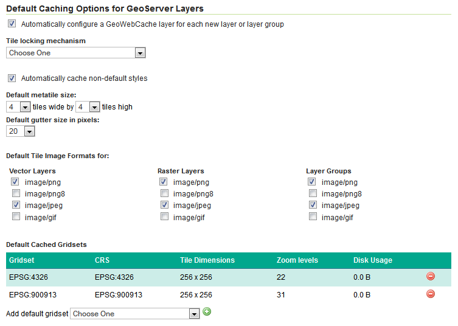

Caching defaults
================

The :guilabel:`Caching Defaults` settings allows the GeoServer administrator to enable and disable the tiling services and configure the default gridset settings that will be applied to each new gridsubset. Most of these defaults can be over-ridden on a per-layer basis. 

.. note:: Configurations can be made on a per-layer basis. This will be discussed in an upcoming section.

Provided services
-----------------

The WMS-C, TMS, and WMTS services can be enabled and disabled by checking and unchecking these boxes. If caching is not going to be used, it is recommended that all the services be disabled.

.. figure:: images/defaults_services.png

   Provided services

Default Caching Options 
-----------------------

When new layers are created in GeoServer, new :term:`tile layers <tile layer>` can be automatically created. If this option is disabled, tile layers will need to be manually configured for new layers. 

This section also allows the administrator to define the default settings of these automatically generated tile layers.

* **Styles**: Tile layers can be automatically generated with the layer's default style or with the default style and all additional styles. If this is disabled, caching for non-default styles may still be enabled for each individual layer.

* **Tiling defaults**: The default metatile size may be changed from the initial 4×4 configuration. GeoServer also disables a gutter by default, but this may be enabled here.

* **Default formats**: The specific file formats that will be cached by default can be configured invidually for vector and raster layers and for layer groups.

* **Default gridsets**: GeoServer configures the `EPSG:4326` and `EPSG:900913` gridsets for each layer by default, but these may be changed here. The :guilabel:`Disk Usage` column gives a quick view of how much disk space has been used for each gridset.

  .. warning:: For the disk usage statistics to be accurate, the :guilabel:`Enable disk quotas` option in :menuselection:`Tile Caching --> Disk Quota` must be enabled. Otherwise, the cache will incorrectly show ``0.0 B`` even though there are tiles in the cache.

   Default caching options

.. note:: There is also an option for "Tile Locking." This is an advanced feature introduced in GeoWebCache version 1.4 and included in OpenGeo Suite 4.0, and will be discussed in an upcoming section.

.. admonition:: Exercise 

   The :guilabel:`Caching Defaults` settings allows the GeoServer administrator to enable and disable the tiling services and configure the default gridset settings that will be applied to each new gridsubset.
     
   #. Find the :guilabel:`Tile Caching` section.
  
   #. Click the :guilabel:`Caching Defaults` link.
  
      .. figure:: images/caching-defaults.png
     
         GeoServer's Caching Defaults menu
  
   #. In the :guilabel:`Provided Services` section, uncheck :guilabel:`Enable WMS-C Service`.

      .. figure:: images/defaults_no_wmsc.png

         Turning off WMS-C
  
   #. Click the :guilabel:`Submit` button.
  
   #. Go to the GeoServer Welcome page.
  
   #. Note that :guilabel:`WMS-C` no longer appears in the :guilabel:`Service Capabilities` list.

      .. figure:: images/defaults_no_wmsc_list.png

         No WMS-C in the list
  
   #. Go back to the :guilabel:`Caching Defaults` page and re-enable :guilabel:`WMS-C`.
  
   #. Click the :guilabel:`Submit` button.
