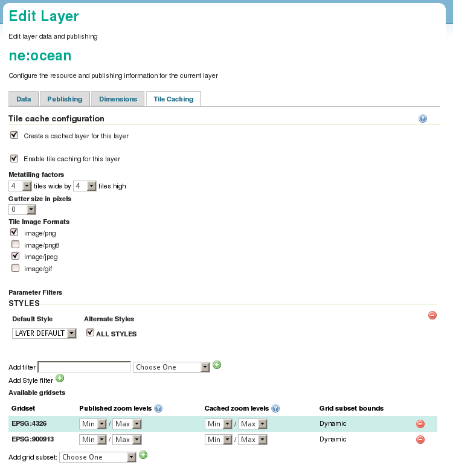

Introduction
============

For GeoServer's embedded GeoWebCache to cache tiles, each layer must have caching enabled in its configuration.

   Tile caching tab in layer configuration

A list of all layers and layer groups with caching enabled is available in the :guilabel:`Tile Layers` page in the :guilabel:`Tile Caching` menu.

.. figure:: images/tile_layers.png

   Tile layers page

.. note:: 

   Layers that have been disabled will still appear in this list, but the preview option will not be available. This is the case for the ``ne:populated_places`` layer in the figure above.
