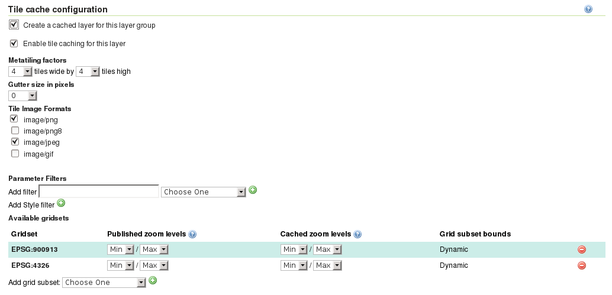

Caching layer groups
====================

Like layers, layer groups may also be configured to be cached by the embedded GeoWebCache instance. GeoWebCache currently, does not support caching multiple layers using the ``LAYERS`` parameter, so layer groups are the means to cache a compisite of two or more layers in a single WMS request.

   Tiled layer group configuration

.. admonition:: Challenge

   Configure cache for your ``ne:basemap`` layer so that you can use it as a cache for large-scale PNG images in the EPSG:900913 SRS.