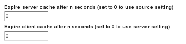

Layer configuration
===================

The GeoServer administrator can enable or disable caching for individual layers through the web interface by navigating to the list of layers on the :guilabel:`Tile Layers` page. When caching is enabled for a layer, a new :term:`cached layer` is considered to exist that is distinct from the original layer.

The default caching settings that we explored previously can also be overridden for each layer. It is possible, for example, to change the metatile and gutter sizes as well as the image formats from the defaults that were configured globally.

.. warning:: Changing the global defaults will not change the settings of any *existing* cached layers.

Tile expiry
-----------

Each layer may also have special settings for the automatic removal of tiles from the server-side and the client-side caches.

   Tile expiry settings

The :guilabel:`Expire server cache after n seconds` setting tells GeoWebCache to remove a tile from its cache after the specified number of seconds (``0`` means that the tile will never expire). The :guilabel:`Expire client cache after n seconds` setting will tell the client (usually a browser) to remove a tile from its cache after the specified amount of time (``0`` means that the standard WMS setting for the layer will be used)
