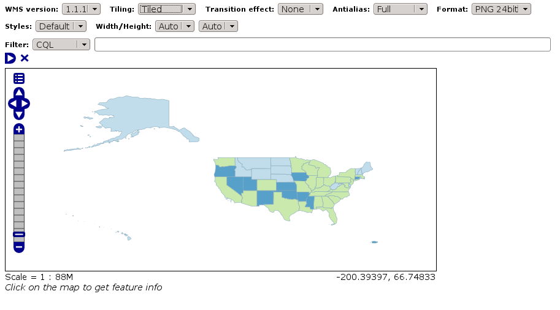
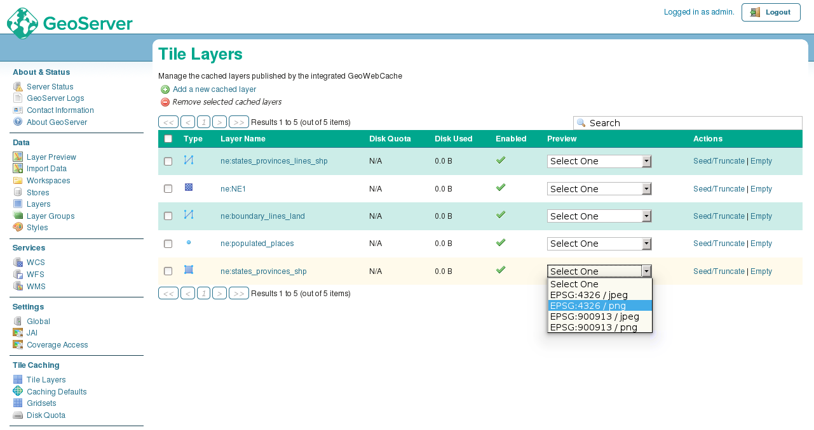
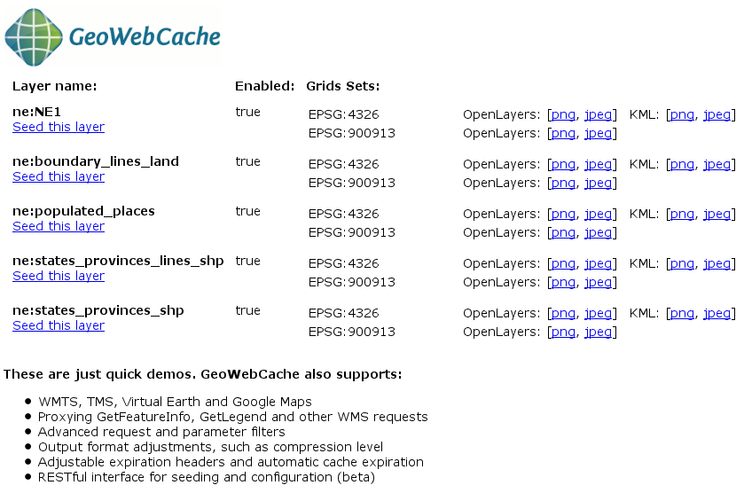

Cached layer preview
====================

GeoServer's web interface comes with two embedded layer preview applications based on OpenLayers, and further previews can be found in the GeoWebCache home page.

Layer Preview
-------------

The first is the familiar layer preview that is accessible in the :guilabel:`Layer Preview` entry in the :guilabel:`Data` menu. **The Layer Preview is not built to be aware of cached layers.**

This application can make tiled requests by changing the :guilabel:`Tiling` setting from ``Single tile`` to ``Tiled``. This will add the ``TILED=true`` parameter to the WMS requests.

   Launching the layer preview application

This client makes only WMS requests, so **GeoWebCache will only be used if direct WMS integration is enabled and TILED is set to true**. If direct WMS integration is disabled and ``TILED`` is set to ``true``, GeoServer will use its internal metatiling.

However, even with integration enabled and ``TILED`` set to ``true``, the requested tiles must align precisely to the tiles calculated by the gridset bounds. However, because this client is not aware of the gridset settings in GeoServer, there is no guarantee that the requests will align correctly. This is explained in the GeoServer documentation (see `Using GeoWebCache <http://docs.geoserver.org/stable/en/user/geowebcache/using.html>`_):

  *GeoWebCache integration is not compatible with the OpenLayers-based Layer Preview, as the preview does not usually align with the GeoWebCache layer gridset. This is because the OpenLayers application calculates the tileorigin based on the layer's bounding box, which is different from the gridset. It is possible to create an OpenLayers application that caches tiles; just make sure that the tileorigin aligns with the gridset.*

If the gridset bounds match the layer bounds, tiles will be cached; otherwise, the request will be passed directly to WMS without caching. Additionally, there is no guarantee that this application will use the same zoom levels as defined in the gridset.

Tile Layers
-----------

The second OpenLayers preview in GeoServer is located in the :guilabel:`Tile Layers` item in the :guilabel:`Tile Caching` menu.

Selecting the gridset and image format from the box will launch the preview application. The application is tuned to the gridset settings, taking the bounds and the zoom levels into account.

   Launching the tiled layer preview application

GeoWebCache demos
-----------------

The GeoWebCache home page (accessible through the :guilabel:`Caching Defaults` page in the GeoServer user interface) also has a subpage that lists all configured cached layers. This is accessed by the link for :guilabel:`Automatically Generated Demos`

   GeoWebCache demos

.. admonition:: Exercise

   We will start by testing the tiled layer preview capabilities in GeoServer and check to see that our cache is being populated by new tiles.
 
   #. Click :guilabel:`Disk Quota` under the :guilabel:`Tile Caching` section.

      .. figure:: images/preview_diskquotalink.png

         Disk Quota link
 
   #. Ensure that :guilabel:`Enable disk quota` is checked.
  
      .. note:: Remember that this option must be checked for GeoServer to track the size of the on-disk cache.

      .. figure:: images/preview_diskquota.png

         Disk Quota page

   #. Now navigate to the :guilabel:`Tile Layers` page. Note that the :guilabel:`Disk Used` value for ``opengeo:countries`` is ``0.0 B`` (bytes).
 
      .. figure:: images/preview_usagebefore.png

         Layer showing no disk usage
 
   #. Pull down the :guilabel:`Preview` menu for :guilabel:`opengeo:countries` and select :kbd:`EPSG:4326/png` from the list. A new browser tab will open with the OpenLayers preview.
  
   #. Zoom and pan around the map.

   #. Leaving that tab open, return to the GeoServer web interface and click :guilabel:`Tile Layers` again. Note that the :guilabel:`Disk Used` value for the :guilabel:`opengeo:countries` has now increased, indicating that the cache has been built up.

      .. figure:: images/preview_usageafter.png

         Layer showing some disk usage

   #. Return to the layer preview tab. Right-click the map and select :guilabel:`View Image` (Firefox) or :guilabel:`Open Image in New Tab` (Chrome).
  
   #. In the resulting request URL, change one of the values in the ``BBOX`` parameter to be different enough from the original that GeoWebCache will return a ``400`` error indicating that the requested tile does not match the gridset. For example, change ``BBOX=0,0,90,90`` to ``BBOX=10,0,90,90``.
  
      .. figure:: images/preview_mismatch.png

         Mismatched tile request

.. admonition:: Challenge

   Look at the source code of the preview application. Find where the resolutions defined in the gridsets used by the layers are also referenced in the OpenLayers code.
