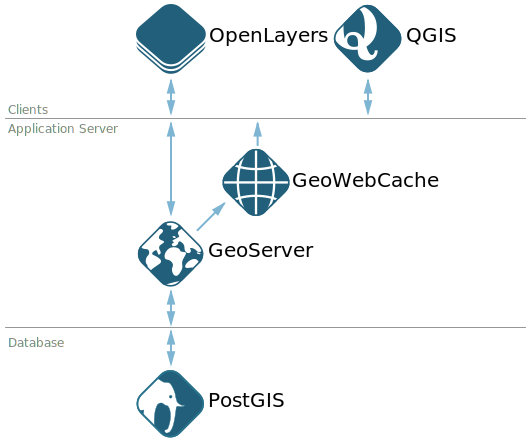

###########
GeoWebCache
###########
   
Contents:

.. toctree::
  :maxdepth: 1
  :numbered:

  01_tiling-concepts/index
  02_services-endpoints/index
  03_embedded-gwc/index
  04_layer-configuration/index
  05_administration/index
  06_production/index
  glossary

Introduction
============

GeoWebCache is an open-source tool that improves the performance of a Web Map Service (:term:`WMS`) by storing previously-rendered map images so that the server does not need to regenerate them each time they are requested by a client. GeoWebCache is most often used with GeoServer, but can be used with any compliant WMS.

.. admonition:: Explore

  #. Open :menuselection:`Data --> Layer Preview`.

  #. Click :guilabel:`Go` to launch the preview for ``ne:ocean``. Note that this layer can take a relatively long time to render (the duration will depend on the capabilities of your computer).

With GeoWebCache, we will be able to dramatically reduce GeoServer's response time for complex layers.

OpenGeo Suite
-------------

In our diagram of OpenGeo Suite architecture, GeoWebCache sits atop GeoServer's map services, brokering map images to web-mapping applications in the client tier.

When receiving a WMS request, GeoWebCache will first check whether its internal cache contains the appropriate image and, if so, will return that to the client. Otherwise, the request will be passed on to the upstream GeoServer, and the resulting image will be both transmitted to the client and stored by GeoWebCache for future use.

  GeoWebCache in OpenGeo Suite stack

Goals
-----

In this session, we will be exploring the concepts behind GeoWebCache as a specialized type of web cache and understanding how it can be configured to function as a component of a GeoServer instance in production.

The focus will be on server configuration, not client interface. Most clients, such as OpenLayers, can seamlessly consume GeoWebCache tiles using various standards.

.. note::

   This module may be used with a default install of OpenGeo Suite 3.x or 4.x with the following caveats:

   #. Certain web interface settings are not available in 3.x

   #. Use the sample layer ``world:boundaries`` (3.x) or ``opengeo:countries`` (4.x)

Before you start
================

Please ensure you have:

* An installation of OpenGeo Suite
* Internet access

.. warning:: If using a Boundless virtual machine, we highly recommend creating a snapshot prior to starting this module. Please refer to the setup instructions for details on how to create a snapshot.

.. only:: instructor
 
   .. admonition:: Instructor Notes
      
      **This module can be run with a default OpenGeo Suite data directory.**

      More than any other module, this one is designed to be run outside of the normal training environment, such as at workshops/conferences. Because of this, care has been taken to change some of the typical wording to not assume (as in other modules) that you are working off of the training VM.
      
      This module assumes some knowledge of GeoServer **Web Administration** application, however it can be run standalone.

      Officially, this module has ``GS302 Data Management`` as a prerequisite. 

    
