GeoWebCache in Production
=========================

.fx: titleslide

Presenter notes
---------------

This is where you can write notes to yourself and only you will be able to see them.

--------------------------------------------------

Outline
=======

#. GeoWebCache concepts
#. Services and endpoints
#. Embedded GeoWebCache
#. Layer configuration
#. Administration
#. Production considerations

--------------------------------------------------

Section 1: GeoWebCache concepts
===============================

--------------------------------------------------

Advantages of GeoWebCache
=========================

A WMS must:

* Read all the source data
* Interpret styling instructions
* Draw the image
* Deliver the image

GeoWebCache eliminates the first three steps.

--------------------------------------------------

Advantages of GeoWebCache
=========================

If GeoWebCache has all the tiles saved for all necessary zoom levels, one could disconnect GeoWebCache from the WMS entirely.

--------------------------------------------------

Advantages of GeoWebCache
=========================

GeoWebCache exists in two different forms:

* A **standalone** Java web application that can interface with one or more OGC-compliant Web Map Services.
* An **embedded** extension to GeoServer itself.

--------------------------------------------------

Web caching
===========

GeoWebCache performs much the same task as regular “reverse web caches” in that it intercepts requests and returns a cached copy of a requested document whenever possible.

(See also: Squid, Nginx, and Varnish)

--------------------------------------------------

Limitations of standard web caching
===================================

A slight difference in bounding box will mean an entirely different image.

``BBOX=0,0,60,60``

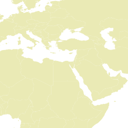

--------------------------------------------------

Limitations of standard web caching
===================================

A slight difference in bounding box will mean an entirely different image.

``BBOX=10,0,70,60``

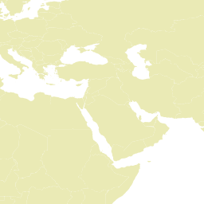

--------------------------------------------------

Benefits of map caching
=======================

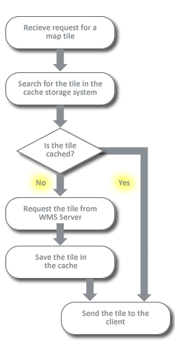

--------------------------------------------------

Tile caching
============

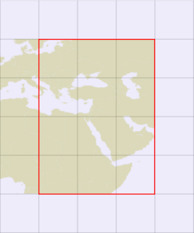

--------------------------------------------------

Tile caching
============

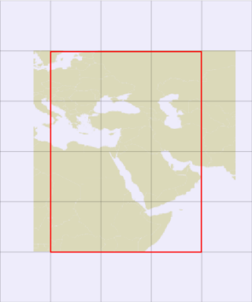

--------------------------------------------------

Zoom levels
===========

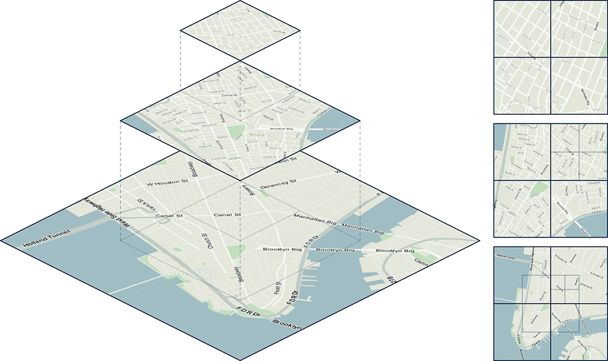

--------------------------------------------------

Gridsets
========

Gridsets define how to create tiles for a particular spatial reference system at desired zoom levels. For example, GeoServer provides a pre-defined gridset with the following settings:

* Coordinate reference system: EPSG:4326
* Bounds: -180, -90, 180, 90
* Tile size: 256×256 pixels

--------------------------------------------------

Tolerance
=========

GeoWebCache requests can be within a 10% margin of error of the tile size.

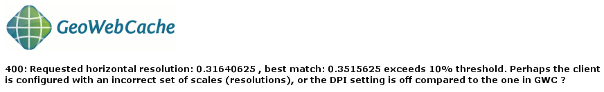

--------------------------------------------------

Gridsubsets
===========

* Gridsets are defined globally for the server, while gridsubsets are layer-specific definitions.
* The bounding box and zoom levels of a gridsubset must be subsets of their base gridsets.

--------------------------------------------------

Metatiling
==========

* A metatile is a group of several individual tiles that are combined to form one large image.
* Metatiling is used to improve performance and to avoid certain cartographic artifacts that can result from using tiles rather than single (larger) images.

--------------------------------------------------

Metatiling
==========

Without metatiling:

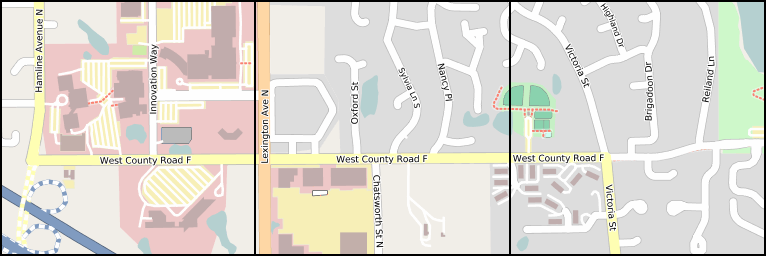

--------------------------------------------------

Metatiling
==========

With metatiling:

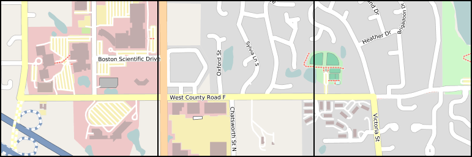

--------------------------------------------------

Gutter
======

Extra space requested when generating a tile.

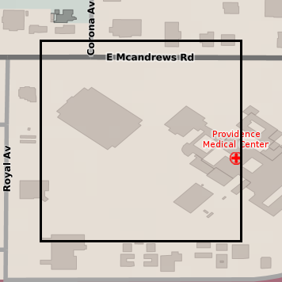

--------------------------------------------------

Section 1: Review
=================

* GeoWebCache is a specialized type of cache.
* OpenGeo Suite contains both a standalone GeoWebCache and a GeoWebCache that is embedded in GeoServer.
* GeoWebCache uses gridsets to define which tiles will be cached and communicates this information to the client in the capabilities document.
* Gridsets are defined by a CRS, bounds, tile size and a tile matrix set.

--------------------------------------------------

Section 1: Review
=================

* A client request must align very closely to a tile or GeoWebCache will return an error.
* A gridsubset is a gridset that has been applied to a layer. A gridsubset may have smaller bounds and fewer tile matrices than its gridset.
* GeoServer comes with several pre-configured gridsets.
* Metatiling is used for better performance and to eliminate problems with labeling.

--------------------------------------------------

Section 1: Review
=================

* A gutter is used to better render features on the edge of tiles.

--------------------------------------------------

Section 2: Services and endpoints
=================================

--------------------------------------------------

Service endpoints
=================

GeoWebCache provides:

* Web Map Service-Cached (WMS-C)
* Tile Map Service (TMS)
* Web Map Tile Service (WMTS)

--------------------------------------------------

Web Map Service-Cached
======================

::

  http://localhost:8080/geoserver/gwc/service/wms?
    LAYERS=ne:ocean&
    FORMAT=image/png&
    SERVICE=WMS&
    VERSION=1.1.1&
    REQUEST=GetMap&
    STYLES=&
    SRS=EPSG:4326&
    BBOX=0,0,45,45&
    WIDTH=256&
    HEIGHT=256

--------------------------------------------------

Direct WMS integration
======================

GeoWebCache can handle WMS-C requests using the regular GeoServer WMS endpoints.

``http://localhost:8080/geoserver/wms``: both a WMS and a WMS-C endpoint.

--------------------------------------------------

Tile Map Service
================

TMS implements a RESTful interface.

::

  http://localhost:8080/geoserver/gwc/service/tms/1.0.0/
    ne:ocean/4/0/0.png

--------------------------------------------------

Web Map Tile Service
====================

Web Map Tile Service (WMTS) is the successor to TMS.

::

  http://localhost:8080/geoserver/gwc/service/wmts?
    REQUEST=GetTile&
    TILECOL=0&
    TILEROW=0&
    LAYER=ne:ocean&
    FORMAT=image/png&
    TILEMATRIX=EPSG:4326:0&
    TILEMATRIXSET=EPSG:4326

--------------------------------------------------

GeoServer WMS
=============

* When direct WMS integration is enabled, GeoServer will pass regular WMS requests to GeoWebCache if the ``TILED`` parameter is set to ``true``.
* GeoServer also has the facility to handle tiled requests separately from GeoWebCache.

--------------------------------------------------

Section 2: Review
=================

* GeoWebCache adds more OGC services.
* WMS-C closely resembles WMS.
* The embedded GeoWebCache offers integrated WMS, which allows a regular ``geoserver/wms`` endpoint to be used as a WMS-C end point. Requests that do not align to a gridset are handled by GeoServer as usual.

--------------------------------------------------

Section 2: Review
=================

* TMS references tiles by an x, y and z (zoom level) in the request URL.
* WMTS references tiles by an x, y and z (zoom level) in the request parameters.

--------------------------------------------------

Section 3: Embedded GeoWebCache
===============================

--------------------------------------------------

Configuration
=============

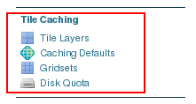

--------------------------------------------------

Capabilities
============

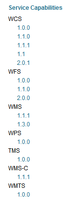

--------------------------------------------------

Caching defaults
================

.. image:: ../doc/source/03_embedded-gwc/images/defaults_services.png

--------------------------------------------------

Default Caching Options
=======================

.. image:: ../doc/source/03_embedded-gwc/images/defaults_options.png

--------------------------------------------------

Default gridsets
================

* ``EPSG:4326``
* ``EPSG:900913``
* ``GlobalCRS84Pixel``
* ``GlobalCRS84Scale``
* ``GoogleCRS84Quad``

Only EPSG:4326 and EPSG:900913 are set to be added automatically to new layers.

--------------------------------------------------

Tile matrix set
===============

.. image:: ../doc/source/03_embedded-gwc/images/gridsets_zoomlevels.png

--------------------------------------------------

GWC "home" page
===============

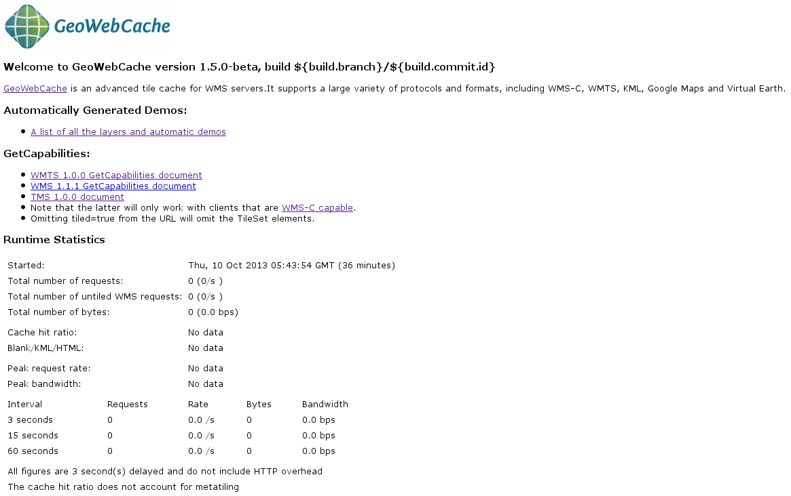

--------------------------------------------------

Section 3: Review
=================

* The embedded GeoWebCache can be configured through the GeoServer web interface.
* We can disable any of the caching services as well as integrated WMS.
* The Caching defaults are only applied to new layers and do not affect existing layers.

--------------------------------------------------

Section 3: Review
=================

* GeoWebCache will create caches for each combination of gridset, image format, and styles.
* The embedded GeoWebCache home page displays statistics about the cache.

--------------------------------------------------

Section 4: Layer configuration
==============================

--------------------------------------------------

Layer configuration
===================

* For GeoServer’s embedded GeoWebCache to cache tiles, each layer must have caching enabled in its configuration.
* A list of all layers and layer groups with caching enabled is available in the Tile Layers page in the Tile Caching menu.

--------------------------------------------------

Tile Layers
===========

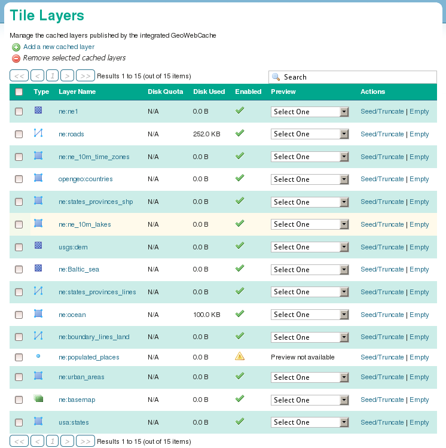

--------------------------------------------------

Layer Preview
=============

* GeoServer Layer Preview is **not** designed to handle cached layers.
* Instead, use the Tile Layers Preview.

--------------------------------------------------

Layer Preview
=============

.. image:: ../doc/source/04_layer-configuration/images/tile_layers_preview.png

--------------------------------------------------

Demo page
=========

.. image:: ../doc/source/04_layer-configuration/images/geowebcache_home_page_demos.png

--------------------------------------------------

Layer configuration
===================

Enable or disable caching for individual layers through GeoServer.

Default caching settings can be overridden for each layer.

--------------------------------------------------

Gridsubsets
===========

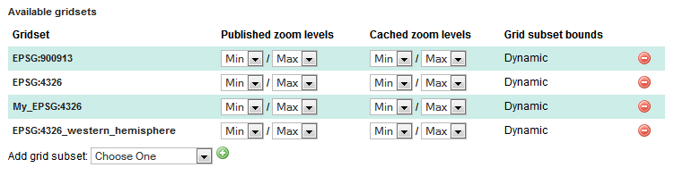

--------------------------------------------------

Caching and styles
==================

Create a separate tile cache for each different style associated with a layer.

--------------------------------------------------

Filters
=======

Non-required parameters in requests will usually be stripped when sent to the WMS.

Some parameters can be whitelisted, in which case **a separate cache will be created for each value that the filter accepts.**

--------------------------------------------------

Bypassed parameters
===================

With direct WMS integration enabled, the presence of any of the following parameters means that GeoWebCache is bypassed completely and the request is passed directly to GeoServer:

``ANGLE``, ``BGCOLOR``, ``BUFFER``, ``CQL_FILTER``, ``ELEVATION``, ``ENV``, ``FEATUREID``, ``FEATUREVERSION``, ``FILTER``, ``FORMAT_OPTIONS``, ``MAXFEATURES``, ``PALETTE``, ``STARTINDEX``, ``TIME``, ``VIEWPARAMS``

--------------------------------------------------

Caching layer groups
====================

* Layer groups may also be configured to be cached by the embedded GeoWebCache instance.
* GeoWebCache currently does not support caching multiple layers using the ``LAYERS`` parameter, so layer groups are the means to cache a composite of two or more layers in a single WMS request.

--------------------------------------------------

Section 4: Review
=================

* Each layer has its own GeoWebCache settings page.
* The standard GeoServer layer preview is not aware of gridsets and will not necessarily request tiles that align properly. The Tile Layers preview should be used to test cached layers.
* When configuring gridsubsets, we can configure which zoom levels will be published and which zoom levels will be cached.

--------------------------------------------------

Section 4: Review
=================

* We can select which styles will be cached for each layer.
* Layer groups can also be cached.

--------------------------------------------------

Section 5: Administration
=========================

--------------------------------------------------

Cache directory
===============

GeoWebCache stores all the cached tiles in a central directory.

For the embedded GeoWebCache: **gwc** directory inside the **GeoServer data directory**.

--------------------------------------------------

Cache directory
===============

* ``gwc/``

  * ``<layer_name>/``

    * ``<SRS1>_<zoom_level1>/``
    * ``<SRS1>_<zoom_level2>/``
    * ...
    * ``<SRS2>_<zoom_level1>/``
    * ``<SRS2>_<zoom_level2>/``
    * ...

--------------------------------------------------

Response headers
================

When GeoWebCache responds to a tile request, it also returns some additional metadata to the standard GeoServer response headers.

::

  curl -sv "http://localhost:8080/geoserver/wms?
    LAYERS=opengeo:countries& FORMAT=image/png&
    SERVICE=WMS&VERSION=1.1.1&
    REQUEST=GetMap&STYLES=&
    SRS=EPSG:4326&
    BBOX=0,0,45,45&
    WIDTH=256&HEIGHT=256"

--------------------------------------------------

Response headers
================

::

  HTTP/1.1 200 OK
  Server: Apache-Coyote/1.1
  Content-Disposition: inline; filename=opengeo-countries.png
  Content-Type: image/png
  Transfer-Encoding: chunked
  Date: Fri, 11 Jul 2014 23:35:21 GMT

--------------------------------------------------

Response headers
================

Extra headers are returned with the GWC endpoint: ``/geoserver/gwc/service/wms`` 

::

  geowebcache-tile-index: [4, 2, 2]
  geowebcache-cache-result: MISS
  geowebcache-tile-bounds: 0.0,0.0,45.0,45.0
  geowebcache-gridset: EPSG:4326
  geowebcache-crs: EPSG:4326

--------------------------------------------------

Client-side caching
===================

::

  curl --header "If-Modified-Since: Sat, 12 Oct 2013 19:05:57 GMT" -sv
    "http://localhost:8080/geoserver/gwc/service/wms?
     LAYERS=opengeo:countries&FORMAT=image/png&
     SERVICE=WMS&VERSION=1.1.1&REQUEST=GetMap&
     STYLES=&SRS=EPSG:4326&BBOX=0,0,45,45&
     WIDTH=256&HEIGHT=256"

::

  HTTP/1.1 304 Not Modified

--------------------------------------------------

Seeding
=======

The GeoWebCache web interface can seed the cache with tiles.

.. image:: ../doc/source/05_administration/images/seed-task.png

--------------------------------------------------

Seeding options
===============

* Seed - generate missing tiles
* Reseed - regenerate all tiles
* Truncate - remove tiles

--------------------------------------------------

Seeding jobs
============

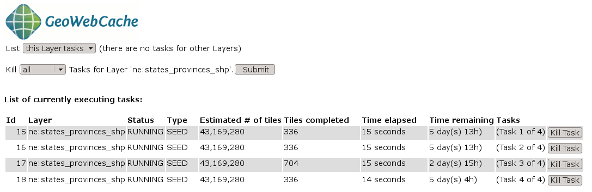

--------------------------------------------------

WFS-T truncating
================

* Embedded GeoWebCache can truncate tiles from the cache when a WFS Transaction (WFS-T) operation updates features. 
* GeoWebCache will only invalidate tiles which contain features that have changed.

--------------------------------------------------

Monitoring
==========

* The GeoWebCache page (``http://localhost:8080/geoserver/gwc``) contains aggregated statistics on the deployment. (Specifically ``Cache hit ratio``)

* The GeoServer log files contain messages generated by the embedded GeoWebCache instance (with ``VERBOSE_LOGGING`` on).

  * ``TRACE [gwc.layer] - --> http-8080-21 returns cache hit for [532, 288, 9]``

--------------------------------------------------

Section 5: Review
=================

* Disk Quotas must be enabled for GeoServer to correctly calcualte the size of a layer’s caches.
* GeoWebCache adds special HTTP repsonse headers for the client.
* A cache can be built ‘organically’ or we can seed the cache ahead of time.
* If our cache has grown too big, we can truncate the cache.

--------------------------------------------------

Section 5: Review
=================

* WFS-T requests will automatically remove tiles from the cache.
* If data has changed, we can reseed the cache with new tiles.

--------------------------------------------------

Section 6: Production considerations
====================================

--------------------------------------------------

Performance
===========

* GeoWebCache is production-ready by default.
* GeoWebCache usually not the bottleneck when performance issues.
* Suggestion: Deploy a standalone instance of GWC.

--------------------------------------------------

Disk usage
==========

* Caching is effectively trading disk space for performance.
* Suggestion: Reduce the number of gridsets, image formats, and styles cached.
* Suggestion: Use PNG8.

--------------------------------------------------

Selective caching
=================

Restrict what the cache will contain:

* Limit by geographic area
* Limit by zoom level

--------------------------------------------------

Disk quotas
===========

GeoWebCache has a built-in disk quota system

Two tiles for tile removal:

* Least Frequently Used (LFU)
* Least Recently Used (LRU)

--------------------------------------------------

Disk quotas
===========

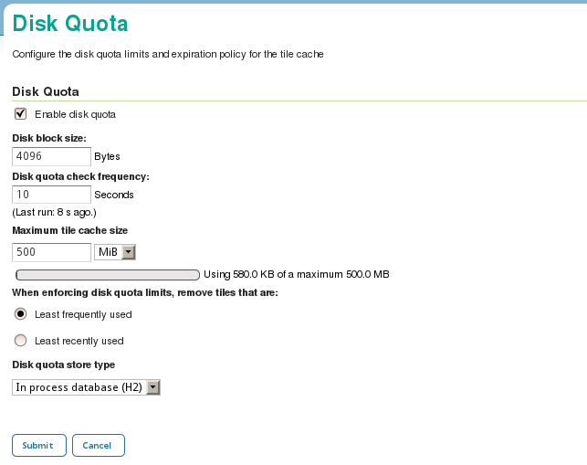

--------------------------------------------------

REST API
========

Programmatically interact with GeoWebCache

``http://localhost:8080/geoserver/gwc/rest``

--------------------------------------------------

REST: List layers
=================

``curl -u admin:geoserver "http://localhost:8080/geoserver/gwc/rest/layers.xml"``

::

  <layers>
    <layer>
      <name>ne:states_provinces_shp</name>
      <atom:link xmlns:atom="http://www.w3.org/2005/Atom" rel="alternate" href="http://localhost:8080/geoserver/gwc/rest/layers/ne%3Astates_provinces_shp.xml" type="text/xml"/>
    </layer>
    <layer>
      <name>ne:populated_places</name>
      <atom:link xmlns:atom="http://www.w3.org/2005/Atom" rel="alternate" href="http://localhost:8080/geoserver/gwc/rest/layers/ne%3Apopulated_places.xml" type="text/xml"/>
  </layer>
  ...

--------------------------------------------------

REST: Layer details
===================

``http://localhost:8080/geoserver/gwc/rest/layers/opengeo%3Acountries.xml``

--------------------------------------------------

REST: Layer details
===================

::

  <GeoServerLayer>
    <id>LayerInfoImpl--3a33e7d0:1400d3d823c:-7fdf</id>
    <enabled>true</enabled>
    <name>opengeo:countries</name>
    <mimeFormats>
      <string>image/png</string>
      <string>image/jpeg</string>
    </mimeFormats>
    <gridSubsets>
      <gridSubset>
        <gridSetName>EPSG:900913</gridSetName>
        <extent>
          <coords>
            <double>-2.003750834E7</double>
            <double>-2.003750834E7</double>
            <double>2.003750834E7</double>
            <double>1.8394384316255733E7</double>
          </coords>
        </extent>

--------------------------------------------------

REST: Job management
====================

Launch a seed task:

``curl -u admin:geoserver -XPOST -H "Content-type: text/xml" -T job.xml "http://localhost:8080/geoserver/gwc/rest/seed/opengeo:countries.xml"``

--------------------------------------------------

REST: Job management
====================

job.xml:

::

  <seedRequest>
    <gridSetId>EPSG:4326</gridSetId>
    <bounds>
      <coords>
        <double>-7</double><double>2</double>
        <double>56</double><double>48</double>
      </coords>
    </bounds>
    <zoomStart>1</zoomStart><zoomStop>6</zoomStop>
    <format>image/png</format>
    <type>seed</type>
    <threadCount>1</threadCount>
  </seedRequest>

--------------------------------------------------

Standalone GWC
==============

* No GUI, except for seed/truncate
* Configuration via XML files / REST API
* Some extra advanced options available
* Work with alternate/multiple WMSs
* No direct WMS integration
* Full WMS (no need to correspond to a gridset)
* No WFS-T truncating

--------------------------------------------------

For more information
====================

http://geowebcache.org
----------------------

Documentation:

* http://geowebcache.org/docs/current/ (Standalone)
* http://docs.geoserver.org/stable/en/user/geowebcache/ (Embedded)

--------------------------------------------------

For more information
====================

Source code:

* https://github.com/GeoWebCache/geowebcache/ (Standalone)
* https://github.com/geoserver/geoserver (Embedded)

--------------------------------------------------

For more information
====================

Mailing lists:

* https://lists.sourceforge.net/lists/listinfo/geowebcache-users (Users list)
* https://lists.sourceforge.net/lists/listinfo/geowebcache-devel (Developers list)

Boundless:

* http://boundlessgeo.com/solutions/solutions-software/geowebcache/

--------------------------------------------------
