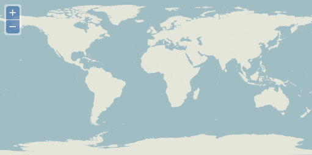

.. _openlayers.layers.wms:

Web Map Service Layers
======================

When you add a layer to your map, the layer is typically responsible for
fetching the data to be displayed. The data requested can be either raster or
vector data. You can think of raster data as information rendered as an image on
the server side. Vector data is delivered as structured information from the
server and may be rendered for display on the client (your browser).

There are many different types of services that provide raster map data. This
section deals with providers that conform with the :abbr:`OGC
(Open Geospatial Consortium, Inc.)` `Web Map Service (WMS)
<http://www.opengeospatial.org/standards/wms>`_ specification.

Creating a Layer
----------------

We'll start with a fully working map example and modify the layers to get an
understanding of how they work.

Let's take a look at the following code:

.. _openlayers.layers.wms.example:

.. code-block:: html

    <!DOCTYPE html>
    <html>
        <head>
            <title>My Map</title>
            <link rel="stylesheet" href="openlayers/theme/default/style.css" type="text/css">
            
            
        </head>
        <body>
            <h1>My Map</h1>
            

            
        </body>
    </html>

.. rubric:: Tasks

#.  If you haven't already done so, save the text above as ``map.html`` in the
    root of your workshop directory.

#.  Open the page in your browser to confirm things work:
    @workshop_url@/map.html

The OpenLayers.Layer.WMS Constructor
------------------------------------

The ``OpenLayers.Layer.WMS`` constructor requires 3 arguments and an
optional fourth. See the `API reference
<http://dev.openlayers.org/apidocs/files/OpenLayers/Layer/WMS-js.html#OpenLayers.Layer.WMS.OpenLayers.Layer.WMS>`_
for a complete description of these arguments.

.. code-block:: javascript

    var imagery = new OpenLayers.Layer.WMS(
        "Global Imagery",
        "http://maps.opengeo.org/geowebcache/service/wms",
        {layers: "bluemarble"}
    );

The first argument, ``"Global Imagery"``, is a string name for the layer. This
is only used by components that display layer names (like a layer switcher) and
can be anything of your choosing.

The second argument, ``"http://maps.opengeo.org/geowebcache/service/wms"``, is
the string URL for a Web Map Service.

The third argument, ``{layers: "bluemarble"}`` is an object literal with
properties that become parameters in our WMS request. In this case, we're
requesting images rendered from a single layer identified by the name
``"bluemarble"``.

.. rubric:: Tasks

#.  This same WMS offers a layer named ``"openstreetmap"``. Change the value of 
    the ``layers`` param from ``"bluemarble"`` to ``"openstreetmap"``. 

#.  In addition to the ``layers`` parameter, a request for WMS imagery allows
    for you to specify the image format.  The default for this layer is
    ``"image/jpeg"``.  Try adding a second property in the params object named
    ``format``.  Set the value to another image type (e.g. ``"image/png"``).
    
    Your revised OpenLayers.Layer.WMS Constructor should look like:
    
    .. code-block:: javascript

        var imagery = new OpenLayers.Layer.WMS(
            "Global Imagery",
            "http://maps.opengeo.org/geowebcache/service/wms",
            {layers: "openstreetmap", format: "image/png"}
        );

#.  Save your changes and reload the map:
    @workshop_url@/map.html

   
    A map displaying the ``"openstreetmap"`` layer as ``"image/png"``.

Having worked with dynamically rendered data from a Web Map Service, let's move
on to learn about :ref:`cached tile services <openlayers.layers.cached>`.
