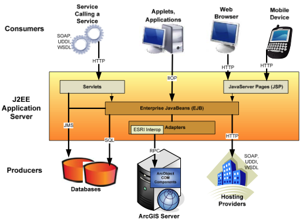
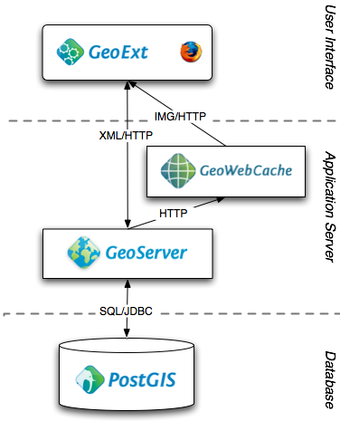
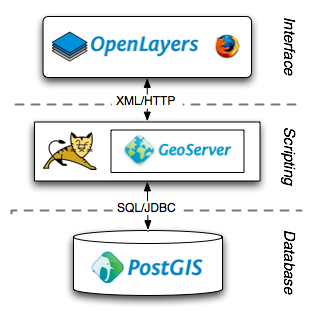

.. _architecture:

Architecture
============

A modern "web map architecture", like ArcGIS Server or the OpenGeo Suite, combines a database with a map rendering engine, a middleware, a map cache, and a web client.  The API solutions promoted by Google and Microsoft provide developers access to just the web client, with some carefully chosen hooks back to middleware functions like geocoding or routing.

In all these approaches, the storage engine is abstracted away, behind a web services API of some sort. And that's unfortunate, because a spatial database provides much more than storage.

  **A spatial database can perform all the analytical and query functions that define most "GIS" operations.**

There is a tendency in defining architectures to design for all possible futures, so one can end up with a design like this SOA architecture from ESRI:

Even the lighter OpenGeo architecture has more moving parts than some applications require:

For this workshop, we are going to strip down the architecture to the database, a scriptable web tier, and a web client.  For visualization purposes, we'll keep map rendering functionality in the middle tier, but we'll also explore some client side rendering. 

The idea is to keep the amount of software between the end user and the database as thin as we can, so we can really explore what is possible with the database alone. The web client will be used primarily to gather input data (in the form of clicks) and display outputs (as markers or table results), which is more aesthetically pleasing than just typing into a SQL terminal.

Tools
-----

The actual tools we will use are:

* PostgreSQL/PostGIS as the spatial database
* Tomcat/JSP as the scriptable web tier
* OpenLayers 2 as the map client
* PgAdmin as the database management tool
* GeoServer for map rendering

In general, *any scripting or programming language* that can be run from a web server and make connections to the database will do as the middle tier, be it Perl, PHP, Python, C#, ASP, JSP, ColdFusion, and so on.

Similarly, *any map rendering engine* that speaks a common protocol like :term:`WMS` (OGC Web Map Server) can be used for map rendering. We are using GeoServer in this case because the Tomcat bundle gives us a web server, JSP scripts, and GeoServer all in a convenient bundle. We could as easily (and almost did) use the `ms4w package <http://www.maptools.org/ms4w/>`_, which also gives us Apache, PHP, and Mapserver in a single bundle.

Unfortunately, none of the database options available to us has a simple install process.  All the database options (PostGIS, SQL Server, Oracle) are more involved than the web/scripting software, involving multiple installation steps and setting up services/daemons. The `binary installers for PostgreSQL <http://www.enterprisedb.com/products/pgdownload.do>`_ are now available for Windows, OS/X and Linux, and are included in the workshop materials. 

