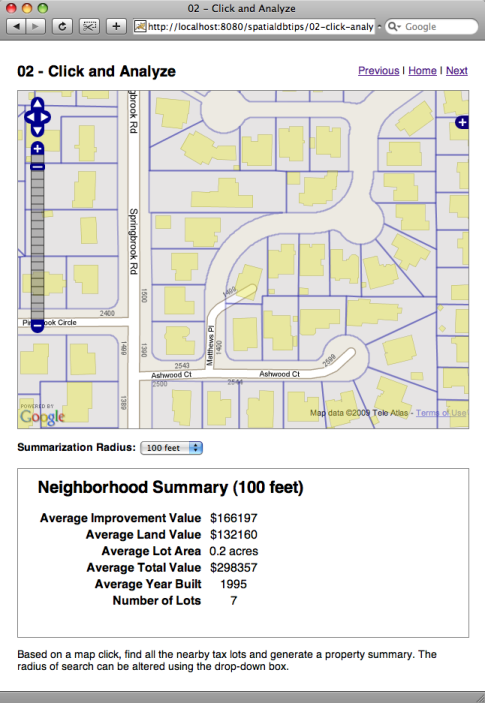

.. _click-analyze:

Analyze Spatial Data from a Map Click
=====================================

If you have installed the PostGIS database, the Medford data, and Tomcat, you should be able to view the functioning example here:

  http://localhost:8080/spatialdbtips/02-click-analyze.html
  
Querying data is all well and good, but what about some simple analysis? One of the most common GIS analysis questions is "what is this area like?" -- that is, summarize an area based on a number of measured variables.

The **medford.taxlots** table has a rich set of attributes regarding the property taxes assessed in the city. 

::

    Table "medford.taxlots"
    Column   |         Type          
 ------------+------------------------
  mapnumber  | character varying(20)  
  shape_area | numeric                
  shape_len  | numeric                
  mapnum     | character varying(20)  
  gis_area   | double precision       
  maplot     | character varying(16)  
  account    | integer                
  lottype    | character varying(4)   
  feeowner   | character varying(29)  
  contract   | character varying(29)  
  incareof   | character varying(29)  
  address1   | character varying(29)  
  address2   | character varying(29)  
  city       | character varying(19)  
  state      | character varying(4)   
  zipcode    | integer                
  commsqft   | integer                
  acreage    | double precision       
  impvalue   | integer                
  landvalue  | integer                
  lotdepth   | integer                
  lotwidth   | integer                
  propclass  | integer                
  addressnum | character varying(8)   
  streetname | character varying(22)  
  buildcode  | integer                
  yearblt    | integer                
  taxcode    | integer                
  assessimp  | integer                
  assessland | integer                
  maintenanc | integer                
  tm_maplot  | character varying(18)  
  scheduleco | integer                
  neighborho | integer                
  ownersort  | character varying(5)   
  addsort    | character varying(5)   
  trssort    | character varying(5)   
  siteadd    | character varying(36)  
  taxlot     | integer                
  the_geom   | geometry               

We will use the tax lot information to generate a summary of property values within a radius of a click point on the map. In particular, we will summarize the **impvalue** (improvement value), **landvalue** (land value), and **yearblt** (year built) while calculating and averaging a total value and an average lot area.

The interface looks much like the previous example. We can click, we can select a radius of calculation, and the result is put into an **iframe** below the map.

The Javascript bound to the **click** event is just like the previous example, except we are targeting a different JSP script and passing a radius instead of a table.

.. code-block:: javascript 

  function queryTaxlots(e) {
  
    // Read the map coordinates from the click event
    var lonlat = map.getLonLatFromViewPortPx(e.xy);

    // Read the radius we are going to use
    var radius = document.getElementById("radius").value;

    // Construct the query URL
    var url = "02-click-analyze.jsp";
    url += "?lon=" + lonlat.lon;
    url += "&lat=" + lonlat.lat;
    url += "&radius=" + radius;

    // Load the URL into an iframe
    document.getElementById("query").src = url;
  }

In this case, a typical URL sent to the script will look like:

  http://localhost:8080/spatialdbtips/02-click-analyze.jsp?lon=-122.84451305866241&lat=42.34369698643959&radius=100
  
The script that handles the URL, again looks like the previous example, except for the **important part**, the embedded SQL query.

.. code-block:: sql 

  select 
    count(*) as "Number of Lots",
    round(avg(st_area(the_geom))::numeric/43560, 1) || ' acres' as "Average Lot Area", 
    '$' || avg(impvalue)::integer as "Average Improvement Value",
    '$' || avg(landvalue)::integer as "Average Land Value",
    '$' || avg(impvalue + landvalue)::integer as "Average Total Value", 
    avg(yearblt)::integer as "Average Year Built"
  from medford.taxlots
  where
    st_dwithin(
      the_geom,
      st_transform(
        st_setsrid(
          st_makepoint(${param.lon},${param.lat}),
          4326),
        2270),
      ${param.radius}
    )
   
At the top of the query, where we specify our columns, are do some math (to convert square feet to acres) and some formatting (to round off doubles and add "$" signs to currency values). We also make the column names more human readable, since they get output directly by our script.

Note that all the values we are returning are wrapped in the **avg()** function. This is an "aggregate" function. Given a collection of input rows, an aggregate query will return a summary of those rows. In this case, we are returning averages for all our columns, but we could just as easily return **sum()**, **min()** or **max()**.

The magic occurs in the "where" block of the statement. 

* One again, we use **ST_MakePoint()** and **ST_SetSRID()** to build a point object with the correct spatial reference system.
* Then we transform it into the storage reference system (2270) using **ST_Transform()**.
* The **ST_DWithin()** function does a distance filter test. All objects that have some part within the radius return true.

About Distance Queries
----------------------

Asking "what things are within distance D of this point" is a *very* common spatial query. New users of spatial SQL will be tempted to write the query as:

.. code-block:: sql

  select *
  from medford.buildings
  where ST_Distance(
          the_geom, 
          ST_GeomFromText('POINT(4300137 244799)', 2270) 
        ) < 1000;
  
This is a perfectly valid formulation, and it will return the right answer, but in PostGIS it will never be able to use the spatial index. In order for the **ST_Distance()** function to be indexed, the database would have to pre-compute the distance between every object in the database.

Databases get around these limitations by re-writing queries to use indexes. SQL Server Spatial actually recognizes the above case and re-writes it correctly. SQL Server Spatial will correctly handle a query of the form:

.. code-block:: sql

  select *
  from medford.buildings
  where the_geom.STDistance( 
          geometry::STGeomFromText('POINT(4300137 244799)', 2270) 
        ) < 1000;

Oracle and PostGIS both provide alternate functions that do use the spatial index.  The high performance PostGIS form of the above query is:

.. code-block:: sql

  select *
  from medford.buildings
  where ST_DWithin(
          the_geom, 
          ST_GeomFromText('POINT(4300137 244799)', 2270), 
          1000
        );

Because all the parameters of the query are within one function, **ST_DWithin()**, PostGIS can re-write the query into one that uses an index to return answers quickly. The definition of **ST_DWithin()** in PostGIS is just this:

.. code-block:: sql

  CREATE OR REPLACE FUNCTION ST_DWithin(geometry, geometry, float8)
      RETURNS boolean
      AS 'SELECT $1 && ST_Expand($2,$3) 
             AND $2 && ST_Expand($1,$3)
             AND ST_Distance($1, $2) <= $3'
      LANGUAGE 'SQL' IMMUTABLE;

The function call is re-written into a pair of spatial index operations (those funny "&&" clauses) and a call to the usual distance function. Because the index clauses reduce the number of features in the candidate set, running the ordinary distance function is no longer inefficient.

The high performance Oracle form of the above query is:

.. code-block:: sql

  SELECT *
    FROM TARGET medford.buildings
    WHERE 
      SDO_WITHIN_DISTANCE( 
        medford.buildings.the_geom, 
        SDO_UTIL.TO_WKBGEOMETRY('POINT(4300137 244799)'), 
        'distance=1000'
      ) = 'TRUE';

Like the PostGIS form, the Oracle variant takes three parameters (two geometries and a distance) and returns true or false.

.. note::

  Within-a-distance queries are often phrased as "find all the objects within an N-unit buffer of this other feature". The appearance of the word "buffer" causes developers to haul out the **ST_Buffer()** function, a function that constructs new geometries expanded by a buffer tolerance. Correct answers can be achieved with this approach, but it is *massively inefficient*. Depending on how it is utilized, large numbers of buffered geometries will be built and then thrown away when they fail to meet the criteria, and indexes may be ignored as the buffered geometries are not indexed (the original, unbuffered ones are). **Best practice**, never use **ST_Buffer()** when doing a distance query.

