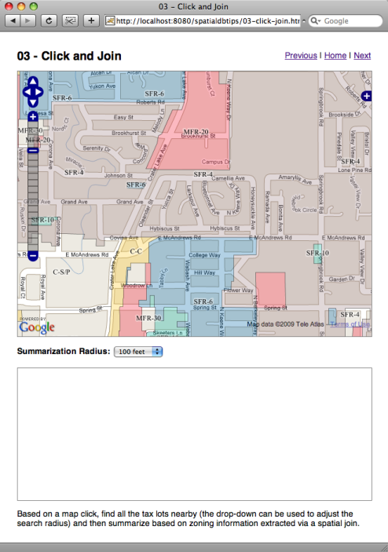
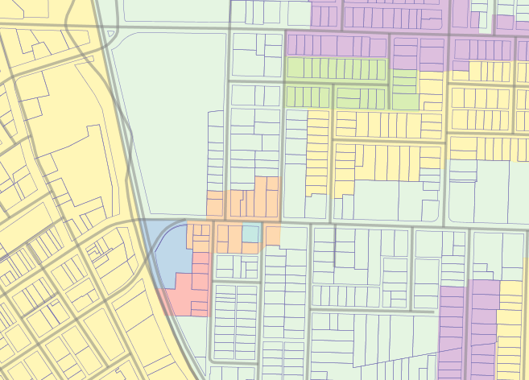
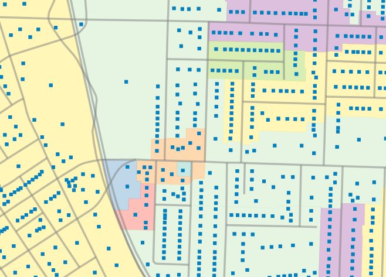
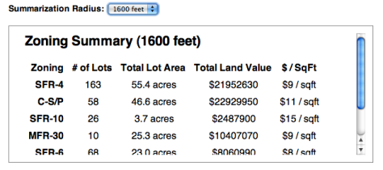

.. _click-join:

Join Spatial Tables from a Map Click
====================================

If you have installed the PostGIS database, the Medford data, and Tomcat, you should be able to view the functioning example here:

  http://localhost:8080/spatialdbtips/03-click-join.html
  
The **medford.taxlots** table has lots of information, but lacks a "zoning" column. What affect does zoning have on property values? The property value information is in the tax lots table, and the zoning information is in the **medford.zoning** table.

::

    Table "medford.zoning"
    Column   |         Type          
  -----------+-----------------------
  objectid   | integer                
  cityzone   | character varying(10)  
  zoning     | character varying(10)  
  revdate    | date                  
  finord     | character varying(20)  
  filenum    | character varying(20)  
  acres      | numeric                
  misc       | character varying(50)  
  shape_leng | numeric                
  perimeter  | numeric                
  area       | numeric                
  shape_le_1 | numeric                
  shape_area | numeric                
  hectares   | numeric                
  the_geom   | geometry               

We will join together the zoning and tax lot tables to generate a report about property values for each zoning category.

The interface still looks like the previous example. We can click, we can select a radius of calculation, and the result is put into an **iframe** below the map.

We have changed our overlay layer from the tax lots and buildings to the zoning types, which also include a label from which you can read the zoning code. The codes seem a little cryptic at first, but some rules of thumb clarify them:

* SFR-* = Single-family residence variants
* MFR-* = Multi-family residence variants
* C-* = Commercial variants
* I-* = Industrial variants

The Javascript side of the example remains the same: a click is transformed into a URL and passed to the server for evaluation.

.. code-block:: javascript 

  function queryZoning(e) {
    // Read the map coordinates from the click event
    var lonlat = map.getLonLatFromViewPortPx(e.xy);
    // Read the radius we are going to use
    var radius = document.getElementById("radius").value;
    // Construct the query URL
    var url = "03-click-join.jsp";
    url += "?lon=" + lonlat.lon;
    url += "&lat=" + lonlat.lat;
    url += "&radius=" + radius;
    // Load the URL into an iframe
    document.getElementById("query").src = url;
  }

Similarly the script side remains the same: evaluate a SQL query based on the URL input parameters and return the results as HTML for display.

The URL sent by the client looks like this:

  http://localhost:8080/spatialdbtips/03-click-join.jsp?lon=-122.85847663879395&lat=42.33691261528855&radius=400

The SQL query is where all the work happens.

.. code-block:: sql

  select 
    count(*) as num_lots,
    round(sum(st_area(taxlot.the_geom))::numeric/43560,1) || ' acres' as total_lot_area, 
    zone.zoning as zoning,
    '$' || sum(taxlot.landvalue)::integer as total_land_value,
    '$' || (sum(taxlot.landvalue) / sum(st_area(taxlot.the_geom)))::integer || ' / sqft' as value_per_ft
  from 
    medford.taxlots taxlot join medford.zoning zone 
    on (st_contains(zone.the_geom, st_centroid(taxlot.the_geom)))
  where
    st_dwithin(
      taxlot.the_geom,
      st_transform(
        st_setsrid(
          st_makepoint(${param.lon},${param.lat}),
          4326),
        2270),
      ${param.radius}
    )
  group by zone.zoning
  order by total_lot_area desc
  
Note that in the output clauses, many of the output columns are wrapped in **sum()** functions. That's because this is a summary query, we aren't returning all the selected rows, we're summarizing them. The columns that aren't summarized are the ones we will be using for grouping.

The only really new element here is the join clause. The join syntax is standard, but we are using spatial functions to define the join criteria instead of the usual database keys:

:: 
  
  medford.taxlots taxlot join medford.zoning zone 
  on (
    st_contains(zone.the_geom, st_centroid(taxlot.the_geom))
    )
  
We wanted to join the tax lots to the zones, so why are we running **ST_Centroid()** on our tax lots? Because the boundaries of the tax lots and the zoning areas might not line up exactly. That means a test on containment of lots in zones might return too few results; or, a test on intersection of lots with zones might return too many results.

By converting the tax lot polygons to point proxies, we can ensure that each lot falls within only one zoning area.

So our join finds tax lots who centers are within zoning areas. That provides us access to the zoning information at the tax lot level, which is enough to create a summary including both valuation (tax lot attribute) and zone (zoning attribute).

The usual **ST_DWithin()** clause is in the WHERE block of the SQL, to restrict the results to our query radius.

:: 

  where
    st_dwithin(
      taxlot.the_geom,
      st_transform(
        st_setsrid(
          st_makepoint(${param.lon},${param.lat}),
          4326),
        2270),
      ${param.radius}
    )
  group by zone.zoning
  order by total_lot_area desc

The **group by** clause is what makes our table a summary "by zoning" rather than a summary of all the records in the result set.

The final result provides an answer that would not be available without spatial processing -- a valuation table organized by zoning category.

