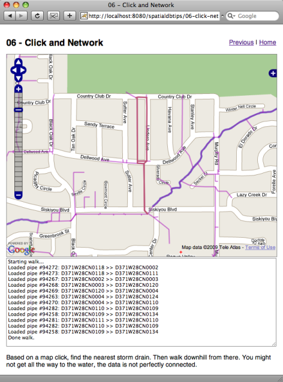

.. _click-network:

Walk a Sewer Network
====================

If you have installed the PostGIS database, the Medford data, and Tomcat, you should be able to view the functioning example here:

  http://localhost:8080/spatialdbtips/06-click-network.html
  
The GeoJSON script is like having direct access to the database from the web client, and using that access, we can do basically anything. This example uses direct database access to recursively walk through the Medford storm drain network: from a starting click, it keeps walking down stream until it runs out of connections.

Once you click on a storm drain line, the process starts, and the walk is logged into the window below the map.

This example uses the same "click and query" logic from previous examples to figure out which storm drain pipe to use as the starting element in the walk:

.. code-block:: javascript

  function getClickedPipe(e) {
    var geojson = new OpenLayers.Format.GeoJSON();
    // Get the mercator coordinates from the viewport
    var xy = map.getLonLatFromViewPortPx(e.xy);
    // Find the starting node with a  distance-from-click test.
    var sql  = "select st_asgeojson(the_geom), node_fm ";
        sql += "from medford.storm_drains ";
        sql += "where st_dwithin(the_geom,st_transform(st_setsrid(";
        sql += "st_makepoint(" + xy.lon + "," + xy.lat + ")";
        sql += ",900913),2270),50) limit 1";
    var config = { 
        "method":"GET",
        "url":"04-sql-to-json.jsp",
        "async":false,
        "params":{"sql":sql}
        };
    var xmlhttp = OpenLayers.Request.issue(config);
    var clicked_pipe = geojson.read(xmlhttp.responseText, "FeatureCollection");
    // Clean out our vector layer.
    pipes.destroyFeatures();
    if ( clicked_pipe ) {
      clearStatus();
      if ( clicked_pipe.length > 0 ) {
        // What node id do we start from?
        var node_fm = clicked_pipe[0].attributes.node_fm;
        updateStatus("Starting walk...");
        // Start the recursive walk
        getConnectedPipes(node_fm);
        updateStatus("Done walk.");
        // We're done, let's see the result.
        map.zoomToExtent(pipes.getDataExtent());
      } else {
        updateStatus("No starting pipe selected.");
      }
    }
  }

As before, we build up a SQL statement to do a distance query to find a geometry near the click point.

Unlike our previous examples, we are pulling the features into OpenLayers by hand, using an **XmlHttpRequest** object. We run a synchronous query instead of asynchronous, for simplicity. Once we have the text result (a GeoJSON object) we can pass that into the GeoJSON parser, which outputs an OpenLayers array of Vector features.

We take the first pipe found, and pass it into our recursive walking function, **getConnectedPipes**. 

The **medford.storm_drains** table has a lot of attributes, but the ones we care about are **node_fm** and **node_do**. The water in the pipes flows from the **node_fm** to the **node_to**. So to walk the pipes, we take each pipe we are given, draw it, and then find all the pipes whose **node_from** are the same as our pipe's **node_to**. 

Here's what doing it manually looks like, starting from a randomly chosen pipe:

::

  medford=# select pipe_id, node_fm, node_to from medford.storm_drains limit 1 offset 1020;    
      pipe_id     |    node_fm    |    node_to    
  ----------------+---------------+---------------
   91058.00000000 | D372W25CN0169 | D372W25CN0168
  (1 row)

  medford=# select pipe_id, node_fm, node_to from medford.storm_drains where node_fm = 'D372W25CN0168';
      pipe_id     |    node_fm    |    node_to    
  ----------------+---------------+---------------
   91061.00000000 | D372W25CN0168 | D372W25CN0167
  (1 row)

  medford=# select pipe_id, node_fm, node_to from medford.storm_drains where node_fm = 'D372W25CN0167';
      pipe_id     |    node_fm    |    node_to    
  ----------------+---------------+---------------
   91062.00000000 | D372W25CN0167 | D372W25CN0166
  (1 row)

  medford=# select pipe_id, node_fm, node_to from medford.storm_drains where node_fm = 'D372W25CN0166';
   pipe_id | node_fm | node_to 
  ---------+---------+---------
  (0 rows)

Eventually, we don't get an answer back -- we've run out of connected pipe!

.. note:: 

  A great exercise in spatial databases is to extend this example, so that when the walker can't find the next pipe by a node search, it instead tries a spatial search before giving up. Instead of looking for a pipe with a **node_fm** that matches our end point, we could look for a pipe with a ST_StartPoint() that is spatially very close to our end point.

The recursive walking function is pretty simple:

.. code-block:: javascript

  function getConnectedPipes(node_fm) {
    // A parser for our GeoJSON return values.
    var geojson = new OpenLayers.Format.GeoJSON();
    // We want to get all the pipes that start where the last one ended.
    var sql = "select st_asgeojson(st_transform(the_geom,900913)),pipe_id::integer,node_to,node_fm from medford.storm_drains where node_fm = '" + node_fm + "'";
    // We are working sequentially, so synchronous fetch is best.
    var config = { 
          "method":"GET",
          "url":"04-sql-to-json.jsp",
          "async":false,
          "params":{"sql":sql}
    };
    var xmlhttp = OpenLayers.Request.issue(config);
    // Parse the return value into an Array(vector).
    var connected_pipes = geojson.read(xmlhttp.responseText, "FeatureCollection");
    if ( connected_pipes ) {
      // First we draw the results on the map.
      pipes.addFeatures(connected_pipes);
      // Then we log.
      for ( var i = 0; i < connected_pipes.length; i ++ ) {
        var id = connected_pipes[i].attributes.pipe_id;
        var to = connected_pipes[i].attributes.node_to;
        var fm = connected_pipes[i].attributes.node_fm;
        updateStatus("Loaded pipe #" + id + ": " + fm + " >> " + to);
      }
      // Then we recurse.
      for ( var i = 0; i < connected_pipes.length; i ++ ) {
        var to = connected_pipes[i].attributes.node_to;
        getConnectedPipes(to);
      }
    }
  }        

Our SQL query this time is non-spatial: given a node, find all the pipes that flow from that node. If our query returns results, we add objects to our vector OpenLayers layer, log the results in our window, and then call the **getConnectedPipes()** function again to get the next downstream pipes.

The logic of this example isn't complex, but it is interesting to see a network walker where the network resides in a database, but the walking logic resides in Javascript.

Walking the Next Nearest Node
-----------------------------

As pointed out above, it should be possible to walk in a spatial sense, traversing from end node to start node down the network. However, doing so requires that the underlying data be structured quite consistently: every pipe junction must be noded; and, the end node must always be "down network" from the start node, or vice versa, as long as the direction is consistent.

The SQL to find the next nearest node efficiently would look something like this:

.. code-block:: sql

  select d.node_fm, d.node_to, d.pipe_id 
  from 
    medford.storm_drains d, 
    medford.storm_drains e 
  where st_dwithin(d.the_geom, e.the_geom, 5) 
    and e.node_to = 'D371W28CN0134'
    and e.gid != d.gid 
    and st_distance(
          st_endpoint(st_geometryn(e.the_geom, 1)),
          st_startpoint(st_geometryn(d.the_geom, 1))
        ) < 5;

By self-joining the storm drains table to itself, and restricting one side of the join to just the edge we are interested in, we get the result out. Note that we include an **ST_DWithin()** clause as well as an **ST_Distance()** clause. The within distance test gets us a set of candidate geometry very quickly using the index, while the distance clause actually winnows the results down to the exact answer -- geometries with a start-point very close to our end-point.

.. note::

  The use of **ST_GeometryN()** might seem superfluous in the example above, but it is required. The storm drain table has a geometry type of "MULTILINESTRING", but the **ST_EndPoint()** and **ST_StartPoint()** functions only work on plain "LINESTRING" types. The **ST_GeometryN()** function is used to extract the first (and generally only) geometry from the multi-geometry.

Unfortunately, the Medford storm drain data *is not* sufficiently well structured to make use of this trick in generality. Some pipes / ditches are not noded where other pipes connect up to them, so their start points are not close to the end point of entering pipes.

A modified spatial query will find all pipes that are close to the end point of a pipe, but this query will return too many results when run against a properly constructed junction (where every pipe has and end at the junction):

.. code-block:: sql

  select d.node_fm, d.node_to, d.pipe_id
  from 
    medford.storm_drains d, 
    medford.storm_drains e
  where st_dwithin(d.the_geom, st_endpoint(st_geometryn(e.the_geom, 1)), 5)
    and e.node_to = 'D371W28AN0113'
    and e.gid != d.gid;

A fair question from this and the previous example is: "why not use **ST_DWithin(ST_StartPoint(), ST_EndPoint())**?" The answer is: "because neither the start nor the end points are indexed (the geometry is, not it's ends) so the query will run very slowly".

