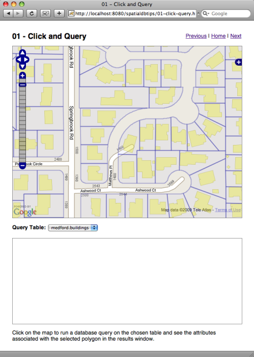

.. _click-query:

Query Spatial Database from Map Click
=====================================

If you have installed the PostGIS database, the Medford data, and Tomcat, you should be able to view the functioning example here:

  http://localhost:8080/spatialdbtips/01-click-query.html
  
For this example, we have added an extra WMS layer (the taxlots) to the overlay and set up some extra boxes in the page to hold the results of queries.

This example is using our thin architecture: Javascript to form a query URL, that is parsed by a script into a SQL query, which is run and results fed back to the user interface. 
 
.. image:: ../img/click-query1.png

The query result box in our web page is a simple **iframe** element, basically an embedded web panel. We could write fancy code to de-serialize our query results from XML into the web page, but for simplicity we are simply going to have our script return HTML, and stuff it into this **iframe**.

The initialization routine for this page now looks like this:

.. code-block:: javascript 

 function init() {

   initMap();
            
   // Add a WMS overlay showing both taxlots and buildings.
   var bwms = new OpenLayers.Layer.WMS( "Medford Buildings",
                  "http://localhost:8080/geoserver/wms?",
                   { 
                     transparent:'true',
                     layers: 'medford:taxlots,medford:buildings',
                     'format':'image/png'},
                     {'reproject': true});
   map.addLayer(bwms);

   // Tie the map click event to our query function (queryDatabase)
   map.events.register("click", map, queryDatabase );

 }
 
Initialization is the same as the previous example except: we are requesting *two* layers from the WMS instead of one; and, we are registering the map "click" event to a function of our own, called **queryDatabase()**.

The **queryDatabase()** function looks like this:

.. code-block:: javascript

  function queryDatabase(e) {
  
    // Read the map coordinates from the click event
    var lonlat = map.getLonLatFromViewPortPx(e.xy);
    
    // Read the table we are going to query from the page
    var table = document.getElementById("table").value;
    
    // Construct the query URL
    var url = "01-click-query.jsp";
    url += "?lon=" + lonlat.lon;
    url += "&lat=" + lonlat.lat;
    url += "&table=" + table;
    
    // Load the URL into an iframe
    document.getElementById("query").src = url;
  }
  
So, the "click" event returns an X/Y pixel value for the click, and we can use a utility method on the "map" object to get a latitude/longitude value instead.  We put that information together with a table to query and get a URL, which we stuff into our query results ``iframe``. The URL looks like this:

  http://localhost:8080/spatialdbtips/01-click-query.jsp?lon=-122.8451943397522&lat=42.344141057680226&table=medford.taxlots
  
OK, so then what?

This is where our scripting and spatial database come it. So far, all we've done is some string manipulation. Now we answer the spatial query question: "tell me about the objects that intersect this point!"

The **01-click-query.jsp** script is a simple :term:`JSTL` script that takes in our location and table parameters, forms a SQL query from them, runs the query and writes back an HTML table of results to display in our page. Here is the script in its entirety.

.. code-block:: jsp

  <%@ taglib uri="http://java.sun.com/jsp/jstl/sql" prefix="sql" %>
  <%@ taglib uri="http://java.sun.com/jsp/jstl/core" prefix="c" %>
  <%@ page contentType="text/html" %>

  <sql:query var="rs" dataSource="jdbc/medford">
  select 
    st_geometrytype(the_geom) as geometrytype,
    st_area(the_geom) as area,  
    *
  from ${param.table}
  where
    st_contains(
      the_geom,
      st_transform(
        st_setsrid(
          st_makepoint(${param.lon},${param.lat}),
          4326),
        2270))
  </sql:query>

  <html>
   <head>
    <link rel="stylesheet" href="style.css" type="text/css" />
   </head>
   <body>
    <c:forEach var="row" items="${rs.rows}">
     <table>
      <c:forEach var="column" items="${row}">
       <c:if test="${column.key != 'the_geom'}">
        <tr>
         <th><c:out value="${column.key}"/></th>
         <td><c:out value="${column.value}"/></td>
        </tr>
       </c:if>
      </c:forEach>
     </table>
    </c:forEach>
   </body>
  </html>

At the top, are :term:`JSTL` directives, that pull in the SQL and the core "taglibs", which we use below. Then we run the SQL query, in the **<sql:query>** block. 

.. note::

  We specify **datasource="jdbc/medford"** in the **<sql:query>** block. This is a reference to a pre-configured database connection, you can see the configuration in the **WEB-INF/web.xml** and **META-INF/context.xml** files in the **webapps/spatialdbtips** directory in Tomcat.
  
The interesting part is the SQL query itself, here it is on its own:

.. code-block:: sql

  select 
    st_geometrytype(the_geom) as geometrytype,
    st_area(the_geom) as area,  
    *
  from ${param.table}
  where
    st_contains(
      the_geom,
      st_transform(
        st_setsrid(
          st_makepoint(${param.lon},${param.lat}),
          4326),
        2270))

1. Our URL passes in a longitude and a latitude, and we are passing those into the **ST_MakePoint()** function to create a geometry object. 
2. Then we pass that object into the **ST_SetSRID()** function, and set the :term:`SRID` to "4326" -- this is a magic number corresponding to lon/lat. 
3. Then, using **ST_Transform()** we transform the geometry into a new SRID, "2270" -- this is the :term:`SRID` our Medford data is stored in. 
4. And finally we test all the geometries in the candidate table to see if they contain our point, using the **ST_Contains()** function.

In the :term:`JSTL` code following, the result of the SQL query is just iterated back into an HTML table, skipping the geometry column (named "the_geom"). None of the functions of this script are at all unique to :term:`JSTL` or JSP -- any other scripting language can be used. 

  **The core logic resides in the SQL query executed by the database.**

For example, here's the same script in `PHP <http://php.net>`_:

.. code-block:: php

  <html>
   <head>
    <link rel="stylesheet" href="style.css" type="text/css" />
   </head>
   <body>

  <?

  $table = $_GET["table"];
  $lon = $_GET["lon"];
  $lat = $_GET["lat"];

  $sql = "select 
            st_geometrytype(the_geom) as geometrytype,
            st_area(the_geom) as area, *
          from $table
          where
            st_contains(
              the_geom,
              st_transform(
                st_setsrid(
                  st_makepoint($lon, $lat),
                  4326),
                2270))";

  $db = pg_connect("dbname=medford user=postgres password=postgres");
  $result = pg_query($db, $sql);
  while( $row = pg_fetch_assoc($result) )
  {
    print "<table>";
    foreach ( array_keys($row) as $column_name )
    {
      if ( $column_name <> "the_geom" ) 
      {
        print "<tr>";
        print "<th>" . $column_name . "</th>";
        print "<td>" . $row[$column_name] . "</td>";
        print "</tr>";
      }
    }
    print "</table>";
  } 

  ?>

  </body>
  </html>

Coordinate Reference Systems
----------------------------

The previous section mentioned "SRID" a number of times, the "spatial reference ID" of a geometry.  Coordinates have no locational meaning by themselves, they are just numbers. Coordinates only have locational meaning when they are tied to a "reference system" that supplies an origin, a definition of the surface on which the numbers are measures (planar, spherical, etc) and units of measure.

"Latitude/longitude" are a well known "coordinate reference system" where the surface is a sphere and the units are angular. However, there are grey areas even for latitude/longitude -- the shape of the sphere (spheroid) makes a difference when interpreting what part of the surface the angular units refer to.

Most GIS data from state and local agencies (like our Medford data) are not distributed in latitude/longitude, they are distributed in a local planar system. The Medford data has been provided in their working coordinate reference system, which is "Stateplane Oregon South, NAD83, Feet". The full text representation of that system is as follows:

::

  PROJCS["NAD_1983_HARN_StatePlane_Oregon_South_FIPS_3602_Feet_Intl",
    GEOGCS["GCS_North_American_1983_HARN",
      DATUM["D_North_American_1983_HARN",
        SPHEROID["GRS_1980",6378137.0,298.257222101]],
      PRIMEM["Greenwich",0.0],
    UNIT["Degree",0.0174532925199433]],
    PROJECTION["Lambert_Conformal_Conic"],
    PARAMETER["False_Easting",4921259.842519685],
    PARAMETER["False_Northing",0.0],
    PARAMETER["Central_Meridian",-120.5],
    PARAMETER["Standard_Parallel_1",42.33333333333334],
    PARAMETER["Standard_Parallel_2",44.0],
    PARAMETER["Latitude_Of_Origin",41.66666666666666],
    UNIT["Foot",0.3048]]

This is a cartesian reference system (on a plane) and the definition includes the assumed shape of the sphere it starts from (the GEOGCS) as well as the math projection (Lambert Conformal Conic) and parameters of that projection that convert from spherical coordinates to useful cartesian coordinates for the region of southern Oregon.

All this is intellectually interesting, but the main takeaway points are:

* All geometries *must* have an SRID in order to be located on the globe.
* Some SRIDs refer to spherical coordinate systems and some refer to cartesian systems.
* All SRIDs can be converted to other SRIDs.
* Cartesian systems use planar units (meters, feet) while spherical ones use angular units (degrees, radians).
* The most common SRID for lon/lat is 4326 (that's what your GPS spits out).
* The Google Maps projection SRID has been conventionally agreed to be 900913 (spells "Google" in l33t-speak) and officially agreed to be 3857.
* The Medford data we are working with is SRID 2270.

Both PostGIS and Oracle Spatial support coordinate reference system transformations inside the database, which can make working with different systems relatively transparent.  *SQL Server does not yet support transformations*, and that means if you need to build a system with multiple reference systems, you'll need to use middle-ware that can support transforms for you, like SharpMap or Mapscript.

In PostGIS, the information about CRSs is maintained in a special metadata table, **SPATIAL_REF_SYS**. Oracle Spatial uses a more normalized collection of tables, with **SDO_COORD_REF_SYS** being the master table. Both PostGIS and Oracle Spatial use an "SRID" identifier as the key to coordinate transformation.

The syntax for a coordinate transformation in PostGIS is:

  ST_Transform(<geometry>, <destination_srid>)

The SRID of the geometry is embedded in the geometry object, so the source SRID does not have to be declared in the function call.

The syntax for a coordinate transformatin in Oracle is:

  SDO_CS.TRANSFORM(<geometry>, <dimensions>, <destination_srid>)

The Oracle Spatial coordinate reference engine can also do Z-value transformations, if the source and destination CRS information supports it, hence the dimensions parameter. The PostGIS engine is limited to 2-dimensional transformations only.

So, what does SRID 2270 data look like, anyways? Here's a text representation of a street from the Medford data (you can plug these queries into PgAdmin and run them directly):

::

  select ST_AsText(the_geom) 
  from medford.streets 
  where ST_NPoints(the_geom) < 5 
  limit 1;

  MULTILINESTRING((4213885.14734031 160185.268762533,4213652.62151609 160197.360154544))

And here is the same feature transformed into SRID 4326 (lon/lat):

::

  select ST_AsText(ST_Transform(the_geom,4326)) 
  from medford.streets 
  where ST_NPoints(the_geom) < 5 
  limit 1;

  MULTILINESTRING((-123.105691290864 42.0759840216797,-123.106548657776 42.0759973317678))

All this transformation is pretty powerful, and people can get carried away with it, transforming things willy nilly.
However, mixing reference systems should be used carefully, as should data in lon/lat systems.

* Spatial data is indexed based on the reference system it is *stored in*. So a SQL statement that transforms it *out* of its storage projection will not be able to make use of indexes. 

  * **Best practice**, always transform query parameters *into* the storage projection.
  
* Oracle and SQL Server allow you to store and work with data in longitude/latitude. However, be aware that:

  * Calculations in spherical coordinates are about an order of magnitude more CPU intensive than planar calculations.
  * Spherical indexes are less effective than planar indexes.
  * **Best practice**, if your data is localized enough to be represented in a planar projection, store it in planar.
  
* You can store and work with longtitude/latitude data as if it were planar, but:

  * Calculations like distance and area and buffers won't make much sense, because the units will be degrees.
  * Simple linear conversions ("there are N feet in a degree") won't work because degrees are not of uniform size on the surface of the globe.
  * **Best practice**, if your data is localized enough to be represented in a planar projection, store it in planar.
  * **Best practice**, if you absolutely must store your data in longitude/latitude be aware of singularity points (poles / dateline) and units of measure (degrees are an angular unit, not a linear unit).
  
