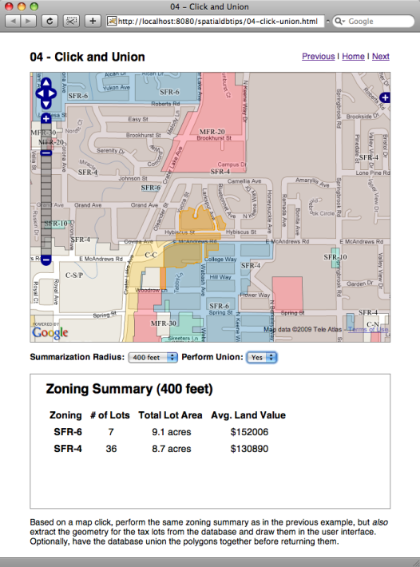
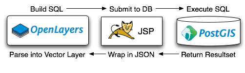
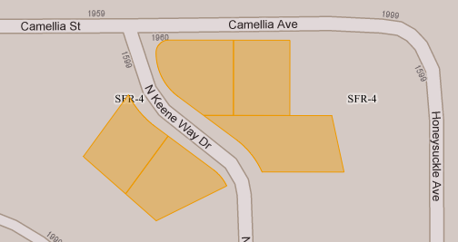

.. _click-union:

Union Geometries inside the Spatial Database
============================================

If you have installed the PostGIS database, the Medford data, and Tomcat, you should be able to view the functioning example here:

  http://localhost:8080/spatialdbtips/04-click-union.html
  
The previous example was a fun bit of analysis, but it was lacking an important visual enhancement: what parcels were being used to compute the summary?  This example builds on the previous one by pulling geometries directly out of the database, and letting them be rendered on the client side.

The interface is just like the last example, but with one drop-down added, which will cause the database to union the geometry results before returning them to the client.

So, what is going on here? The base map from Google and the WMS overlay of the zoning areas remain the same. The yellow tax lot features on the top are different from the other layers -- they are actual "vector features" transferred from the database to the client and drawn on top of the map in the browser.

The format we are using for transferring the vector features in this example is :term:`JSON`, in particular the `GeoJSON <http://geojson.org>`_ form.  A GeoJSON geometry looks like this:

.. code-block:: sql

  select st_asgeojson(the_geom) 
  from medford.streets 
  where st_npoints(the_geom) < 6 
  limit 1;

::

  {"type":"MultiLineString",
   "coordinates":[[
                   [4289753.353490965440869,253537.898097474477254],
                   [4290375.097619544714689,253518.366321456269361]   
                 ]]}
  
The OpenLayers library can directly consume GeoJSON "feature collections" and draw them as a layer on the map. We are going to take advantage of this to build an even thinner architecture than before: for this example, our Javascript builds a SQL statement, which is passed to the JSP script, which runs the SQL, and then returns a GeoJSON feature collection to the browser for rendering.

Turning on the "Union" option tells the spatial database to perform a union of all the polygons before turning them into GeoJSON and sending the back. The effect is to turn a result like this:

Into a result like this:

How does this all work? Well, the summary window at the bottom of the page is a clone of the last example, so we will ignore that element.

More Coordinate Reference Systems
---------------------------------

In order to make all the layers (Google, WMS and Vector) line up in OpenLayers, we have to get more explicit about our coordinate reference systems.

The dirty little secret behind Google Maps, Virtual Earth, and Yahoo Maps is that, even though their APIs deals entirely with coordinates in latitude/longitude, the actual map tiles, the colorful pictures you see, are not in latitude/longitude -- they are in a form of Mercator.

That means, in order to draw vectors on top of those tiles, and have those vectors line up with the pictures in the tiles, we need to draw the vectors in Mercator -- in particular, we need to use the form of Mercator Google (and Microsoft (and Yahoo)) are using.

Our **initMap()** function has slightly changed in this example, to explicitly set our projection:

.. code-block:: javascript

  function initMap() {
          
    // Initialize our map using Mercator as the internal units. 
    // That means our bounds, center, resolutions, all have to be in Mercator.
    var options = {
      projection: new OpenLayers.Projection("EPSG:900913"),
      displayProjection: new OpenLayers.Projection("EPSG:4326"),
      units: "m",
      numZoomLevels:20,
      maxResolution: 156543.0339,
      maxExtent: new OpenLayers.Bounds(-20037508, -20037508, 20037508, 20037508.34),
      controls:[new OpenLayers.Control.MouseDefaults(),
                new OpenLayers.Control.LayerSwitcher(),
                new OpenLayers.Control.PanZoomBar()]
      };

    map = new OpenLayers.Map( 'map' , options );
 
    var gmap = new OpenLayers.Layer.Google(
      "Google Streets", // the default
      {'sphericalMercator': true}
    );
    var gsat = new OpenLayers.Layer.Google(
      "Google Satellite",
      {type: G_SATELLITE_MAP, 'sphericalMercator': true}
    );
    map.addLayers([gmap, gsat]); 
    map.setCenter(new OpenLayers.LonLat(x, y), zoom);
  }

In our **map** options, we are now explicitly stating our "projection" (the actual projection we expect our working units to be in) and our "displayProjection" (the units to use in printing coordinates on the screen). 

The project code we are using is "EPSG:900913", which is the community code for the Google projection. At the same time, our instantiations of the Google layers have added the "sphericalMercator" option, to let them know that our working units are no longer latitude/longitude.

Changing our working units means that things like a map "click" event will now return geographical units in Mercator instead of latitude/longitude.

.. note::

  The "EPSG" number for the Google/Yahoo/Microsoft projection has undergone a lot of changes. Initially, the EPSG would not accept it (it is not a real cartographic projection, it is a computationally efficient shortcut). So the community made their own number, **900913**. But the web mapping APIs really took off, and the EPSG changed their mind, and added a definition to their database under the number **3785**. But then they found some things they wanted to change about that entry, so they deprecated it, and added the current number, **3857**. **Best practice**, use whatever you can get to work, but err on the side of the official number if you have a choice.

Retrieving GeoJSON from the Database
------------------------------------

Now that our interface is set up with proper coordinates, we can go about retrieving the vectors and drawing them on the map.

Our retrieve-and-draw function has been registered with the "click" event, and it looks like this:

.. code-block:: javascript

  function getFeatures(e) {

    // Get the mercator coordinates from the viewport
    var xy = map.getLonLatFromViewPortPx(e.xy);

    // Read the query radius from the form
    var radius = document.getElementById("radius").value;

    // Read the union status from the form
    var dounion = document.getElementById("dounion").value;

    // If we are unioning, change the SQL appropriately
    var sql_geom = "st_transform(the_geom,900913)";
    if(dounion > 0) {
      sql_geom = "st_union(st_transform(the_geom,900913))";
    }

    // Build up the SQL query
    var sql =  "select st_asgeojson(" + sql_geom + ") ";
        sql += "from medford.taxlots ";
        sql += "where st_dwithin(the_geom,st_transform(st_setsrid(";
        sql += "st_makepoint(" + xy.lon + "," + xy.lat + ")";
        sql += ",900913),2270)," + radius + ")";

    // Build the URL
    var json_url = "04-sql-to-json.jsp?sql=";
    json_url += escape(sql);

    // If we already have a vector layer, blow it away
    if (undefined != json_layer) {
      json_layer.destroy();
    }
    
    // Make a fresh vector layer, pulling features from our script URL
    json_layer = new OpenLayers.Layer.Vector("GeoJSON", {
                strategies: [new OpenLayers.Strategy.Fixed()],
                  protocol: new OpenLayers.Protocol.HTTP({
                                   url: json_url,
                                format: new OpenLayers.Format.GeoJSON()
                            })
                });
                
    // Add our vector layer to the map
    map.addLayer(json_layer);
    
  }
  
There are not a lot of moving parts here. At the top we extract the click point, radius and union choice from the HTML page. Then **we build the SQL statement up in Javascript**. We are actually going to pass SQL back to the JSP script. The Javascript ends up building a SQL statement like this one:

.. code-block:: sql

  select st_asgeojson(st_transform(the_geom,900913)) 
  from medford.taxlots 
  where 
    st_dwithin(
      the_geom,
      st_transform(
        st_setsrid(
          st_makepoint(-13676108, 5212594),
          900913),
        2270),
      100
    )

Note the careful juggling of coordinate systems. 

* We want Mercator (900913) outputs, so we wrap our output "the_geom" column in a call to **ST_Transform()**.
* Our map is generating click coordinates in Mercator, so we wrap those in a call to **ST_Transform()** to shift them from 900913 to 2270 (Stateplane Oregon South), which is coordinate system in which **ST_DWithin()** call takes place.

And then the SQL is fired off to the JSP scripting layer, where this happens to it:

.. code-block:: jsp

  <%@ taglib uri="http://java.sun.com/jsp/jstl/sql" prefix="sql" %>
  <%@ taglib uri="http://java.sun.com/jsp/jstl/core" prefix="c" %>
  <%@ page contentType="text/x-json" %>

  <sql:query var="rs" dataSource="jdbc/medford">
  ${param.sql}
  </sql:query>

  {"type":"FeatureCollection",
   "features":[
  <c:forEach var="row" items="${rs.rows}" varStatus="rowStatus">
  <c:set var="propCount" value="0"/>
   {"type":"Feature",
    "geometry":<c:out value="${row.st_asgeojson}" escapeXml="false" />,
    "properties":{
    <c:forEach var="column" items="${row}" varStatus="columnStatus">
     <c:if test="${column.key != 'st_asgeojson'}">
      <c:if test="${propCount > 0}">,</c:if>
      "<c:out value="${column.key}"   escapeXml="false" />":
      "<c:out value="${column.value}" escapeXml="false" />"
      <c:set var="propCount" value="${propCount + 1}"/>
     </c:if>
    </c:forEach>
  }}
   <c:if test="${!rowStatus.last}">,</c:if>
  </c:forEach>
  ]}

It looks more complex than it is, because JSON notation is a terse and visually confusing collection of braces, brackets, colons and quotation marks. What it does is execute whatever SQL is provided to it (**${param.sql}**) and write the resulting rows into a GeoJSON "FeatureCollection". It has the built-in assumption that the geometry will be wrapped in a call to **ST_AsGeoJSON()**, so it can put that column in the "geometry" property and exclude it from the "properties" list of other attributes.

You can call the GeoJSON script directly with any legal SQL and see what it spits out. Here's an example query:

  http://localhost:8080/spatialdbtips/04-sql-to-json.jsp?sql=select+st_asgeojson(the_geom,10),name,address,students+from+medford.schools

.. note::

  If you work in security, your heart may have already stopped. The above script is an excellent learning tool, but web scripts that blindly execute raw SQL should never be put into a production setting, no matter how convenient they are (and they are quite convenient). Imagine someone running the SQL query "drop table bank_transactions" and you get the picture.
  
A GeoJSON "FeatureCollection" looks like this:

::

  {"type":"FeatureCollection",
   "features":[{
      "type":"Feature",
      "geometry":{
         "type":"MultiLineString",
         "coordinates":[[ [4272092.134658517315984,240109.088356967899017],
                          [4272221.040898637846112,240576.101989402901381] ]]
      },
      "properties":{
        "name":"GREY EAGLE DR"   
      }
    }]
  }

Try clicking the map in different places, using different radiuses, and turning unions on and off. You'll notice that as the number of features selected grows, the map slows down. For rendering large numbers of features, pulling vectors directly is not a wise design. However for small collections, and particularly for features you want to manipulate (with editing tools) it works great.

What about Oracle and SQL Server
--------------------------------

Oracle and SQL Server don't currently have support for GeoJSON outputs. However, they do support output to :term:`GML` which is a heavier format (more characters to represent the same thing) but capable of the same tricks as GeoJSON. In fact, OpenLayers will read a GML collection in the same way as reading a GeoJSON collection, just change the reader type:

.. code-block:: javascript

    gml_layer = new OpenLayers.Layer.Vector("GML", {
                strategies: [new OpenLayers.Strategy.Fixed()],
                  protocol: new OpenLayers.Protocol.HTTP({
                                   url: gml_url,
                                format: new OpenLayers.Format.GML()
                            })
                });

The Oracle SQL to generate GML outputs looks like this:

.. code-block:: sql

  SELECT TO_CHAR(SDO_UTIL.TO_GMLGEOMETRY(the_geom)) AS GmlGeom 
  FROM medford.taxlots t 
  WHERE t.impvalue > 100000;
  
The SQL Server call to generate GML outputs looks like this:

.. code-block:: sql

  SELECT the_geom.StAsGML() 
  FROM medford.taxlots t 
  WHERE t.impvalue > 100000;
  
 
