.. _installation:

Installation
============

There are a lot of steps in this section, but it's possible to get through them pretty quickly. These instructions will cover the installation of the software on Windows, with a few notes about running the software on OS/X and Linux platforms.

We will be installing:

* PostgreSQL 8.3, which includes

  - PgAdmin 
  - PostGIS 1.3

* Tomcat 6, with which we've bundled

  - OpenLayers 2.7
  - JSP and JSTL
  - GeoServer 1.7

.. note::

  You will need administrative rights to your computer to install the database and web service software.

Workshop Materials
------------------

The software and data to be installed are all in the workshop materials you have received as a CDROM or ZIP file. Within the CDROM/ZIP you will find.

**workshop/** 
  a directory containing this HTML workshop

**software/** 
  a directory containing all the software we will be installing and a couple extras

**data/** 
  a directory containing the data files we will be loading and the original shape files

All the data in the package is public domain and freely re-distributable. All the software in the package is open source, and freely re-distributable. This workshop is licensed as Creative Commons "`share alike with attribution <http://creativecommons.org/licenses/by-sa/3.0/us/>`_", and is freely re-distributable under the terms of that license. Our attribution requirement is that you retain the OpenGeo branding of the workshop materials.

Installing PostgreSQL
---------------------

Double-click the PostgreSQL installer file in the **software/** directory to start the process. Click "Next".

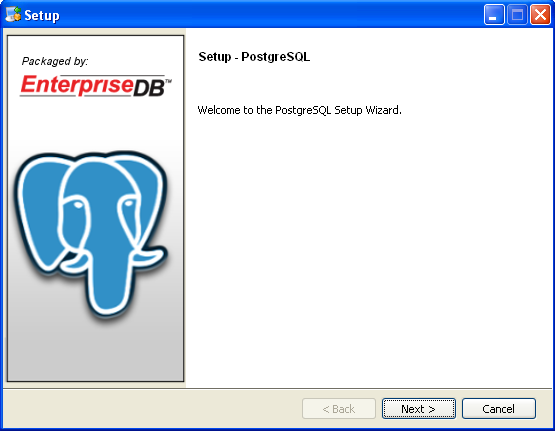

Accept the default installation location. Click "Next".

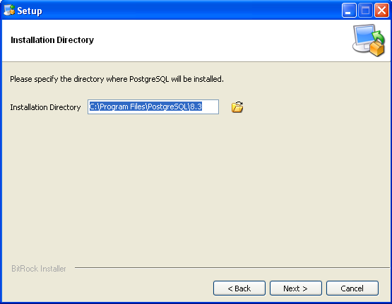

Accept the default data directory location. Click "Next".

.. note::

  In a production setting you will probably use a data location that is distinct from your software installation location, such as on a RAID device or high performance SAN.
  
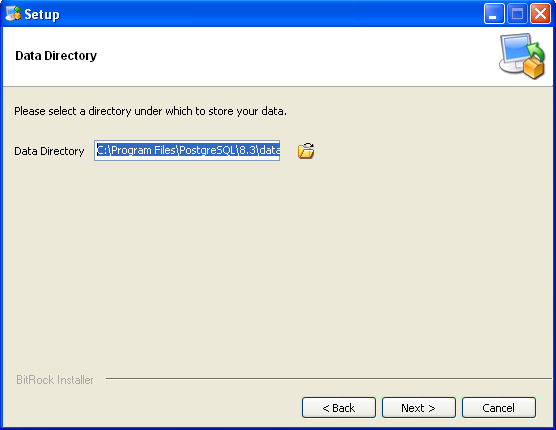
 
For the database super-user account password, enter "**postgres**".  

.. note::

  It is important to use "**postgres**" as the password because other elements of the workshop software expect it.  In a production setting, you would use a secure password.
  
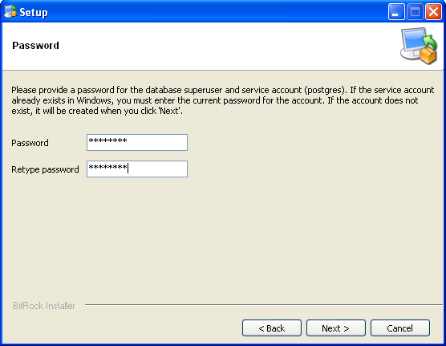

Accept the default server port number.

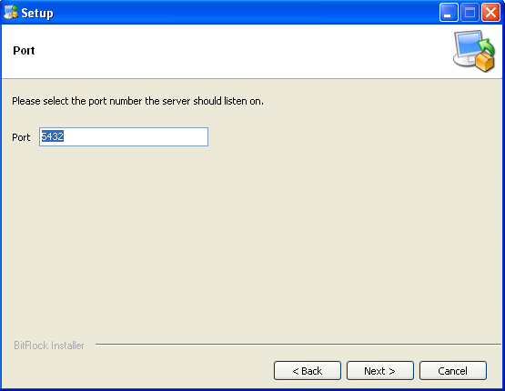

Accept the default database cluster locale.

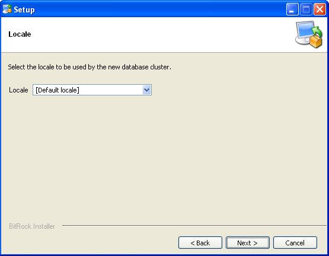

And start off the installation process.

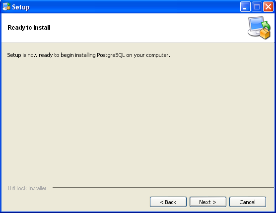

Watch it work.

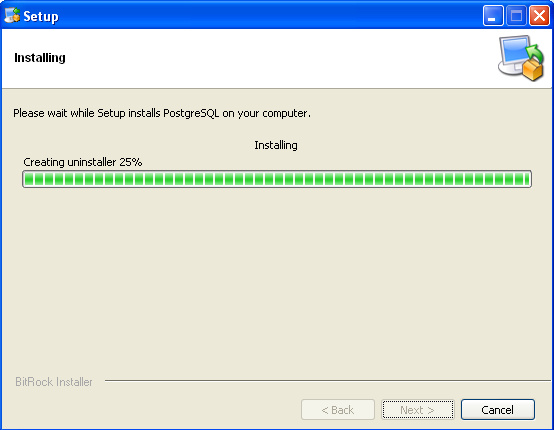

And hopefully you reach the conclusion without trouble.

.. note::

  The PostGIS installation can be launched directly from the PostgreSQL installer, by opting to "Launch Stackbuilder at exit".

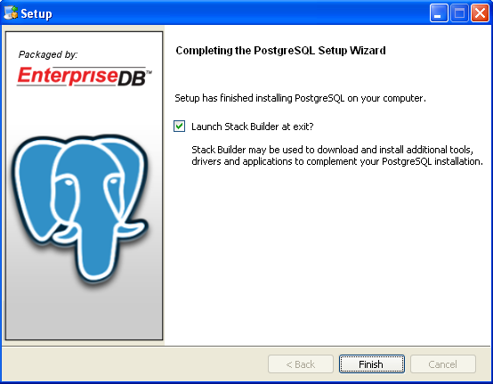

Installing PostGIS
------------------

If you neglected to launch the Stackbuilder during the PostgreSQL install process, you can still manually launch it from the PostgreSQL applications folder in the Windows Start menu.

The Stackbuilder will first try to determine which PostgreSQL software you want to download add-ons for. The correct answer should be the PostgreSQL instance on port 5432. Select it and click "Next".

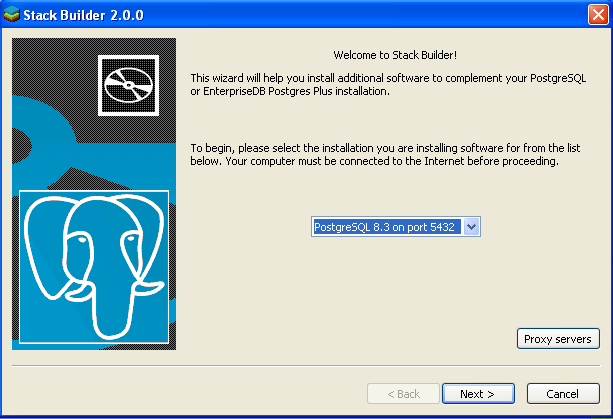

Now navigate into the "Spatial Extensions" menu and opt to install the latest version of PostGIS that is available. Click "Next".

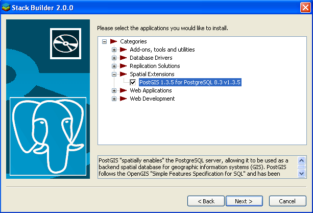

Select a suitable mirror site to download from (one close to you) and click "Next".

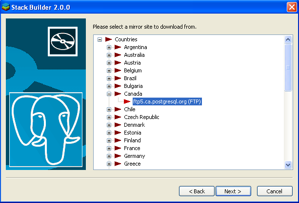

Accept the default download location. Click "Next".

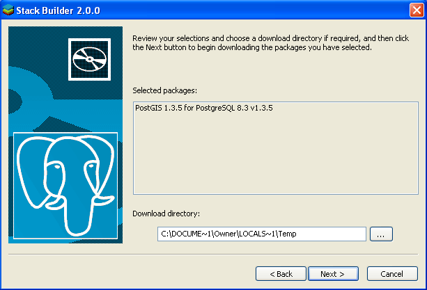

Stackbuilder will download the PostGIS package. When you click "Next", it will start the PostGIS install package.

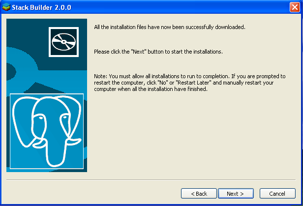

The PostGIS installer first displays the GNU GPL license for your acceptance. Click "I Agree".

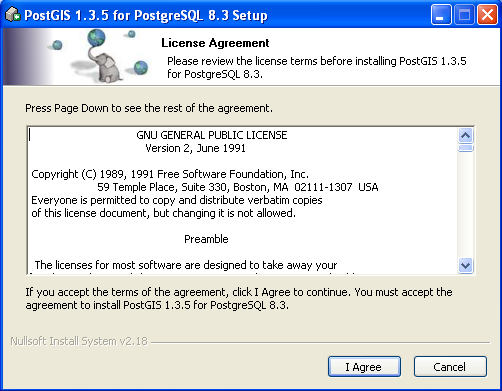

The PostGIS installer then asks which components to install. Ensure that both "PostGIS" and "Create spatial database" are checked. Click "Next".

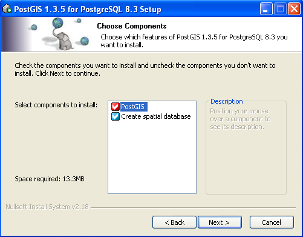

The PostGIS installer then figures out which PostgreSQL to install into. The default should be correct. Click "Next".

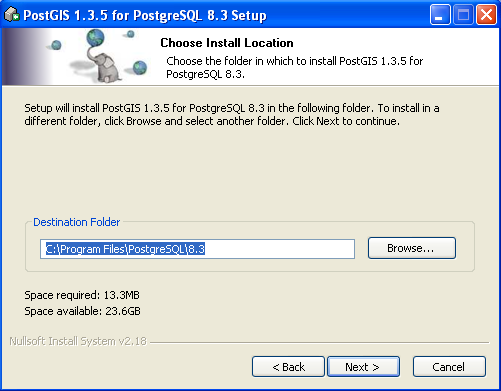

The PostGIS installer then asks for your super-user password. It should be "postgres", as you entered back in the PostgreSQL installation phase. Enter it and click "Next".

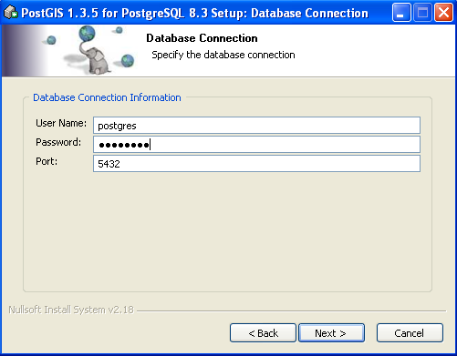

The PostGIS installer then asks for the name of the spatial database to create. This workshop will be using data from the City of Medford for examples, so our test database will be named "medford". Enter "medford" as the database name it and click "Next".

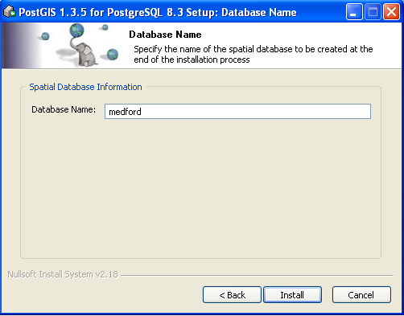

.. note:: 

  It is possible that while installing the PostGIS software, you will encounter the error below. **Do not panic.** It just means that the libiconv DLL file already exists in your database, and the installer cannot over-write it. Just press the "Ignore" button to complete the installation.

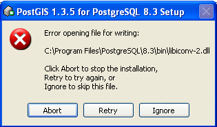

Hopefully the installation runs to completion and you see this.

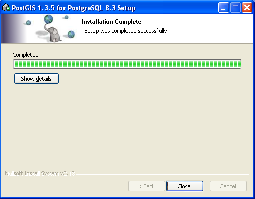

After the PostGIS installation completes, you'll exit back to the Stackbuilder, where you can click "Finish" to end the process.

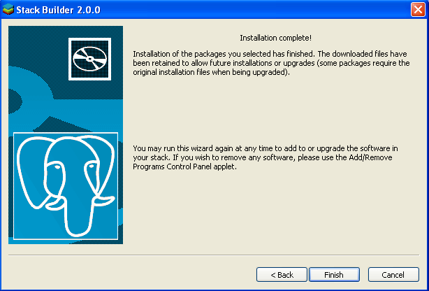

Installing the Medford Data
---------------------------

GIS data comes in a large number of formats, and there are tools available for loading data from those formats into spatial databases. The most widely used tools are:

* `Feature Manipulation Engine (FME) <http://www.safe.com/fme>`_ a proprietary tool from Safe Software that can read from hundreds of formats and includes a GUI workbench for configuring translations.
* `ogr2ogr <http://www.gdal.org/ogr2ogr.html>`_ an open source command-line tool that can read from tens of formats. The FWTools installer included in the workshop software directory contains the ogr2ogr tool.

Rather than load the data directly from the original files (which are available in the "shapes.zip" file in the workshop bundle) we will load the data by restoring PostgreSQL dump files to our database.

First, start up the "PgAdmin" graphical administration tool for PostgreSQL. You can find it in the PostgreSQL application folder in the Start Menu.

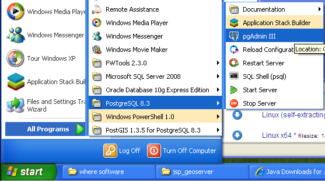

Double click the "PostgreSQL 8.3" entry in the list of servers (the entry with the red "X" on it).

You will be prompted for your database super-user password, and you can enter "postgres", since that's the value we chose back at the database installation step.

.. image:: ../img/data_install_25.png

Explore the database. You'll see a "medford" database, as well as a "postgres" database and a "template_postgis" database.  

The "template_postgis" database is a blank database with PostGIS already installed. It was created during the PostGIS install process. It is used when you want to create a new spatially enabled database -- in the database creation form, choose "template_postgis" as your template, and your new database will automatically be spatially enabled.

To load the Medford data, right-click on the "medford" database and select the "Restore..." option.

.. image:: ../img/data_install_26.png

In the restore form, click on the "..." to and navigate to the **data/** folder in the workshop bundle. Select the "medford.backup" file. When you are ready, click "OK" to start the data loading process. It may take a few minutes to load all the data.

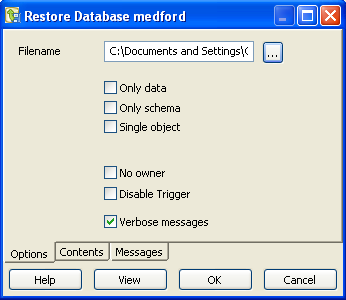

Click "OK" when the process is complete.

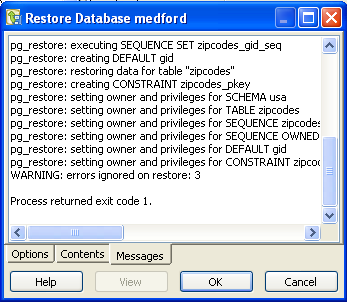

When the restore is done, you will find a new schema named "medford" in your database. If you open it up you will find a collection of tables inside.

.. note:: 

  You may have to click the "refresh" button in PgAdmin (the circular arrows at top left) to refresh the database browser tree and see the new schema.

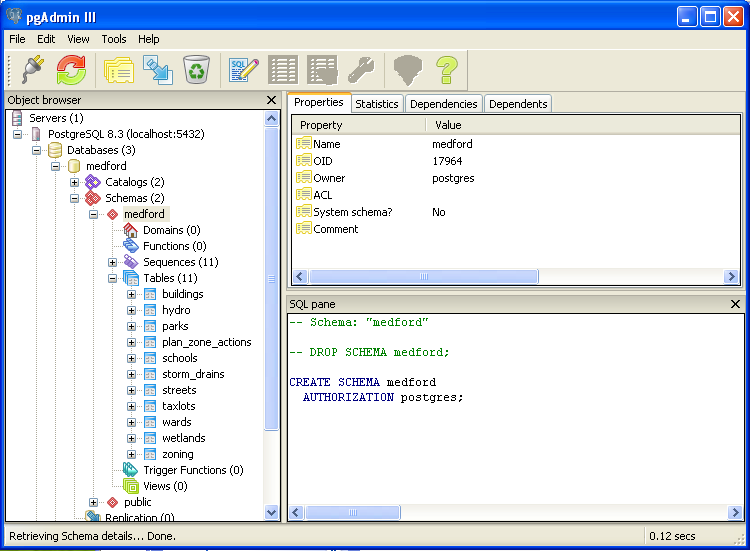

Repeat the restore process to load the "geometry_columns.backup" file.

* Right-click on the "medford" database entry.
* Select the "Restore..." option.
* Navigate to the workshop folder and select "geometry_columns.backup" as the restore file.
* *Click the **Only data** option.*
* Press "OK" to start the restore.

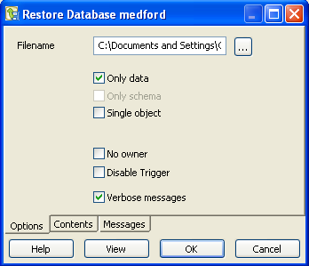

Repeat the restore process to load the "spatial_ref_sys.backup" file.

* Right-click on the "medford" database entry.
* Select the "Restore..." option.
* Navigate to the workshop folder and select "spatial_ref_sys.backup" as the restore file.
* *Click the **Only data** option.*
* Press "OK" to start the restore.

Installing Data with the Command Line
-------------------------------------

If you have an existing PostgreSQL / PostGIS installation (make sure your PostGIS >= 1.3.5) you can install the data by hand using the command line tools.

Create your database and spatially enable it:

::

  # createdb medford
  # createlang plpgsql medford
  # psql -f /path/to/lwpostgis.sql -d medford
  # psql -f /path/to/spatial_ref_sys.sql -d medford
  
Load the data files into the new database (note the "--data-only" argument in the last two commands):

::

  # pg_restore -d medford -U postgres medford.backup
  # pg_restore -d medford -U postgres --data-only geometry_columns.backup
  # pg_restore -d medford -U postgres --data-only spatial_ref_sys.backup  

Viewing the Medford Data
------------------------

You have spatial data loaded into your database! But how you can you tell?

You can browse the tables in the PgAdmin tool, and see the geometry values serialized as hexadecimal strings, but that is not very satisfying.

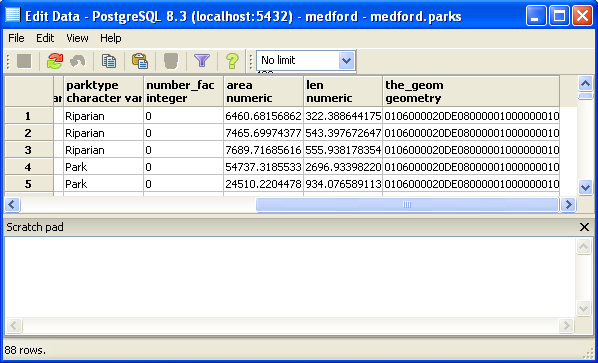

For a look at the data on a map, install the "uDig" software from the workshop **software/** folder. uDig is a desktop GIS viewing application, and it can view data in PostGIS and Oracle tables. No support for SQL Server, currently, though that is forthcoming.

Simply double-click the installer, accept all the defaults, and your install will be quickly complete.

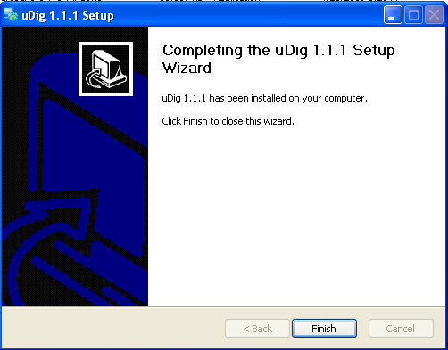

Fire up uDig, and open the workbench. In the "Layer" menu, select the "Add.." option.

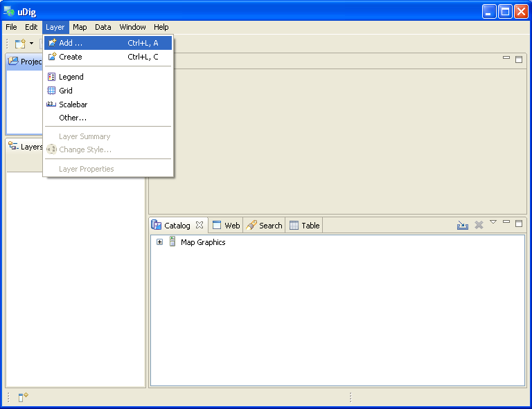

Choose PostGIS as the data source.

.. image:: ../img/udig_view_12.png

Fill in the connection parameters. The host is "localhost", the username is "postgres", the password is "postgres". The database is "medford", and **make sure** to change the schema to "medford" to. Click "Next".

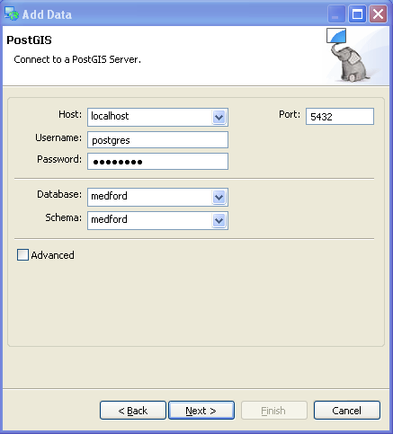

Now select which tables you want to view, or, if you like, select all of them.

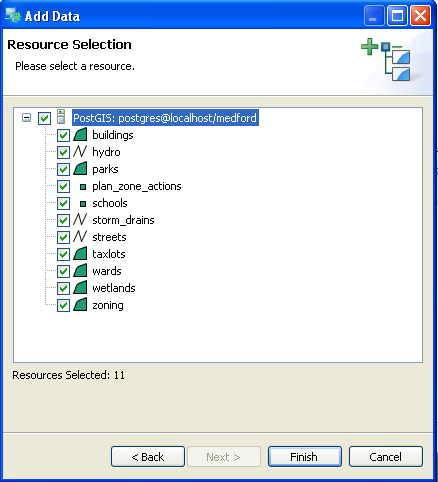

There's a lot of data, when you load up all the tables at the same time!

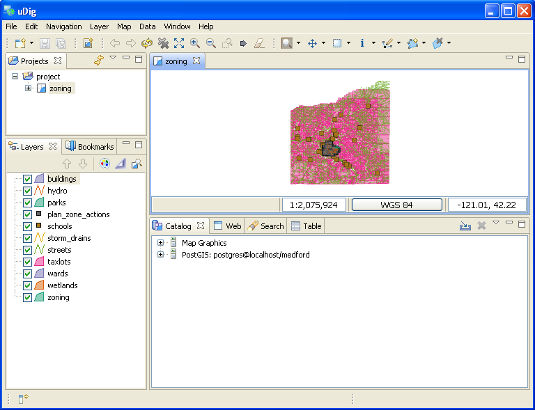

If you zoom in, though, you will see things begin to make sense. Explore the data a little and get a feel for what is in each table.

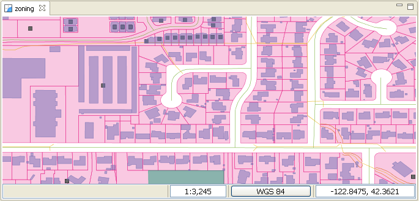

Installing Tomcat
-----------------

The Tomcat install for the workshop is not the default install you can `download <http://tomcat.apache.org/download-60.cgi>`_ from the Tomcat web site. We have taken Tomcat 6 and added in extra software and configuration for the workshop: 

* We have configured a JNDI database connection so that we can easily connect to our "medford" database in PostgreSQL.
* We have added a copy of GeoServer and configured it to pull layers from our "medford" database.
* We have added the scripts needed for our workshop examples.
* We have added a recent copy of OpenLayers.

To use Tomcat you will need a Java run-time installed first. You may already have one installed. You can check by opening up a terminal window (in Windows, choose "Run..." in the start menu, then type in "cmd") and running "java" at the command line. If you have Java installed, you will see some usage instructions. If you don't, you'll see an error message.

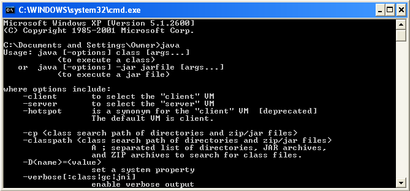

.. note::

  If you need to install Java, use the JRE included in the workshop software collection, "jre-6u13-windows-i586-p-s". Just double-click to start.

Once you have confirmed you have a working Java, or have installed Java, move on.
  
Unzip the "tomcat6-geoserver.zip" file included in the workshop software collection, to a location of your choosing (I like to put it at **C:\\**). Open a terminal window ("Run..." then "cmd") and navigate to the Tomcat directory. 

* Enter the "bin/" subdirectory
* Run "service.bat install" 
* Run "net start Tomcat6"

.. image:: ../img/tomcat_install_19.png

You should now have a running instance of Tomcat on your machine.

.. note::

  There are many ways for this process to go wrong. You might not have sufficient privileges to install the service: solution, use an account with those privileges. You might already have software using the network port (8080) that Tomcat uses: solution, stop that software, or reconfigure Tomcat to use a different port. Your firewall might disallow services opening on ports: solution, turn off your firewall, or make an exception for port 8080.
  
To test that Tomcat is now up and running, point your web browser at port 8080 on your local machine.

  http://localhost:8080/
  
You should see the Tomcat web server welcome page.

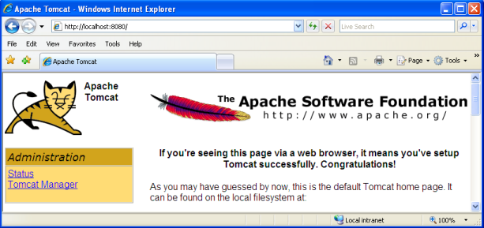

Uninstalling Tomcat
-------------------

To remove Tomcat from your system, you need to stop the service and then remove it from the registry.

* Open a terminal window
* Navigate to the Tomcat directory
* Enter the "bin/" subdirectory
* Run "net stop Tomcat6"
* Run "service.bat uninstall"

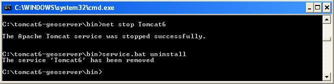

Now it is safe to delete the Tomcat directory from your hard drive.

Uninstalling PostgreSQL / PostGIS
---------------------------------

To remove PostgreSQL from your system, open the "Add or Remove Programs" tool from the "Control Panel" of your system. Choose the "Remove" option for PostGIS, then PostgreSQL.

.. image:: ../img/pgsql_install_22.png

