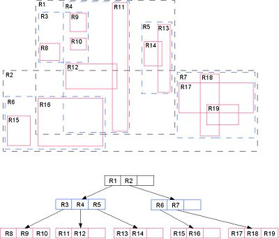

.. _introduction:

Introduction
============

Internet mapping with Google Maps and Virtual Earth is great fun, but there comes a day in every internet mapper's life when she wants to add a great deal of her own data to the site, and then the question becomes: where do I store it?

The mapping service providers would like you to store data in their own mapping APIs, like Google's MyMaps and Microsoft's collections. However, the API solutions are, like the map itself, optimized to relatively simple use cases. Store and extract. `CRUD <http://en.wikipedia.org/wiki/Create,_read,_update_and_delete>`_ operations. 

All the simple solutions end up ignoring the power of geography, they provide means of storing data, but no means of analyzing it.

  "Everything is related to everything else, but near things are more related than distant things", the `First Law of Geography <http://en.wikipedia.org/wiki/First_law_of_geography>`_

Storing spatial data in a spatial database provides a simple API (`SQL <http://en.wikipedia.org/wiki/Sql>`_) for CRUD operations as well as analysis operations. And true spatial databases provide the ability to use geography as a query parameter and operations parameter.

Spatial Databases
-----------------

Having decided to use a spatial database for your mapping application, what are your technology options? What is it that makes an ordinary database a "spatial database"?

Spatial Column Types
~~~~~~~~~~~~~~~~~~~~

An ordinary database has types for strings, numbers and dates.  A spatial database adds one or more types for representing geographic features. The basic geographic types are:

* GEOMETRY (abstract superclass)
* POINT (a single coordinate, usually but not necessarily 2 dimensional)
* LINESTRING (a set of two or more coordinates, with a linear interpretation of the path between the coordinates)
* LINEARRING (a linestring of three or more coordinates in which the start and end points are the same, usually not instantiable, but used to build polygons)
* POLYGON (a set of one or more closed linearrings, one exterior ring that defines a bounded area, and a set of interior rings that define exceptions (holes) to the bounded areas)
* MULTIPOINT (a set of points)
* MULTILINESTRING (a set of linestrings)
* MULTIPOLYGON (a set of polygons)
* GEOMETRYCOLLECTION (a heterogeneous set of geometries)

This basic model is defined in the Open Geospatial Consortium (:term:`OGC`) "Simple Features for SQL" (:term:`SFSQL`) specification and defines the playing field shared by all the particular spatial database implementations we will be discussing.

The :term:`SFSQL` specifies the particular rules for building valid geometries, the legal representations of geometries in both ASCII and binary form, and a set of basic functions for constructing, inspecting, measuring and manipulating geometries.

Spatial Indexes
~~~~~~~~~~~~~~~

An ordinary database provides "access methods" -- commonly known as indexes -- to allow fast random access to subsets of data.  Indexing for standard types (numbers, strings, dates) is usually done with b-tree indexes. `B-trees <http://en.wikipedia.org/wiki/B-tree>`_ partition the data using the natural sort order to put the data into quickly findable buckets. 

The natural sort order of numbers, strings, and dates is pretty easy to determine -- every value less than, greater than or equal to every other value. But what is the natural sort order of polygons?

Because polygons can overlap, be contained in one another, and are arrayed in a two-dimensional (or more) cartesian space, a B-tree cannot be used to efficiently index them. Real spatial databases provide a "spatial index" that gives fast random access answers to the question "which objects are within this bounding box"?

A bounding box is the minimum rectangle capable of containing any given feature. 

.. image:: ../img/mbr.png

Why bounding boxes? Because answering the question "is A inside B" is very computationally expensive in the case of polygons but very fast in the case of boxes. Indexes have to perform quickly. So instead of providing exact results, as b-trees do, spatial indexes provide approximate results. You might ask "what lines are inside this polygon" but the index can only efficiently answer the question "what lines have bounding boxes that are contained in this polygon's bounding box"? Even the most complex polygons and linestrings can be represented by a simple bounding box.

The actual spatial indexes implemented by various databases vary widely. The most common implementation is the `R-tree <http://en.wikipedia.org/wiki/R-tree>`_, but there are also implementations of `Quadtrees <http://en.wikipedia.org/wiki/Quadtree>`_, and `grid-based indexes <http://en.wikipedia.org/wiki/Grid_(spatial_index)>`_ in shipping spatial databases.

This is a picture of an R-tree index showing how each shape is proxied by a bounding box, and how the bounding boxes are built into a searchable tree structure.

But if spatial indexes only return an approximation, what good are they? If the approximation was as far as we got, they wouldn't be much good at all. But fully functional spatial databases include more than indexes, they also include functions capable of exactly testing the relationships between geometries. 

So the question,

  "what lines are inside this polygon"

is evaluated inside a spatial database as,

  "find the lines that have bounding boxes that are contained in this polygon's bounding box, **and then** test all those lines for exact geometric containment inside this polygon"

providing an answer that is both mathematically correct and computationally efficient.

Spatial Functions
~~~~~~~~~~~~~~~~~

An ordinary database will provide functions for manipulating the data during a query: concatenating strings, performing hash operations on strings, doing mathematics on numbers, extracting information from dates and so on.  A true spatial database must provide a complete set of functions for analyzing the components of geometries, the relationships between geometries, and manipulating geometries.

The functions fall into a few basic categories:

* *construction*, for building geometries from text and binary representations
* *serialization*, for outputting geometries into various text and binary representations (like :term:`KML`, :term:`GML`, :term:`JSON` and SVG)
* *predicates*, for testing relationships between geometries and returning true/false answers
* *analysis and measurement*, for returning numerical summaries (areas, lengths, distances) about geometries
* *accessors*, for stripping out parts from geometries (rings from polygons, points from linestrings, and so on)
* *builders*, that take geometry inputs and build new altered outputs (like unions, differences, buffers, convex hulls and so on)
* *aggregates*, that take geometry sets and return single resultants, union is the most common

The list of possible functions is very large, but a common set of functions is defined by the :term:`OGC` :term:`SFSQL` and implemented by all the spatial databases recommended in this workshop.

Real World Spatial Databases
~~~~~~~~~~~~~~~~~~~~~~~~~~~~

There are three spatial databases you might use with more-or-less equivalent functionality:

* `Oracle RDBMS with Spatial or Locator <http://www.oracle.com/technology/products/spatial/index.html>`_
* `SQL Server 2008 with Spatial <http://www.microsoft.com/sqlserver/2008/en/us/spatial-data.aspx>`_
* `PostgreSQL <http://postgresql.org>`_ with `PostGIS <http://postgis.net>`_

In each case, we start with a capable relational database, and add a set of spatial types, functions, and indexes. We will briefly discuss the relative features of each, but first here are some less well-known options.

* `IBM DB2 with Spatial Extender <http://www.ibm.com/software/data/spatial/>`_
* `IBM Informix with Spatial Blade <http://www.ibm.com/software/data/spatial/>`_

The two options from IBM are both fully functional, but we won't be covering them since they are relatively rare. Both follow the :term:`OGC` :term:`SFSQL`.

Finally, two options which are less optimal as spatial database options.

* `MySQL Spatial <http://dev.mysql.com/doc/refman/5.0/en/spatial-extensions.html>`_

MySQL Spatial has some substantial disadvantages.  On the plus side, it does have spatial types, functions and an index.  And it follows the :term:`OGC` specification for geometry representations.  However, the number of functions MySQL supports is very small, and as a result it is difficult to use the database for anything more complex that simple storage and retrieval-by-bounding-box use cases.  Additionally, because the spatial option is implemented in the (non-transactional) MyISAM table type, it is not possible to use spatial objects within transactions.

* `ArcSDE <http://www.esri.com/software/arcgis/arcsde/>`_

ArcSDE is properly a "spatial middle-ware" and has to some extent been subsumed into the larger `ArcGIS Server <http://www.esri.com/software/arcgis/arcgisserver/index.html>`_ product of late. It is deployed on top of a real RDBMS, spatial or otherwise, and provides a database-independent set of functionality that is consumed by other ESRI client software. Until recently, it was accessed strictly programmatically via Java or C APIs, but in newer versions includes a growing SQL dialect. Fortunately, the ESRI SQL flavor is also :term:`OGC` :term:`SFSQL` standard so concepts usable on Oracle or PostGIS are usable on newer ArcSDE instances as well.

The main drawback to ArcSDE is the complexity it adds, in licensing and management, to an installation. Rather than managing a single database, you manage the database and the middleware. And when ArcSDE is deployed on top of a real spatial database -- like Oracle, PostgreSQL/PostGIS, or SQL Server -- it is delegating the spatial aspects of queries to the back-end database anyways. Why not work with the database directly?

Oracle with Spatial or Locator
^^^^^^^^^^^^^^^^^^^^^^^^^^^^^^

Oracle Spatial was originally an "enterprise only" option for Oracle, which sharply reduced the number of users who could deploy it, given the high cost of Oracle Enterprise Edition. However, at version 9i, Oracle split the spatial functionality into "Locator" and "Spatial", with Locator being the less-functional version available in all Oracle database products, including the `free Oracle XE database <http://www.oracle.com/technology/products/database/xe/index.html>`_.

Since 9i, Oracle has migrated most of the core :term:`OGC` spatial database functionality from Spatial to Locator, but a `few notable exceptions remain <http://www.spatialdbadvisor.com/oracle_spatial_tips_tricks/55/oracle-locator-vs-enterprise-licensing-the-sdogeom-package>`_, in the category Oracle calls "geoprocessing".

- You cannot run a buffer operation in Locator.
- You cannot run a union operation in Locator.
- You cannot run an intersection operation in Locator.
- You cannot generate a centroid point in Locator.
- You cannot calculate area or length in Locator.

Note that the word "cannot" above actually means "cannot within the constraints of the license". In fact, all the necessary functions for the operations above ship in the ``MDSYS.SDO_GEOM`` package, and are available to users of Locator. However, if you use them in production without purchasing an Enterprise edition, be aware that you are contravening the license.

The full Oracle Spatial package includes more than just the license right to perform "geoprocessing", it also includes extension packages for more complex use cases in the geospatial domain:

* Linear referencing system (LRS) support
* Spatial analysis and mining functions and procedures (SDO_SAM package)
* Geocoding support (SDO_GCDR package)
* GeoRaster support
* Topology data model
* Network data model

In terms of raw number of features, Oracle Spatial is clearly in the lead in the spatial database world thus far.  

.. note::

  We will use the term "Oracle Spatial" to refer to spatial functionality in Oracle in general, rather than constantly switching between Locator and Spatial.

The Oracle Spatial functionality is a descendant of an earlier Oracle add-on called the "Spatial Data Option" (SDO), and the SDO moniker lives in lots of places in Oracle. The spatial type is called an ``SDO_GEOMETRY``, the functions live in the ``SDO_GEOM`` package, and so on. The SDO add-on actually pre-dates the :term:`OGC` :term:`SFSQL` specification slightly, and as a result most of the common functions in Oracle Spatial do not follow the :term:`OGC` function naming guidelines.  Of all the syntaxes, the Oracle one is the least standard, and that can make transposing examples to and from Oracle a little difficult at times. However, the basic types and semantics of operations remain the same.

You can get Oracle XE as a `free download from Oracle <http://www.oracle.com/technology/products/database/xe/index.html>`_. 

SQL Server 2008 with Spatial
^^^^^^^^^^^^^^^^^^^^^^^^^^^^

Microsoft is the most recent entrant into the spatial database game, with the 2008 release of SQL Server including spatial types, functions and indexes. Unlike Oracle, Microsoft is including their full spatial functionality in every edition of SQL Server, even the free Express edition.

Microsoft joined the :term:`OGC` and followed the :term:`SFSQL` while implementing the new functionality for SQL Server, and as a result, their implementation is very familiar to users of other :term:`SFSQL` products.  The biggest difference in syntax has more to do with SQL Server than spatial -- because Microsoft has adopted "object oriented" ideas in their extended types for SQL Server, functions are expressed as methods on objects or as static methods in the geometry class.

For example, where a PostGIS query might look like this:

.. code-block:: sql
  
  SELECT * FROM the_table 
  WHERE ST_Intersects(
          the_geom, 
          ST_GeomFromText('POINT(0 0)',0)
        );

The equivalent SQL Server query would be:

.. code-block:: sql

  SELECT * FROM the_table 
  WHERE the_geom.STIntersects(
          geometry::STGeomFromText('POINT(0 0)',0)
        );

Note also that Microsoft opted to not use the underscore "_" character to separate the ST prefix from the rest of the method name.

The primary limitation of SQL Server is the platform limitation -- you can only run it on Windows servers.  With virtualization technology, that's less of a restriction than it used to be, but it is still a limitation.  

A particular limitation of SQL Server Spatial is that it does not include support core coordinate reference system transformation. That may sound like an obscure piece of functionality, but we'll see later on that once you start working with other people's data, it is quite common to use coordinate reference system transforms.

The SQL Server spatial index also differs substantially from that used by Oracle or PostGIS. Rather than an R-tree (used by PostGIS and Oracle), SQL Server uses a `multi-level grid scheme <http://technet.microsoft.com/en-us/library/bb964712.aspx>`_. From a database developer perspective, this has allowed the Microsoft spatial team to integrate with SQL Server without requiring a whole new index method, since the grid can be indexed using standard b-trees.  In general, grid index schemes have been popular in the past, and the main drawback for users is the need to occasionally re-tune the grid-size and grid-levels for data with heterogeneously sized objects (both very large and very small objects).

SQL Server Express is included with Visual Studio, but you don't need to buy Visual Studio to get it. Simply download the SQL Server Evaluation version from Microsoft, then during installation select the free Express installation option.  You can get the `SQL Server Evaluation <http://www.microsoft.com/sqlserver/2008/en/us/trial-software.aspx>`_ from Microsoft, and MSDN members should already have access to it.

PostgreSQL with PostGIS
^^^^^^^^^^^^^^^^^^^^^^^

Like Informix (and unlike Oracle and SQL Server) PostgreSQL was `designed from the very start <http://www.postgresql.org/about/history>`_ with type extension in mind -- the ability to add new data types, functions and access methods at run-time.  Because of this, the PostGIS extension can be developed by a separate development team, yet still integrate very tightly into the core PostgreSQL database.  

PostGIS began following the :term:`OGC` :term:`SFSQL` document early in the development process, and it achieved full specification coverage around the 0.9 release.  Because it has an engaged user community, the development team has been able to take feedback and use that in adding new features and functions to the database.  

The ISO SQL/MM-Spatial specification, which is a superset of the :term:`SFSQL` document, is now being used as a development guideline in function and type naming. So, the SQL function syntax used by PostGIS is the same as DB2, Informix, ESRI, and Netezza which all use the ISO specification as a guideline.

PostGIS and PostgreSQL are both open source software projects, licensed under the `GNU GPL <http://www.opensource.org/licenses/gpl-2.0.php>`_ and `BSD <http://www.opensource.org/licenses/bsd-license.php>`_ licenses, respectively.  

PostgreSQL can be downloaded from http://postgresql.org/download in source or binary form. Binary builds include the "stack builder" utility, which can be used to directly download an appropriate binary build of PostGIS. The PostGIS source code and documentation are available from http://postgis.net/.
