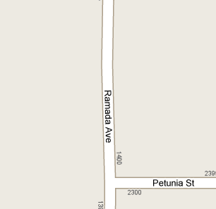
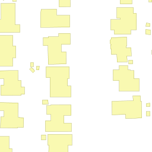
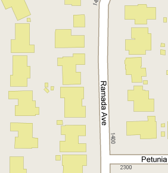
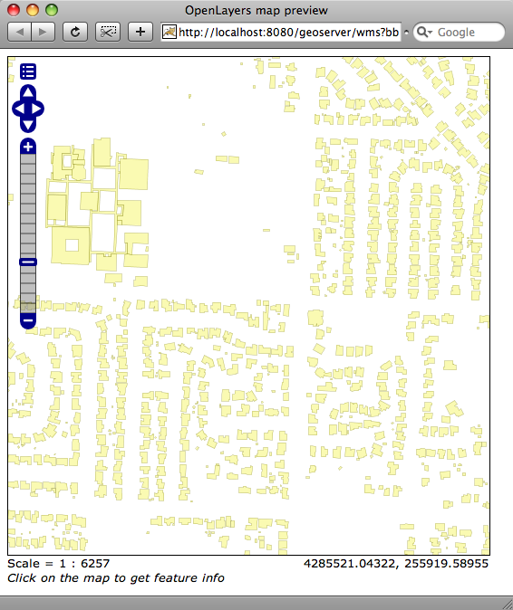
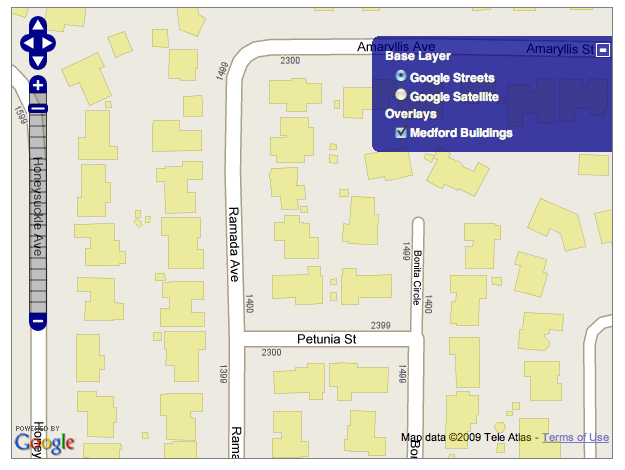

.. _map-with-wms:

Base Map with WMS Overlay
=========================

If you have installed the PostGIS database, Medford data, and Tomcat, you should be able to view the functioning example here:

  http://localhost:8080/spatialdbtips/00-map-with-wms.html
  
Once you have put a mapping component into your web site, whether it be Google Maps or Virtual Earth or OpenLayers, the next question becomes: "how do I get other data on that map?!"

All the standard mapping components allow you to create "tile overlays", basically secondary tile sets that are laid on top of the base map, and, through the magic of transparency, show other features in context.

But, how to create those tile overlays from our spatial database? The answer is a rendering engine.

We have chosen GeoServer for our example rendering engine, but any engine will do, as long as it meets these criteria:

* Reads from your database of choice.
* Is fast enough at drawing your layer.
* Outputs standard image formats.
* Speaks the :term:`WMS` standard.

The last criteria (standards support) is not actually critical, but can save you lots of time hand-writing connectivity to the rendering engine. Among the renderers that meet the criteria (and the databases they support) are:

* GeoServer

  - PostGIS, Oracle, ArcSDE, DB2

* Mapserver

  - PostGIS, Oracle, ArcSDE, SQLServer

* ArcGIS Server

  - ArcSDE

* ArcIMS

  - ArcSDE

* Oracle Mapviewer (for Oracle)

  - Oracle

* Mapguide

  - PostGIS, Oracle, SQLServer, ArcSDE

The overlay works by taking combining the unadorned base map tile from your map provider,

with the transparent rendering of your features of interest from the rendering engine,

to create the visual illusion of a single composed map.

Our Rendering Engine
--------------------

We are using GeoServer for rendering. You can explore the configuration of GeoServer using the web administration interface.

  http://localhost:8080/geoserver/
  
To see the various layers in our database rendered into web clients, check the "Map Preview" area in the "Demo" page accessible from the front of the GeoServer interface.

Our User Interface
------------------

Since we are using OpenLayers, adding an overlay is a very simple matter. Here are the relevant bits of the HTML file.

At the top of the file, in the "<head>" section, we load the mapping APIs we need: Google to access their tile base, and OpenLayers for the rest of our functionality.

.. code-block:: html

  <!-- Load the Google Maps API, using our localhost API key -->
  
  <!-- Load the OpenLayers API library and stylesheet -->
  <link rel="stylesheet" href="OpenLayers-2.7/theme/default/style.css" type="text/css" />
  
 
Then we define the Javascript that configures our map. For all our examples in this workshop, we will initialize the Google base map layers in an **initMap()** function:

.. code-block:: javascript 
    
    var lon = -122.8450;
    var lat = 42.3438;
    var zoom = 18;
    var map;

    //
    // Common code to create a map object and add the Google base layers
    //
    function initMap() {
        map = new OpenLayers.Map( 'map' ,
        {controls:[new OpenLayers.Control.MouseDefaults(),
                   new OpenLayers.Control.LayerSwitcher(),
                   new OpenLayers.Control.PanZoomBar()], 
         numZoomLevels:20});

        var gmap = new OpenLayers.Layer.Google(
            "Google Streets" // the default
        );
        var gsat = new OpenLayers.Layer.Google(
            "Google Satellite",
            {type: G_SATELLITE_MAP}
        );
        map.addLayers([gmap, gsat]); 
        map.setCenter(new OpenLayers.LonLat(lon, lat), zoom);
    }

The **initMap()** function actually adds two base layers, a street map and a satellite image layer. You can toggle between them here (and in all the subsequent examples) using the layer switcher hidden under the "+" sign at the top right edge of the map.

The WMS creation comes after the map is set up. We create a new WMS layer, with a URL pointing at our local GeoServer and the layer "medford:buildings" we want rendered. Note that we set transparency on (to allow the overlay to work) and use a format (image/png) that support transparency.

.. code-block:: javascript 
        
  function init(){

    initMap(); // Set up base map

    // Initialize WMS layer from our local GeoServer
    var bwms = new OpenLayers.Layer.WMS( "Medford Buildings",
                    "http://localhost:8080/geoserver/wms?",
                    { "transparent":"true",
                      "layers":"medford:buildings",
                      "format":"image/png" },
                    { "reproject":"true" }
                    );
                          
    // Add WMS layer to our map
    map.addLayer(bwms);

  }

Finally, in the HTML body of the page, we just set up a "
" element to accept the name and ensure the map initialization function is called after the body is loaded.

.. code-block:: html 

    <body onload="init()">
      

    </body>

These basic structures -- loading the APIs, creating a base map, adding an overlay layer -- will show up in all the subsequent examples, but will be ignored henceforth, only the "interesting bits" will be described.
