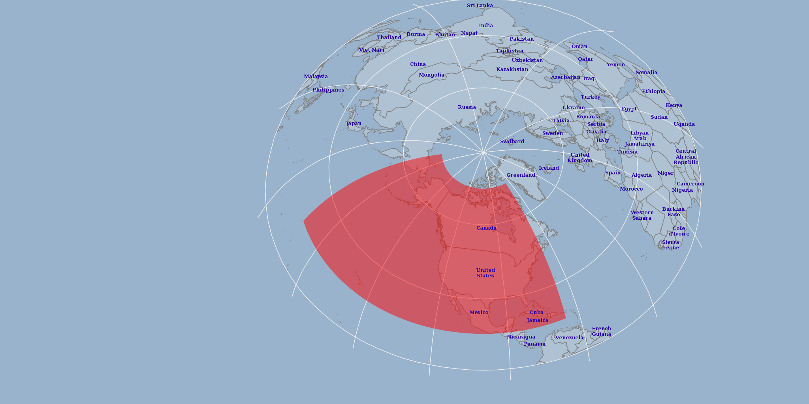

Coordinate reference systems
============================

Before we continue with adding more data, we will want to see how to standardize the CRSs that our layers and our project are using. We will be using a CRS named **US National Atlas Equal Area** (known by the code EPSG:2163) for this workshop.

   **US National Atlas Equal Area**

#. To see what CRS any particular layer is in, right click a layer name and select :guilabel:`Set Layer CRS`. Open the CRS settings for the **2016_Antelope_Hunt_Areas** layer.

   .. figure:: images/layers_panel.png

      Layer CRS

#. Close the dialog when finished.

#. To alter the data so that it is using a new CRS, we will need to save it into a new file. Once again, right click the layer and select :guilabel:`Save As`.

#. To change the CRS setting click |select_CRS| (:guilabel:`Select CRS`).

#. From the list of CRS's, select **EPSG:2163**.

   .. note:: You can use the filter box to quickly find the CRS that you are looking for.

#. Set the new file name to ``qgis/data/2016_Antelope_Hunt_Areas.shp``.

   .. note:: We will keep all the correctly projected data in the ``qgis/data`` directory.
   
   .. note:: A full path is required to be provided in order for the file save to succeed.

#. Click :guilabel:`OK` to save the new file.

#. Repeat this process for the **SurficialGeology500k** layer.

#. Remove each of the previous layers in the project by right clicking them and selecting :guilabel:`Remove`.

#. Ensure that the new layers are added to the project.

#. Drag and drop the layers in the list so that the **2016_Antelope_Hunt_Areas** layer is first. You should now see that the two layers line up on the map.

   .. figure:: images/reprojected_layers.png

      Aligning layers in the project

#. Right click on a layer in the list and select :menuselection:`Set Project CRS from Layer`. From now on our project will be using the **US National Atlas Equal Area** spatial reference system. However whenever we add any new data to our project, it will only be **displayed** in the desired projection. It will still need to converted to the **EPSG:2163** CRS before we run any processes.

   .. note:: You may now use the :guilabel:`Project CRS` option when saving files.

             .. figure:: images/project_crs.png

                Using the project's CRS

