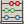

Processing first steps
======================

Dissolve
--------

Our newly-styled map has one obvioius visual flaw: our herds are divided into several subzones which are all coloured and labelled identically. To better display the data, we can remove the borders that divide the herd units so that each is only labelled once with no internal borders.

To do this, we will use one of QGIS's processes named **Dissolve**, which merges multiple polygons when the attribute values are identical.

#. Ensure that the processing toolbox is open.

#. Use the process filter to search for an algorithm named :kbd:`dissolve`.

   .. figure:: images/processing_dissolve.png

      Filtering process list

   You will see that there are several matches for the dissolve algorithm because QGIS supports processes from a number of sources.

#. Double click the **Dissolve** process from the :guilabel:`QGIS geoalgorithms` section. A new process configuration dialog will open.

#. Set the input layer to **ant14hh**.

#. Set :guilabel:`Dissolve all` to **No** since we do not want to merge all polygons.

#. Change the :guilabel:`Unique ID field` to **HERDNAME**.

#. Click the ellipsis and then select :guilabel:`Save to file`.

#. Save the new layer as ``workshop\data\epsg4267\ant14hh_dissolved.shp``.

#. Ensure that :guilabel:`Open output file after running algorithm` is checked.
   
#. Now that the process has been configured, click :guilabel:`Run` to start the process. Once finished our new layer will be added to the project.

#. We can reuse our previously-created style by right clicking **ant14hh** and selecting :guilabel:`Copy Style`.

#. Right click the new **Dissolved** layer and selecte :guilabel:`Paste Style`.

#. Finally, remove the original **ant14hh** layer from this project.

   .. figure:: images/dissolved_herdname.png

      Dissolved herd name layer

Field calculator
----------------

If we look at the features using the :guilabel:`Identify features` tool, we can see that our features contain **Shape_Area** and **Shape_Leng** (perimeter) attributes. Since we reprojected the data to a new CRS and then merged polygons together, these values are no longer going to be correct. QGIS's field calculator can be used to programmatically set the value of a layer's attributes.

#. Ensure that the **Dissolved** layer is selected.

#. Right click the layer name and select :guilabel:`Toggle Editing`.

#. Click the |field_calc| button in the toolbar to open the field calculator.

#. Check the :guilabel:`Update existing field` box.

#. Select **Shape_leng** from the drop down box.

#. Open the :guilabel:`Geometry` section in the :guilabel:`Function list` box.

#. Double click :guilabel:`$perimeter` so that it appears in the :guilabel:`Expression` box.

   .. figure:: images/field_calc_perimeter.png

      Calcualate polygon perimeter

#. Click :guilabel:`OK`. QGIS will now calculate the perimeter length of each polygon and store the result in the **Shape_leng** attribute, overwriting any previous value.

#. Repeate this process for the **Shape_area** attribute, but using the :guilabel:`$area` function.

#. Once again right click the layer name and select :guilabel:`Toggle Editing` to save the changes we made to this layer.

