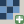

Raster data
===========

#. We can add some raster data by clicking the |raster| icon next to the layer list.

#. Select the ``dem_90m.zip`` file in the ``workshop\downloads`` directory.

#. Save the file as ``dem_90m.tif`` in the ``workshop\data`` directory with the correct **EPSG:4267** CRS.

#. Remove the old file and add the new GeoTIFF to the project.

   .. figure:: images/dem.png

      Digital elevation model

#. Repeat the conversion process with ``gaplandcov_WY.img``.

#. Add the new file to the project.

#. Copy the style from the original to the reprojected land cover layer.

   .. figure:: images/landcover.png

      Land cover layer

#. Remove the old file from the project.

