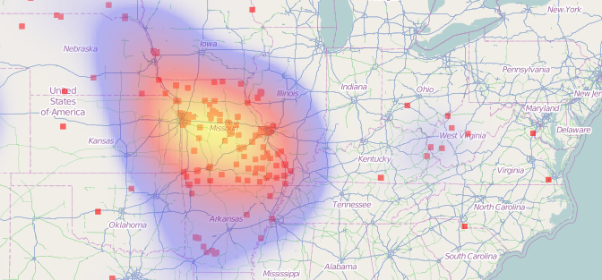

QGIS
====

`QGIS <http://qgis.org>`_ is a free and open-source desktop Geographic Information System (GIS) application that allows the user to create, edit, display and publish spatial data, in addition to providing a platform for spatial analysis.

  Spatial analysis of the density of points can be used to generate heatmaps

QGIS was originally founded with the name Quantum GIS, with the 'Q' in its name a reference to the `Qt <http://qt-project.org>`_ C++ application framework. Because Qt is a cross-platform toolkit, QGIS is available on Linux, Windows, OSX and other computing platforms. Today, QGIS has evolved into a powerful GIS tool used by professionals around the world to work with their geospatial data.

Plugin ecosystem
----------------

QGIS itself is a tool which can accomplish many tasks, but it is especially powerful in that it can be extended with plugins easily to provide even more functionality. There is a large number of plugins which have developed by members of the community and which can be downloaded through the integrated QGIS plugin manager.

Processing
----------

One of the most important plugins -- and one which is now included by default in QGIS -- is the processing plugin, formerly known as SEXTANTE. The processing plugin adds some important analytical tools for GIS professionals:

* a graphical environment for running spatial algorithms
* a Python scripting environment for writing new spatial algorithms
* access to algorithms provided by third-party applications, such as GRASS, SAGA, Orfeo and more
* a graphical modeller that can be used to 'chain' algorithms together
