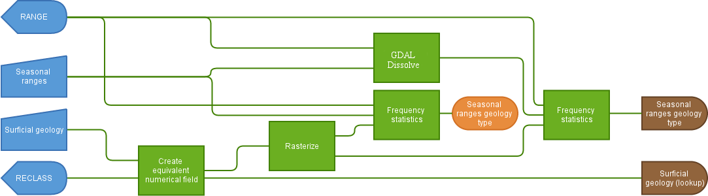
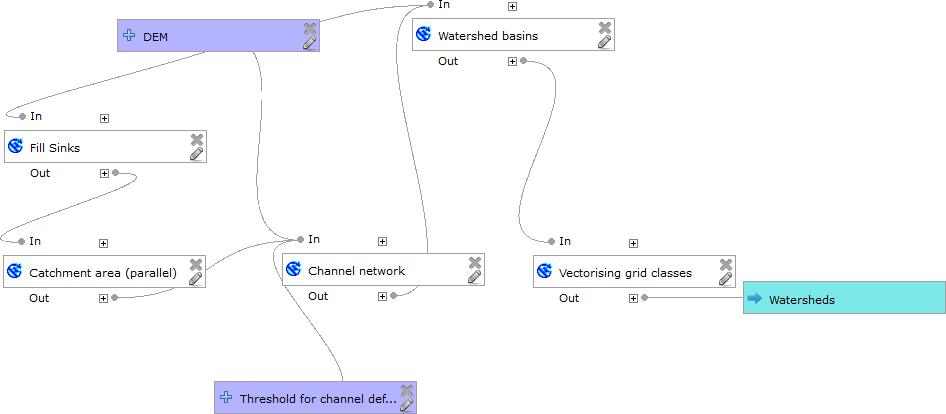

Reusable components
===================

Since our initial analysis of ranges based on geology did not seem to produce the results we had hoped for, we can repeat the analysis with another data set to see if we can pin down what influences the seasonal land usage of Wyoming's antelopes. Before we start however, we should recognise that all the steps that we performed will be identical each time we do this type of analysis.

For example, if we look at the various inputs and outputs, we can see that we supplied four parameters (two layers and one attribute from each); if we decide to use a different data set (for example, instead of **Surficial geology**, we may use a layer that shows soil types) we merely need to alter the inputs, but the process remains the same.

Below is a simplified flowchart that shows the inputs and outputs of the entire processing chain:

   Inputs and outputs for **Surficial geology** analysis

.. note:: The simplification in this diagram is that we are not showing the creation of the **Surficial geology baseline** table.

QGIS allows us to create reusable "models" which define a set of inputs and steps so that we can create reusable components to use with different data inputs. This section will focus on creating these type of models.

   QGIS model

Raster model
------------

Our next target will be the **Land cover** layer, which means we can skip some of the processing steps in the diagram above by starting after the **Rasterize** step since it is already a raster layer.

In total, we'll need the following inputs: a raster image, a vector layer containing the zones to analyse (the **Seasonal ranges** layer) and an attribute from that layer to classify the zones (the **RANGE** attributes). We could hard code the **Seasonal ranges** layer and the **RANGES** attribute in our model definition; however, we can also imagine that we might want to apply this same process to a layer that contains data for a different year or for a different animal species (the same website where we retrieved the antelope data also has similar data sets for bighorn sheep, elk, moose, goats and two species of deer).

As outputs, we should get a layer which has an extra **MAJ** attribute showing the most common land cover type and a table which has the complete breakdown of land cover types for each range.

Because we are starting from a raster, we will need to refer to the layer's metadata to understand the meaning of the different raster band values. In this case, the ``gaplandcov_wy.zip`` contains a file named ``gaplandcov_WY.img.vat.dbf``, which can be loaded into QGIS and which contains a description of each value, such as ``86`` meaning "cultivated cropland".

#. Move ``gaplandcov_WY.img.vat.dbf`` to the ``qgis/reference`` directory.

#. Add the file to the project's **Reference** group and rename it :kbd:`Land cover (reference)`.

#. Confirm that the values in the **Land cover** layer appear to match the reference table. For example, the red developed areas on the map have a value of ``583``, which is recorded as "Developed, Medium Intensity" in the reference table.

   .. figure:: images/landcover_developed.png
   
      Developed areas
