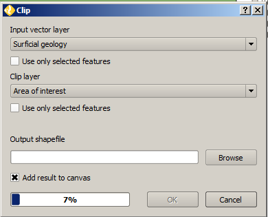

Clipping
========

Because our area of interest is less than the entire state of Wyoming, let's eliminate some unnecessary data from some of our other layers by running clipping processes that will throw out all the data which does not fall inside the bounds of the **Area of interest** layer.

Vector
------

First, let's throw out some features from the **Surficial geology** layer.

#. Save your QGIS project.

#. In the main menu, select :menuselection:`Vector --> Geoprocessing Tools --> Clip` process.

   .. note:: The **Processing Toolbox** also contains a **Clip** process and we could have used that option as well.

#. This particular process takes two inputs, a :guilabel:`Input vector layer` which will be clipped and a :guilabel:`Clip layer` which will be used to determine the extents to clip. There is one layer as an output.

#. Set :guilabel:`Input vector layer` to **Surficial geology**.

#. Set :guilabel:`Clip layer` to **Area of interest**.

#. Set the output to be a new file named ``workshop\data\surfgeol_500k_clipped.shp``.

#. Check the :guilabel:`Add result to canvas` box.

   Configuring the vector clip process

#. Click :guilabel:`OK` to start the process.

   .. warning:: This process can take a very long time to run as there are many features in the **Surficial geology** layer.

#. Once the process has completed, click :guilabel:`Close`.
   
#. Copy the original **Surficial geology** style to the new layer.

#. Remove the old **Surficial geology** layer.

#. Rename the clipped layer to be :kbd:`Surficial geology`.

Raster
------

Next, let's clip the **Digital elevation model** layer since it too covers Wyoming in its entirety.

#. In the properties for the **Digital elevation model**, note that the :guilabel:`Transparency` tab has :guilabel:`No data value` set to :kbd:`-32768`.

#. In the main menu, select :menuselection:`Raster --> Extraction --> Clipper` process.

   .. note:: The **Processing Toolbox** also contains a **Clip** process and we could have used that option as well.

#. Set the :guilabel:`Input file` to **Digital elevation model**.

#. Set the :guilabel:`Output file` to ``workshop\data\dem_90m_clipped.tif``.

#. Set the :guilabel:`No data value` to :kbd:`-32768`.

#. Change the :guilabel:`Clipping mode` to :kbd:`Mask layer`.

#. Set the :guilabel:`Mask layer` to **Area of interest**.

#. Make sure that :guilabel:`Load into canvas when finished` is checked.

   .. figure:: images/clipper_process.png
   
      Configuring the raster clipper process

#. Click :guilabel:`OK` to start the process.

#. Once the process has completed, click :guilabel:`Close`.

#. Remove the old **Digital elevation model** layer.

#. Rename the newly-clipped layer to **Digital elevation model**.

#. Repeat this process for the **Land cover** layer (remembering to copy the style from the old to the new layer).
