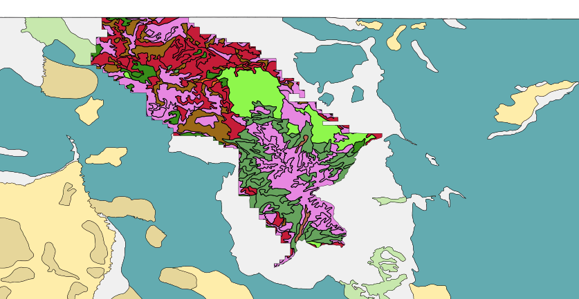

Running processes
=================

To run a process from the toolbox, you will need to provide inputs, which can be layer names, attribute names, numbers or other variables, and outputs, which are usually layers but can be something else. For example, our **Dissolve** process took a layer and an attribute name as inputs and provided a new layer as an output. As a reminder the process merged neighbouring polygons when the values of the designated attribute were identical, and we used this to combine several hunt areas into single herd units.

Area of interest
----------------

Let's revisit the **Dissolve process** and change some of the input parameters to see how they will change the results. Instead of focusing on the herd units, let's create a new layer with just a single feature that shows the area covered by our antelope data. We are doing this because when we enable the **Seasonal ranges** and **Surficial geology** layers, we can see that the ranges layer does not in fact cover the entire state of Wyoming (for example, areas which are covered by large bodies of water or are mountains of very high elevation are excluded). 

   **Surficial geology** layer is visible

#. Configure the **Dissolve** process again with an input layer of **Herd units**, but this time we will set :guilabel:`Dissolve all` to **Yes** since we want to dissolve all borders to create the single feature.

   .. note:: We could have used the **Antelope ranges** as the input since the extents of both these layers are identical.

#. Save the new file to ``qgis\data\area_of_interest.shp``. 
   
#. Rename the layer :kbd:`Area of interest`.

   .. figure:: images/aoi.png
   
      **Area of interest** layer
