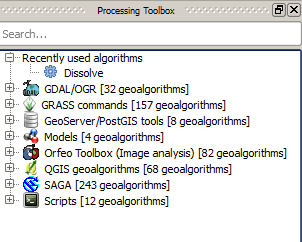

Processing toolbox
==================

Let's now take a closer look at the processing toolbox that we used earlier to dissolve the internal borders of the herd areas.

   Processing toolbox

Categories
----------

The different categories refer to different collections of algorithms that can be used from within QGIS. First in the list should be the :guilabel:`Recently used algorithms`, which will contain just the **Dissolve** algorithm since that is the only process we have used so far.

The remaining categories mostly refer to external open-source programs which QGIS calls on for processing and analytical tasks.

GDAL/OGR
^^^^^^^^

`GDAL and OGR <http://www.gdal.org>`_ are a collection of raster and vector tools respectively which form the core of QGIS's spatial functionality as well as the backbone of a number of other spatial programs. GDAL is required by QGIS and these processing algorithms will always be present.

GRASS
^^^^^

`GRASS GIS <http://grass.osgeo.org/>`_ is a software suite for geospatial data management and analysis. Although GRASS is often used as a standalone program, QGIS can also use GRASS's implementation of many spatial algorithms. The community distribution of QGIS includes the GRASS suite of algorithms.

Models
^^^^^^

The :guilabel:`Models` section allows us to further exploit the power of the processing tasks in the other sections. We will be working with the modeller to build some reusable processing workflows.

Orfeo Toolbox
^^^^^^^^^^^^^

`Orfeo Toolbox <http://orfeo-toolbox.org/>`_ is a set of algorithms for large-scale raster images. Like GRASS, QGIS provides access to the Orfeo set of algorithms, but they may not be available if the required libraries aren't installed.

QGIS geoalgorithms
^^^^^^^^^^^^^^^^^^

QGIS itself implements a number of geospatial algorithms for both raster and vector data.

SAGA
^^^^

`SAGA <http://www.saga-gis.org>`_ (System for Automated Geoscientific Analyses) is another standalone GIS program that QGIS can employ to run geospatial algorithms. Like GRASS and Orfeo Toolbox, the SAGA algorithms are bundled with QGIS packages.

Scripts
^^^^^^^

Finally, QGIS comes with a powerful `Python <https://www.python.org/>`_-based API named `PyQGIS <http://docs.qgis.org/testing/en/docs/pyqgis_developer_cookbook/>`_ that can be used to write custom processing scripts. By default, QGIS ships with a few sample PyQGIS algorithms, and we will be adding to this default set of scripts during this workshop.

Script installation
~~~~~~~~~~~~~~~~~~~

We will be using a few custom scripts in this workshop:

* :download:`EquivalentNumField.py <downloads/EquivalentNumField.py>`
* :download:`FrequencyStats.py <downloads/FrequencyStats.py>`

#. Download the script.

#. In the processing toolbox, open :menuselection:`Scripts --> Tools --> Add script from file`.

   .. figure:: images/add_script_from_file.png

      Add a new processing script

#. Repeat for all the scripts needed in this workshop.

.. note:: An alternative means of installing scripts is to copy them directly into ``.qgis/processing/scripts`` in the user's home directory.
