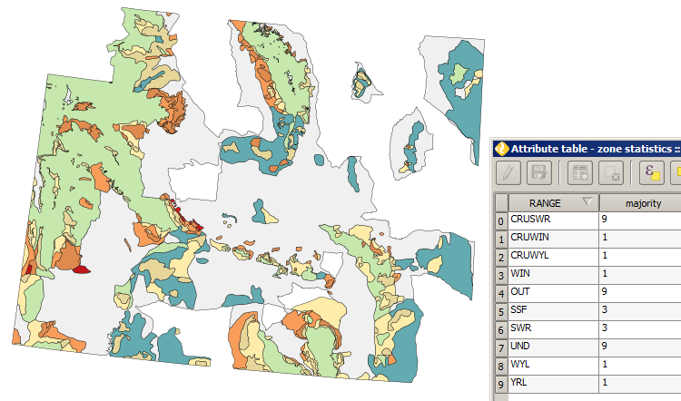

Other applications
==================

Seasonal ranges
---------------

The processes and models that we have created are easily applicable to other data on the `Wyoming Game and Fish Department <http://wgfd.wyo.gov/web2011/wildlife-1000819.aspx>`_ website; for example, we might want to run the same processes for other animal ranges, such as bighorn sheep. We only need convert any of the seasonal ranges data sets to the correct CRS and use our **Zona anlysis** models to calculate the majority layer, statistics and a baseline to compare against.

For example, the elk seasonal ranges are perhaps more interesting than antelopes in that there appears to be much tighter corrleation between their land usage and the surficial geology types. We may recall that geology type ``ri`` was the most common in inhabited areas. However, elk land statistics indicate that they avoid these areas and generally prefer the types ``sci`` and ``Ri``.

   Elk seasonal ranges and surficial geology majorities

General
-------

Other ideas that show the power of reusable processes could be:

* What is the majority racial component in each state/province?
* What is the majority landuse in each census unit? Graph against each census unit's Longterm Limiting Illness score (UK Census).
* What is the majority landuse in each salmon watershed? Graph against each watershed's 10-year salmon population average.
* Which songbirds prefer fragmented forest?
