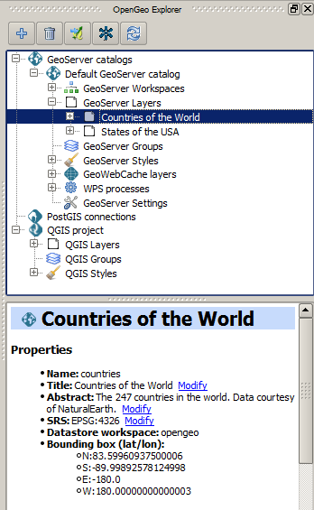

OpenGeo Explorer
================

OpenGeo Explorer is a plugin for configuring the components of OpenGeo Suite through QGIS. It can be used to prepare data in PostGIS or style and publish directly to GeoServer, all within the QGIS interface. OpenGeo Explorer makes it easier than ever to go from desktop to server, using all the functionality of QGIS to configure GeoServer.

   OpenGeo Explorer

When the OpenGeo Explorer is activated, it displays a list of our current layers, groups and styles, and when we connect to GeoServer we additionally get to see all the data that is loaded there. The power of the OpenGeo Explorer is in sharing data between the two: either displaying GeoServer layers in QGIS or uploading QGIS layers and styles to GeoServer.

.. note:: We assume you are using a local copy of OpenGeo Suite (http://localhost:8080/dashboard). If you are running OpenGeo Suite, then please substitute the appropriate URL.

#. Close the processing toolbox.

#. Click :menuselection:`OpenGeo --> OpenGeo Explorer`.

   .. figure:: images/explorer_menu.png

      Activating the OpenGeo Explorer

#. Check the layers and groups in the OpenGeo Explorer list.

   .. figure:: images/qgis_project.png

      QGIS groups in OpenGeo Explorer

#. Click on :menuselection:`GeoServer catalogs`.

#. Click the |add_catalog| icon.

#. Use the default settings in the :guilabel:`Catalog definition` dialog.

   .. note:: You may ignore any warning about an older version of GeoServer.

#. Check the layers in the GeoServer catalog. There should be only two: **Countries of the World** and **States of the USA** (these are the two default layers that come with OpenGeo Suite).

   .. figure:: images/gs_catalog.png

      GeoServer layers
   
#. Drag the **States of the USA** layer over to the QGIS layers list. Reorder the **States of the USA** layer so that it is at the bottom of your list of layers.

   .. figure:: images/layer_list_usa.png

      QGIS with a GeoServer layer

   .. note:: The data for a GeoServer layer remains on the server since QGIS uses WFS to fetch the layer.

