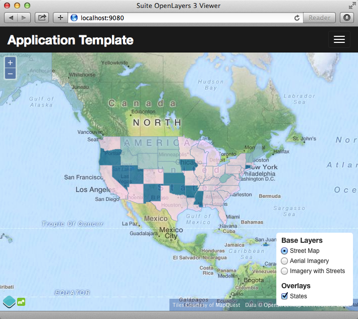
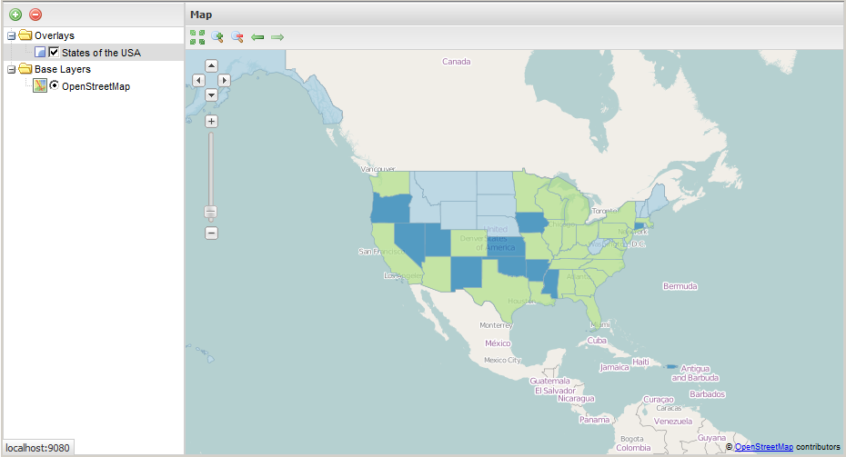
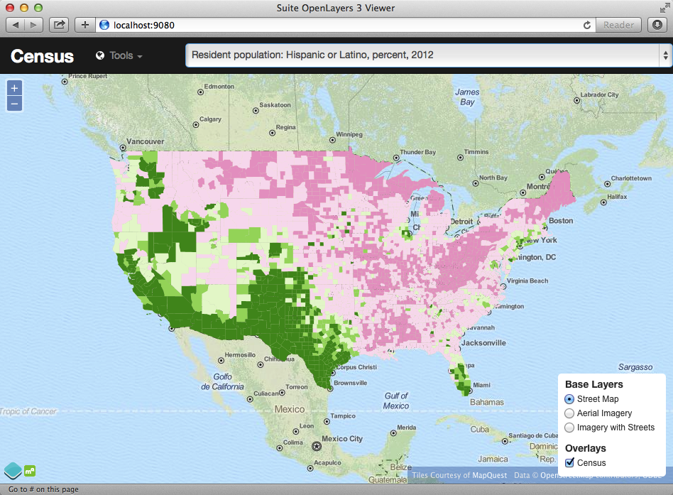
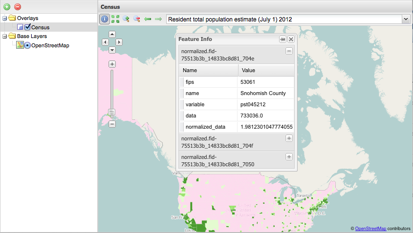

.. _app_basic:

Building the App
****************

Finding the Metadata
--------------------

The first thing we need for our app is a data file that maps the short, meaningless column names in our *census* table to human readable information. Fortunately, the `DataDict.txt`_ file we downloaded earlier has all the information we need. Here's a couple example lines::

   POP010210 Resident population (April 1 - complete count) 2010                                                      ABS    0      308745538          82   308745538  CENSUS
   AGE135212 Resident population under 5 years, percent, 2012                                                         PCT    1            6.4         0.0        13.3  CENSUS

Each line has the column name, a human readable description, and some other metadata about the column. Fortunately the information is all aligned in the text file, so the same field starts at the same text position in each line:

+------------------+----------------+--------+
| Column           | Start Position | Length |
+==================+================+========+
| Name             | 1              | 10     |
+------------------+----------------+--------+
| Description      | 11             | 105    |
+------------------+----------------+--------+
| Units            | 116            | 4      |
+------------------+----------------+--------+
| # Decimal Places | 120            | 7      |
+------------------+----------------+--------+
| Total            | 127            | 12     |
+------------------+----------------+--------+
| Min              | 139            | 12     |
+------------------+----------------+--------+
| Max              | 151            | 12     |
+------------------+----------------+--------+
| Source           | 163            | 8      |
+------------------+----------------+--------+

We're going to consume the first two columns of this information in a JavaScript web application. The text file can easily be read in and split into lines. So with start position and length of Name and Description it will be easy to extract these and to populate a topics dropdown.

Framing the Map
---------------

We already saw our map visualized in a bare `OpenLayers`_ map frame in the *Layer Preview* section of GeoServer. 

We want an application that provides a user interface component that manipulates the source WMS URL, altering the URL `viewparams <http://docs.geoserver.org/stable/en/user/data/database/sqlview.html#using-a-parametric-sql-view>`_ parameter.

We will build a map frame using the `OpenGeo Suite SDK <http://suite.opengeo.org/opengeo-docs/webapps/index.html#webapps>`_ to provide a basic application template.

.. note::

   * OSX, you may need to add ``/usr/local/opengeo/sdk/bin`` to your ``PATH`` environment variable.
   * Windows, verify that ``C:\Program Files\Boundless\OpenGeo Suite\sdk\bin`` (or wherever the sdk is installed) has been added to your ``PATH`` environment variable under Control Panel > System > Advanced > Environment Variables > System Variables. 
   * Linux, check that the ``suite-sdk`` program is on your ``PATH``

Creating the Template
---------------------
   
There are three templates that come with the Suite SDK:

* ``gxp`` a `ExtJS <http://www.sencha.com/products/extjs/>`_ and OpenLayers 2 viewing template
* ``ol3view`` a `Bootstrap <http://getbootstrap.com>`_ and OpenLayers 3 viewing template
* ``ol3edit`` a Bootstrap and OpenLayers 3 editing template

We will be creating two different flavours of the application. One with the ``gxp`` template, to make it look and feel familiar to Desktop GIS users, and one with the ``ol3view`` template to get a nice, clean and focussed web page with our census map.

The OpenLayers 3 Viewing Template
---------------------------------

We will start the first version of our application from the OpenLayers 3 viewing template:

.. code-block:: text
   :emphasize-lines: 1

   # suite-sdk create censusapp/ ol3view

   Creating application ...
   Buildfile: /usr/local/opengeo/sdk/build.xml

   checkpath:

   create:
   Created dir: /Users/pramsey/censusapp
   Copying 65 files to /Users/pramsey/censusapp
   Created application: /Users/pramsey/censusapp

   BUILD SUCCESSFUL
   Total time: 0 seconds
        
This creates a `censusapp` directory and fills it with the template contents:

.. code-block:: text
   :emphasize-lines: 2,3

   buildjs.cfg	
   index.html	
   src/app
   src/bootstrap
   src/font-awesome
   src/ol3
   src/bootbox
   src/css
   src/jquery

The files we will working with primarily are

* `index.html` which holds the document elements of the page our map will appear in, and
* `src/app/app.js` which holds the custom code for our application.

The rest of the contents of the `src` directory are support files, providing the utility libraries and styles the app template depends on.

Now that the template is created, we can test it by running the SDK in "debug" mode:

.. code-block:: text
   :emphasize-lines: 1

   # suite-sdk debug censusapp/

   Starting debug server for application (use CTRL+C to stop)
   Buildfile: /usr/local/opengeo/sdk/build.xml

   checkpath:

   debug:
   0    [main] INFO  org.eclipse.jetty.server.Server  - jetty-7.6.13.v20130916
   50   [main] INFO  org.eclipse.jetty.server.handler.ContextHandler  - started o.e.j.s.ServletContextHandler{/,null}
   52   [main] WARN  org.eclipse.jetty.server.handler.RequestLogHandler  - !RequestLog
   67   [main] INFO  org.eclipse.jetty.server.AbstractConnector  - Started SelectChannelConnector@0.0.0.0:9080
   68   [main] INFO  ringo.httpserver  - Server on http://localhost:9080 started.  

Now you can open up the template by pointing your web browser at the port where the application debug session is running:

* http://localhost:9080

The OpenLayers 2 gxp Template
-----------------------------

We will start this version of our application from the gxp template:

.. code-block:: text
   :emphasize-lines: 1

   # suite-sdk create censusgis/ gxp

   Creating application ...
   Buildfile: /usr/local/opengeo/sdk/build.xml

   checkpath:

   create:
   Created dir: /Users/ahocevar/censusgis
   Copying 65 files to /Users/ahocevar/censusgis
   Created application: /Users/ahocevar/censusgis

   BUILD SUCCESSFUL
   Total time: 0 seconds
        
This creates a `censusapp` directory and fills it with the template contents:

.. code-block:: text
   :emphasize-lines: 3,4

   buildjs.cfg	
   favicon.ico
   index.html	
   src/app
   src/ext
   src/geoext
   src/gxp
   src/openlayers
   src/ux
   theme

Because gxp template does not rely heavily on the DOM, there will be no need to modify any HTML markup. The only file we will be working with is

* `src/app/app.js` which holds the custom code for our application.

The rest of the contents of the `src` directory are support files, providing the utility libraries and styles the app template depends on. The `theme` directory contains the application css, to allow tweaking the appearance of the application.

Now that the template is created, we can test it by running the SDK in "debug" mode, just like we did with the ol3view template:

.. code-block:: text
   :emphasize-lines: 1

   # suite-sdk debug censusgis/

   Starting debug server for application (use CTRL+C to stop)
   Buildfile: /usr/local/opengeo/sdk/build.xml

   checkpath:

   debug:
   0    [main] INFO  org.eclipse.jetty.server.Server  - jetty-7.6.13.v20130916
   50   [main] INFO  org.eclipse.jetty.server.handler.ContextHandler  - started o.e.j.s.ServletContextHandler{/,null}
   52   [main] WARN  org.eclipse.jetty.server.handler.RequestLogHandler  - !RequestLog
   67   [main] INFO  org.eclipse.jetty.server.AbstractConnector  - Started SelectChannelConnector@0.0.0.0:9080
   68   [main] INFO  ringo.httpserver  - Server on http://localhost:9080 started.  

Like with the ol3view version, you can open up the template by pointing your web browser at the port where the application debug session is running:

* http://localhost:9080

Working with the Templates
--------------------------

The templates are close to what we want: they have a base map and an overlay layer. However, we want to change the overlay layer to be our special census data layer, so:

#. Get a text editor you like.
#. For OpenLayers 3, open the `censusapp/src/app/app.js` file and edit the configuration section, replacing the highlighted lines as follows:

   .. code-block:: text
      :emphasize-lines: 3,4,5,7,9,10,13

       // ========= config section ================================================
       var url = '/geoserver/ows?';
       var featurePrefix = 'opengeo';
       var featureType = 'normalized';
       var featureNS = 'http://opengeo.org';
       var srsName = 'EPSG:900913';
       var geometryName = 'geom';
       var geometryType = 'MultiPolygon';
       var fields = ['fips', 'name', 'data'];
       var layerTitle = 'Census';
       var infoFormat = 'application/vnd.ogc.gml/3.1.1'; // can also be 'text/html'
       var center = [-10764594.758211, 4523072.3184791];
       var zoom = 4;
       // =========================================================================

#. For OpenLayers 2, open the `censusgis/src/app/app.js` file and edit the map and layer configuration section, replacing the highlighted line as follows:

   .. code-block:: text
      :emphasize-lines: 4,14,15

      // map and layers
      map: {
          id: "mymap", // id needed to reference map in portalConfig above
          title: "Census",
          projection: "EPSG:900913",
          center: [-10764594.758211, 4523072.3184791],
          zoom: 3,
          layers: [{
              source: "osm",
              name: "mapnik",
              group: "background"
          }, {
              source: "local",
              name: "opengeo:normalized",
              title: "Census",
              selected: true
          }],
          items: [{
              xtype: "gx_zoomslider",
              vertical: true,
              height: 100
          }]
      }

#. Using the SDK's debug mode for each version of the app, reload http://localhost:9080 in your web browser, you should see the same templates, with the census layer in place of the states layer.

   .. image:: ./img/sdk_census_nobar.png

Now we can see our layer of interest, all that's left is to control it!

Adding to the Template
----------------------

We want to add a form element that we can use to select which database column to show on the map. For the ol3view censusapp application, we need to do two things:

* add a place in the document where the form data can live, and
* add the data from `DataDict.txt`_ to the form automatically.

The first step, creating an empty form element is easy, we will put it into the header bar, inserting the form after the unordered list used for the tools menu in `censusapp/index.html`:

.. code-block:: html
   :emphasize-lines: 2-5

      </ul>
      <form class="navbar-form navbar-right">
        

          <select id="topics" class="form-control"></select>
        

      </form>
    
<!--/.navbar-collapse -->

While you're at it, you can change the `<title>` of the page and set the value of the "navbar-brand" element to the title we want displayed, "**Census Mapper**".

For the OpenLayers 2 app, we achieve the same by creating an empty combo box and adding it to the map panel's top toolbar:

To achieve the same for the gxp censusgis application, we append some code at the bottom of the `censusgis/app/app.js` file:

.. code-block:: javascript

    // Create a dropdown
    var dropdown = new Ext.form.ComboBox({
      width: 450,
      mode: 'local',
      triggerAction: 'all',
      store: new Ext.data.ArrayStore({
        fields: ['name', 'value']
      }),
      valueField: 'value',
      displayField: 'name'
    });
    // Add the dropdown to the top toolbar of the map panel
    app.on('portalready', function() {
      app.mapPanel.getTopToolbar().addItem('->');
      app.mapPanel.getTopToolbar().addItem(dropdown);
    });

To load data from `DataDict.txt`_ into our OpenLayers 2 app, we will use some `JQuery`_ magic. As discussed earlier, the data dictionary file is column aligned, so we can get the colums we are interested in using a substring function on each line. We want to skip the first two lines, which are not data, but otherwise each line gets written into an `<option>` element in the `<select>` form control.

#. Copy the `DataDict.txt`_ file into the `censusapp` directory.
#. Add the following code at the very end of the `censusapp/src/app/app.js` file:

   .. code-block:: javascript

      // Load variables into dropdown
      $.get("../DataDict.txt", function(response) {
        // We start at line 3 to only get column names
        $(response.split('\n').splice(2)).each(function(index, line) {
          $('#topics').append($('<option>')
            .val(line.substr(0, 10).trim())
            .html(line.substr(10, 105).trim()));
       });
      });

If you reload the web browser at http://localhost:9080 when running the sdk in debug mode for the censusapp application, you should now see the dropdown bar populated with the data dictionary column names.

For the OpenLayers 2 app, instead of JQuery, we will be using ExtJS to parse and load the data from `DataDict.txt`_. When loaded, we pass it to the data store of the combo box.

#. Copy the `DataDict.txt`_ file into the `censusgis` directory.
#. Add the following code at the very end of the `censusgis/src/app/app.js` file:

   .. code-block:: javascript

    // Populate the dropdown with values from DataDict.txt
    Ext.Ajax.request({
      url: '../DataDict.txt',
      success: function(response) {
        var lines = response.responseText.split('\n').splice(2);
        var data = [];
        Ext.each(lines, function(line) {
          data.push([
            line.substr(10, 105).trim(),
            line.substr(0, 10).trim()
          ]);
        });
        dropdown.getStore().loadData(data);
        dropdown.setValue(data[0][0]);
      }
    });

Finally, in order to affect the map, we need to tie actions on the dropdown bar to the configuration of our WMS tile layer in the map. The SQL view layer we are using in GeoServer responds to the `column` variable in the view parameters, so new selections in the form should alter that aspect of the WMS parameters.

For the ol3view template, add the following to the very end of the `censusapp/src/app/app.js` file:

.. code-block:: javascript

   // Add behaviour to dropdown
   $('#topics').change(function() {
     wmsSource.updateParams({
       'viewparams': 'column:' + $('#topics>option:selected').val()
     });
   });

For the gxp template, add the following to the very end of the `censusgis/src/app/app.js` file:

.. code-block:: javascript

    // Handle dropdown selection changes
    dropdown.on({
      select: function(combo) {
        app.mapPanel.map.getLayersByName('Census')[0].mergeNewParams({
          viewparams: 'column:' + combo.getValue()
        });
      }
    });

Voila! We now have a live census mapping application, where changes in the form change the configuration of the map layer. Try out different variables and zoom around. When you click on the map, the template's built-in query functionality should show you the variable values and county names in a popup.

Final Tweaks
------------

As you can see in the image above, the layer switcher of the ol3view template overlaps the map attribution. We can easily change that by modifying the `<style>` section in `censusapp/index.html` to have a larger offset from the bottom:

.. code-block:: css
   :emphasize-lines: 3

      .layers-control {
        position: fixed;
        bottom: 35px;
        top: auto;
      }

In the gxp template version of the application, there is no info popup on map clicks. We can easily add this by extending the app initialization code:

.. code-block:: text
   :emphasize-lines: 1,30-32

     * @require plugins/WMSGetFeatureInfo.js
     */

    var app = new gxp.Viewer({
        portalConfig: {
            layout: "border",
            region: "center",
        
            // by configuring items here, we don't need to configure portalItems
            // and save a wrapping container
            items: [{
                id: "centerpanel",
                xtype: "panel",
                layout: "fit",
                region: "center",
                border: false,
                items: ["mymap"]
            }, {
                id: "westpanel",
                xtype: "container",
                layout: "fit",
                region: "west",
                width: 200
            }],
            bbar: {id: "mybbar"}
        },
    
        // configuration of all tool plugins for this application
        tools: [{
            ptype: "gxp_wmsgetfeatureinfo",
            format:"grid"
        }, {
            ptype: "gxp_layertree",

After reloading the application at http://localhost:9080, the top toolbar of the map will have an additional (i) button. When activated, clicking on the map will bring up the info popup for the clicked location.

.. _DataDict.txt: _static/data/DataDict.txt
.. _OpenLayers: http://openlayers.org
.. _JQuery: http://jquery.org
