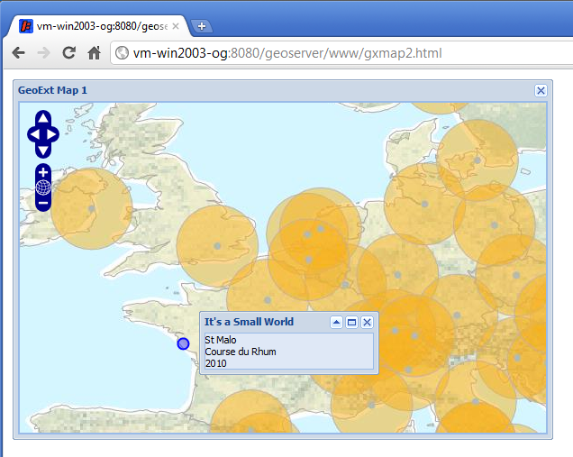

.. _apps.gx.advancedmap:

Creating popups with feature info
=================================

For our final exercise, we will create a GeoExt map application with:

* A raster basemap and a vector overlay, and
* Pop-ups that display when we click the vector features.

The pop-ups will contain information about those features, directly from their attributes in the underlying GeoServer feature-store.

Example
-------

#. First open the previous example, :file:`gxmap1.html` and save it as a new file, called :file:`gxmap2.html`. Open this new file for editing in a text editor.

#. Add a new WFS layer definition just below our existing WMS layer:

   .. code-block:: javascript

      var smallworld = new OpenLayers.Layer.Vector(
         "Small World", {
         strategies: [new OpenLayers.Strategy.Fixed()],
         protocol: new OpenLayers.Protocol.WFS({
            url: "/geoserver/wfs",
            featureType: "smallworld",
      	    featureNS: "http://geoserver.org/earth"
         })
      });

   This creates a vector layer out of our Small World points, served through WFS from our local GeoServer.

#. Add this layer to your GeoExt map panel by updating the layers array in the configuration object:

   .. code-block:: javascript

      layers: [world, smallworld]

#. At the bottom of the map initialization code, but before the ``mapwin.show()`` call, create a function for a GeoExt popup:

   .. code-block:: javascript

      var popup;
      function createPopup(feature) {
         popup = new GeoExt.Popup({
            title: "It's a Small World",
            location: feature,
            width:200,
            html: feature.attributes.placename + " " + feature.attributes.comment + " " + feature.attributes.year + " ",
            maximizable: true,
            collapsible: true
         });
         popup.show();
      }

#. Below that, we add a function that creates the popup when the ``smallworld`` layer is clicked:

   .. code-block:: javascript

      smallworld.events.on({
         featureselected: function(e) {
            createPopup(e.feature);
         }
      });

#. Finally, we add the SelectFeature control to our map and activate it

   .. code-block:: javascript

      var selectCtrl = new OpenLayers.Control.SelectFeature(smallworld);

      var mapPanel;
      mapPanel = mapwin.items.get(0);
      mapPanel.map.addControl(selectCtrl);
      selectCtrl.activate();

#. Save the file, and load it in the browser: ``http://localhost:8080/geoserver/www/gxmap2.html``. Click on a feature to see the pop-up

   A GeoExt MapWindow with a vector layer plus popup

Your final code-listing will look like this:

.. code-block:: html
   :linenos:

   <html>

   <head>

   
   
   <link rel="stylesheet" type="text/css" href="http://extjs.cachefly.net/ext-3.4.0/resources/css/ext-all.css"></link>

   

   

   

   </head>

   <body><!-- Oh no you didn't !!! --></body>

   </html>