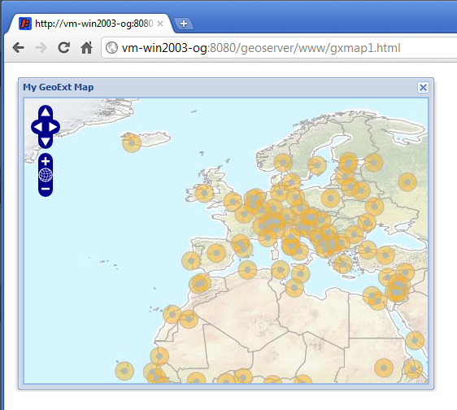

.. _apps.gx.createmap:

Creating a GeoExt Floating Map Window
=====================================

In GeoExt, we use a "web application" paradigm, as opposed to a "web page" paradigm. This means that we won't create extensive markup. The basic ingredients of our map window will be:

 * A minimal HTML document including JavaScript and CSS resources
 * JavaScript for application initialization
 * Configuration objects for the application's components

Example
-------

Let's take a look at a fully working example of a GeoExt map window.

#. Copy the code below into your text editor and save it as :file:`<user>\\.opengeo\\data_dir\\www\\gxmap1.html`.

.. code-block:: html
   :linenos:

   <html>

   <head>

   
   
   <link rel="stylesheet" type="text/css" href="http://extjs.cachefly.net/ext-3.4.0/resources/css/ext-all.css"></link>

   

   

   

   </head>

   <body><!-- Oh no you didn't !!! --></body>

   </html>

#. Open this file in your web browser: http://localhost:8080/geoserver/www/gxmap1.html

#. Drag this map window around your browser!

   *A GeoExt MapWindow*