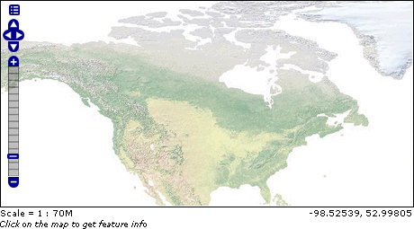
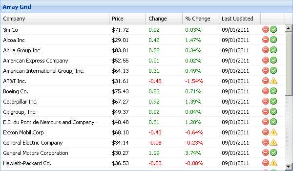
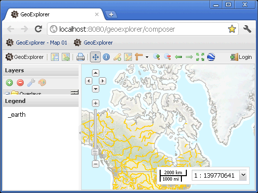

.. _apps.introduction:

Introducing OpenLayers and GeoExt
=================================

The OpenGeo Suite includes a few libraries for building custom web map applications.  This section will discuss the different projects and how they fit together.

OpenLayers
----------

`OpenLayers <http://openlayers.org>`_ is a JavaScript library for building mapping applications in a browser. Mapping applications consist of map layers (raster- or vector-based, integrated from a variety of sources), and controls for operating on those layers.

Ext JS
------

Ext JS is a JavaScript library offering a range of user interface widgets such as grids, trees, menus, and panels.

GeoExt
------

GeoExt combines the geospatial controls of OpenLayers with the user interface components of Ext JS into a framework that allows you to build rich desktop-style GIS applications for the browser.

GXP
---

GXP is a client-side only JavaScript library, built on top of OpenLayers, GeoExt, and Ext JS. The purpose of GXP is twofold:

  * Creating web mapping applications should be as simple as providing JSON configuration
  * Creating an extensible framework in which it is easy to add new layer types and new tools.

.. note:: GXP is unfortunately outside the scope of the workshop.

Previous Examples
-----------------

We've seen both OpenLayers and GeoExt applications in the preceding sections.

* The GeoServer/GeoWebCache layer preview tools are built using OpenLayers
* Our published map application (and GeoExplorer itself) use GeoExt

In our evolving diagram of the OpenGeo Suite architecture, applications built using OpenLayers and/or GeoExt sit right at the top consuming layers, with/without GeoWebCache, from our local GeoServer.

.. figure:: ../suite/img/stack_geoext.png
   :align: center

   *OpenLayers/GeoExt web-mapping applications in the OpenGeo Suite stack*