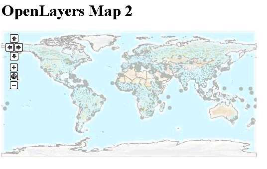
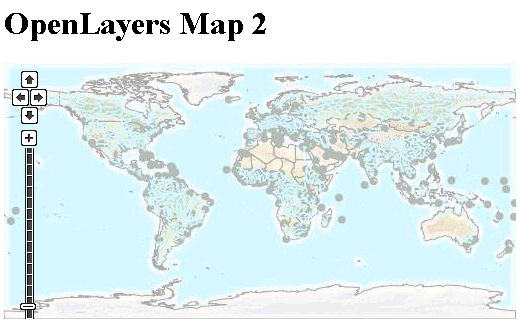
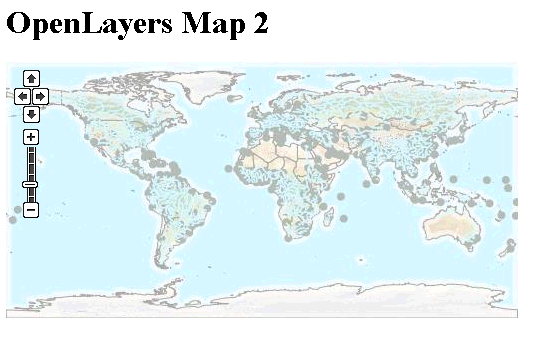

.. _ol-advancedmap:

Adding layers and controls
==========================

By default, all OpenLayers maps come with two default controls. We saw them in our previous example.

* There is a navigation (or "pan") tool in the top left corner of the screen, which allows a user to pan the map by clicking on direction buttons.

* Below this, there is a Zoom tool, which contains three buttons, one to Zoom In (the up arrow), one to Zoom Out (the down arrow), and a middle button which is a Zoom To Full Extent button (the globe icon).

In this section, we'll extend the template from our previous example with another control for zooming and panning, another layer, and a control that allows you to toggle layer visibility.

A new starter map
-----------------

Let's start with a slight variation on our template OpenLayers map.

.. code-block:: html
   :linenos:

   <html>
     <head>
       <title>OpenLayers Map 2</title>
       
       <link rel="stylesheet" href="openlayers/theme/default/style.css" type="text/css">
       
     </head>
     <body>
       <h1>OpenLayers Map 2</h1>
       

       
     </body>
   </html>

#. Using a basic text editor. Copy the text above into a new file called :file:`map2.html`, and save it as :file:`<user>\\.opengeo\\data_dir\\www\\map2.html`.

   This template is nearly identical to our previous map. This version has place holders for code we'll add to implement controls (``// MAP OPTIONS //``) and additional map layers (``// OTHER LAYERS //``).

#. Verify that the map works by navigating to: http://localhost:8080/geoserver/www/map2.html

   A basic (but soon to be extended) OpenLayers map

Adding controls
---------------

The PanZoom control is added to OpenLayers maps by default. However, when it is added explicitly you can configure an option for the zoom tool to include a slider bar with a "step" for each available zoom level. (For example, if you have 16 zoom levels, the default, your Zoom tool will have 16 possible positions for the slider.)
 
#. In your working example, add a ``mapoptions`` block with the following code:

   .. code-block:: javascript

      var mapoptions = {
         controls:[
            new OpenLayers.Control.PanZoomBar(),
            new OpenLayers.Control.Navigation()
         ]
      };
                                  
   It should be added at around line 17, replacing the placeholder ``// MAP OPTIONS //``.

#. The next thing we need to do is instruct the map constructor to use these options. Replace the line:

   .. code-block:: javascript

      var map = new OpenLayers.Map("map-id");
   
   with:

   .. code-block:: javascript

      var map = new OpenLayers.Map("map-id", mapoptions);

#. Save the file and reload in the browser.

   An extended ZoomBar

Note that the zoom bar has too many zoom levels for the size of our small map window. In this case, we could either make our map window larger, by replacing our map style with a large ``height`` value, as in:

.. code-block:: html

   

Or, we could reduce the number of zoom levels in our map, by adding the ``numZoomLevels`` property to the map options, for example:

.. code-block:: javascript

   var mapoptions = {
      numZoomLevels: 6,
      controls:[
         new OpenLayers.Control.PanZoomBar(),
         new OpenLayers.Control.Navigation()
      ]
   };

   An extended ZoomBar with fewer zoom levels
   
Bonus
-----

* Add other layers to your map. You'll need to include the following:

   * A variable to hold the layer definition (what type of layer will you add?)
  
     .. code-block:: javascript
  
        var OSM = new OpenLayers.Layer.OSM();
       
  * The layer object(s) in the list of layers added to the map:
  
    .. code-block:: javascript
    
       map.addLayers([world, OSM]);

* Add a control to toggle the visibility of your layers  
  
   .. code-block:: javascript
    
      map.addControl(new OpenLayers.Control.LayerSwitcher());
