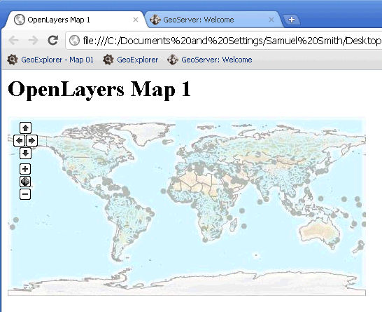

.. _apps.ol.createmap:

Creating a basic OpenLayers map
===============================

In OpenLayers, a map is a collection of data layers and various controls for dealing with user interaction.

A map is generated on a web page by four components:

#. Loading Libraries
#. Markup
#. Style Declarations
#. Map Initialization Code

Simple example
--------------

Let's create and preview a simple, fully functional example of an OpenLayers map.

In the next section will go into the details of the code.

.. code-block:: html
   :linenos:

   <html>
     <head>
       <title>OpenLayers Map 1</title>
       
       <link rel="stylesheet" href="openlayers/theme/default/style.css" type="text/css">
       
     </head>
     <body>
       <h1>OpenLayers Map 1</h1>
       

       
     </body>
   </html>

#. Using a basic text editor, copy the text above into a new file and save it as :file:`<user>\\.opengeo\\data_dir\\www\\map1.html`.

   .. note:: On Windows, we recommend using `Notepad++ <http://notepad-plus-plus.org/>`_, `Notepad2 <http://www.flos-freeware.ch/notepad2.html>`_, or `Sublime Text <http://www.sublimetext.com>`_ instead of the standard Windows Notepad.

#. Open the working map in your web browser by navigating to: ``http://localhost:8080/geoserver/www/map1.html``

   A basic OpenLayers map
