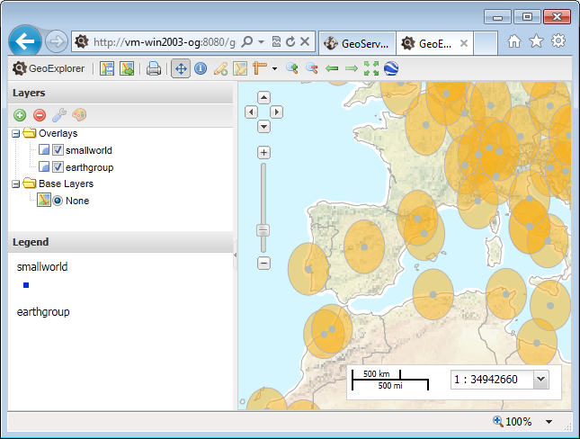

.. _geoexplorer.composing:

Composing a Map
===============

Let's start composing a custom map by adding some layers from our local GeoServer.

#. Click the :guilabel:`Add Layer` button. The :guilabel:`Available Layers` dialog opens.

   .. figure:: img/gx_addlayers.png
      
      Available Layers list

#. By default, the list of :guilabel:`Available Layers` is tuned to our local GeoServer instance. You should recognize some of the layer names from previous chapters. 

#. Make sure that :guilabel:`Local GeoServer` is selected in the data source drop-down. Select the :guilabel:`earthmap` group layer and the :guilabel:`smallworld` feature layer that we previously created in GeoServer, and :guilabel:`Add` them to the map.

   .. figure:: img/gx_ourlayers.png
      
      Available Layers list

   .. note:: Layers can be added individually by simply double-clicking a row in the list of :guilabel:`Available Layers`. Alternately, you can Shift/Control + Click to select multiple layers, and then click the :guilabel:`Add Layers` button at the bottom of the panel.
   
#. When your layers have been added, close the :guilabel:`Available Layers` dialog by clicking :guilabel:`Done`.

#. Back on your map, you can re-order your layers by selecting an item, and dragging and dropping it above or below another in the Layers Panel.  Re-order your layers, so they appear as follows:

   #. smallworld
   #. earthmap
   

   
   Our compiled map

Why do the buffers look squished?
   
Bonus
-----

The `Available Layers` window includes our Local GeoServer and a selection of popular mapping services by default. You can add other WMS or WFS services that you know about by following these steps:

#. Click :guilabel:`Add` (layer) to open the :guilabel:`Available Layers` window.

#. Click the :guilabel:`Add a New Server` button. 

   .. figure:: img/gx_addnewserver.png

      Adding an external WMS server

#. Enter a valid URL to a WMS endpoint, and click the :guilabel:`Add Server` button.

   .. note:: An example of this would be: ``http://suite.opengeo.org/geoserver/ows?service=wms&version=1.3.0&request=GetCapabilities``

#. Select your new server's name in the drop-down list to view all of the layers available from that server that can be added to your map.