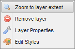

.. _geoexplorer.layers:

Layer Panel and Legend
======================

The Layer Panel lists each layer currently loaded on the map, and provides both a tool set and context menu for interacting with them.

Layer types
-----------

Layers are organized in two folders: **Overlays** and **Base Layers**.

* **Overlays** include any layer added from the local GeoServer or any other remote, WMS or WFS server
* **Base Layers** include any layer added from a known tile-map server (Google, Bing, Yahoo, MapQuest, or OpenStreetMap)  

Layer tools
-----------

The Layer Tools are located in a smaller tool-bar at the top of the Layer Panel.

.. list-table::
   :header-rows: 1

   * - Button
     - Name
     - Description
   * - .. image:: img/gx_icon_addlayer.png
     - Add Layer
     - Opens a list of available layers for you to add to your map.
   * - .. image:: img/gx_icon_remlayer.png
     - Remove Layer
     - Removes the currently selected layer from your map.
   * - .. image:: img/gx_icon_layerprops.png
     - Layer Properties
     - Opens the layer properties dialog.
   * - .. image:: img/gx_icon_editstyle.png
     - Edit Styles
     - Opens a GUI-based layer style editor. (Requires Login.)

.. note:: You might notice that the **Edit Styles** button is visible but inactive. It is one of several tools that users must log in to use. We'll review these in upcoming sections.
	     
Layer context menu
------------------

The Layer context menu opens when you right-click an item in the Layer list.

   Layer context menu

Its options mirror the Layer Tools (above) with the addition of the :command:`Zoom to layer extent` option.

As its name implies, this tool zooms the map to the spatial extent of the selected layer.

Legend
------

The map legend displays styling information for any layers in the Overlay list. Its contents are updated automatically as layers are added, removed or re-styled.

.. note:: Due to their nature as a composite of multiple layers, layer groups will not display any legend.
