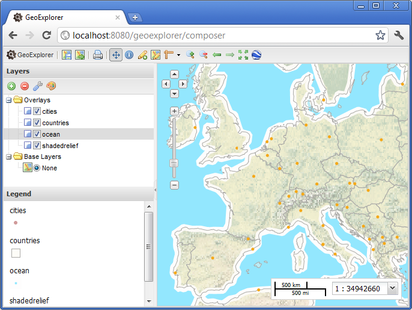

.. _geoexplorer.layout:

GeoExplorer interface
=====================

We'll now launch GeoExplorer and have a look at the user interface.

#. You can access GeoExplorer directly from this URL ``http://localhost:8080/geoexplorer``, or from the Dashboard by clicking on :guilabel:`GeoExplorer`.

   .. note:: OpenGeo Suite needs to be running in order to access GeoExplorer.
   
The interface is divided into the following sections:

#. The main **Map Panel**
#. The **Toolbar**
#. The **Layers Panel**

   
   GeoExplorer Interface

In upcoming sections, we'll review specific GeoExplorer tools.
   

   