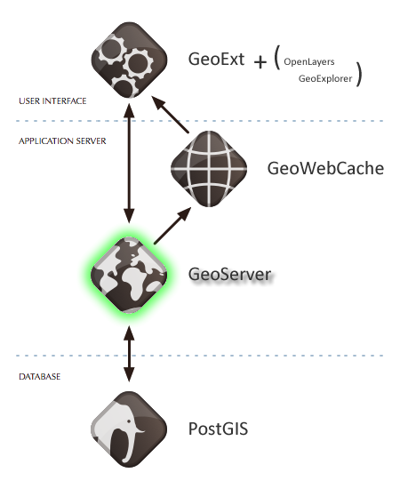

.. _geoserver.introduction:

Introducing GeoServer
=====================

GeoServer is an open source software server written in Java that allows users to share and edit geospatial data. Designed for interoperability, GeoServer publishes data from any major spatial data source using open standards.

We'll look at server/service concepts in more detail in another section.  For now, think of GeoServer as a gateway to collections of geospatial data. GeoServer abstracts this data, allowing all of it to be accessed in identical ways.

In the evolving diagram of our OpenGeo Suite architecture GeoServer sits on top of PostGIS, sharing data from the database to clients.

   GeoServer in the OpenGeo Suite stack

	