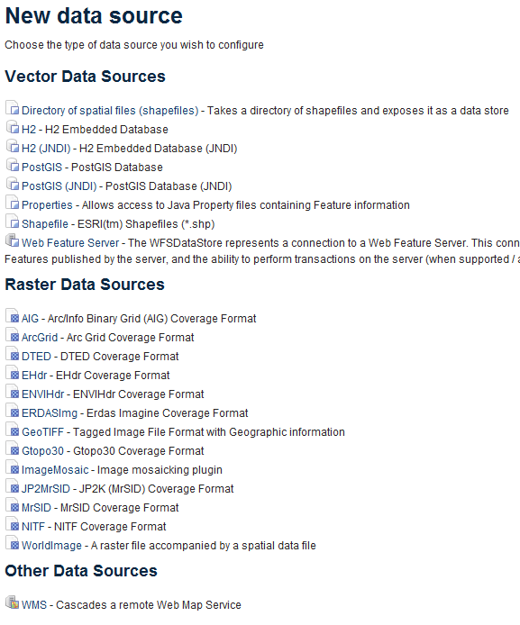

.. _geoserver.loadother:

Other supported data formats
============================

We've only touched on two of the data formats that GeoServer supports. Here's a quick look at some of the other data stores you can publish through GeoServer:

   
   *Current list of data stores supported by GeoServer*

This list is not exhaustive.  New datastore connections are developed every so often, and more are planned for the future.  All major spatial database vendors (**SQL Server 2008**, **Oracle**, **ArcSDE**, **Teradata**, etc.) are supported in GeoServer.