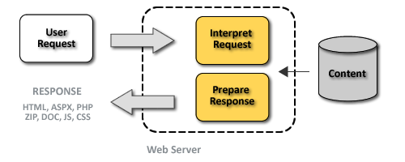
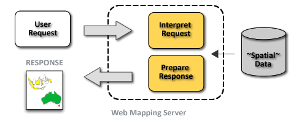

.. _geoserver.server:

Server basics
=============

In this section, we'll have a brief discussion of what a web server is and how it works.

Web Servers
-----------

A web server is a program that serves content (web pages, images, files, data, etc.) using HTTP (Hypertext Transfer Protocol). When you use your browser to connect to a website, you contact a web server. The web server takes the request, interprets it, and returns a response, which the browser renders on the screen.

   *Web server request life-cycle*

For example, when you request a web page, your request takes the form of a URL::

   http://example.com/some/path/page.html

The web server looks to its file system, and if that request points to a valid file (if :file:`page.html` exists in :file:`some/path`), the contents of that file will be returned via HTTP.  Usually these calls come from a browser, in which case the result is rendered in the browser.

It is possible to request many different kind of files through HTTP, not just HTML pages::

   http://example.com/some/path/image.jpg
   http://example.com/some/path/archive.zip
   http://example.com/some/path/data.xml

If your browser is configured to display the type of file, it will be displayed, otherwise you will usually be asked to download the file to your host system.

The most popular web servers used today are `Apache HTTP Server <http://httpd.apache.org/>`_ and `Internet Information Services (IIS) <http://www.iis.net/>`_.

Web Mapping Servers
-------------------

A web mapping server is a specialized subset of the web server model. Like a web server, requests are sent to the server, they are interpreted and responded to.
 
The key differences between a web-mapping server and a standard web-server are that:

* Responses aren't documents or files (.HTML, .ZIP, .MP3, etc.), but geographic data.
* The request is a bit more specific than ``http://server/file.extension``

Because it wouldn't be useful to simply say "Give me all the geography ever", we use specific, structured protocols to request discrete portions of geography from the web-mapping server.

Protocols that can be employed to make requests for geographic data include **Web Map Service (WMS)** and **Web Feature Service (WFS)**.

   *A typical request life-cycle*

Some popular web mapping servers:

  * `GeoServer <http://geoserver.org>`_
  * `MapServer <http://mapserver.org>`_
  * `Mapnik <http://mapnik.org>`_
  * `ArcGIS Server <http://www.esri.com/software/arcgis/arcgisserver/index.html>`_

GeoServer as Web Map Server
---------------------------

GeoServer is a specific implementation of a web mapping server, offering access to data in a known set of formats and sources (files and databases) using specific protocols.

In a way, GeoServer acts as an abstraction layer. It allows standards-based methods of accessing geospatial data regardless of the source data type.

Data Sources
~~~~~~~~~~~~

GeoServer can read from many different data sources, from files on the local disk to external databases. 

The following is a list of the most common data formats supported by GeoServer. This list is by no means exhaustive.

* Files

  * Shapefile
  * GeoTIFF
  * ArcGrid
  * JPEG2000
  * GDAL formats

* Databases

  * PostGIS
  * ArcSDE
  * Oracle Spatial
  * DB2
  * SQL Server

OGC Protocols
~~~~~~~~~~~~~

GeoServer implements standard open web protocols established by the `Open Geospatial Consortium (OGC) <http://www.opengeospatial.org/>`_), a standards organization.

GeoServer contains a high-performance certified compliant Web Map Service (WMS), and is in fact the reference implementation of the OGC Web Feature Service (WFS) and Web Coverage Service (WCS) standards. 

The next sections will provide an overview of the two protocols most commonly used by GeoServer.