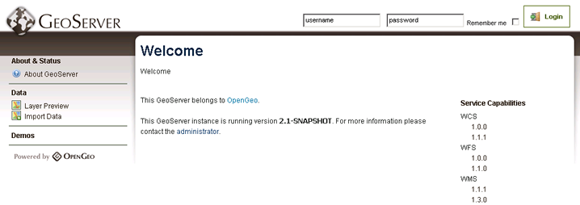

.. _geoserver.webadmin:

GeoServer Web Admin Interface
=============================

GeoServer includes a web-based administration interface through which most data/service configurations can be made. This interface lessens the need to edit configuration files by hand.

This section will give a brief overview to the web interface.

Viewing
-------

The default location of the GeoServer admin interface is `<http://localhost:8080/geoserver>`_.  The initial page is called the *Welcome* page.

   *GeoServer Welcome page*

Authentication
--------------

For security reasons, most GeoServer configuration tasks require that you log in. By default, the GeoServer administration credentials are ``admin`` and ``geoserver``, though these can be changed.

#. If you haven't already, launch the GeoServer admin interface `<http://localhost:8080/geoserver>`_.

#. Log in using the default credentials.

   .. figure:: img/login.png
      :align: center

      *Logging in with default credentials*

#. After logging in, many more options will be displayed.

   .. figure:: img/loggedin.png
      :align: center

      *GeoServer Welcome page with administrative options*

Navigation
----------

The links in the left-hand column load management pages for specific features of GeoServer, such as:

* Status
* Data
* Services
* Security

Links in the right-hand column of the main page lead to the capabilities documents for each service (WFS, WMS, WCS).  

In this workshop, we will primarily be using the links in the :guilabel:`Data` section on the left (:guilabel:`Workspaces`, :guilabel:`Stores`, :guilabel:`Layers`, etc.), so it is a good idea to familiarize yourself with their location.

Layer Preview
-------------

You can use the :guilabel:`Layer Preview` link to easily view layers currently being served by GeoServer. The Layer Preview page includes quick links for viewing layers using OpenLayers, and other services.

#. Click on the :guilabel:`Layer Preview` link, located on the left side under :guilabel:`Data`.

   .. figure:: img/layerpreviewlink.png
      :align: center

      *Navigating to the Layer Preview page*

#. Preview a few layers by clicking on the :guilabel:`OpenLayers` link next to each layer.

   .. figure:: img/layerpreviewpage.png
      :align: center

      *The Layer Preview page*

   .. figure:: img/usastates.png
      :align: center

      *Viewing the usa:states layer*

.. note:: Take a look at the contents of the URL in the browser address bar when viewing an OpenLayers map. It is similar in construction to the sample WMS requests made in the :ref:`geoserver.wms` section. The primary difference is the use of ``format=application/openlayers`` as the output format.

Bonus
~~~~~

Spend some time exploring this interface and its features by clicking through the links on the left. The :guilabel:`Demos` link in particular contains some helpful utilities for testing and learning about the inner-workings of GeoServer functionality.