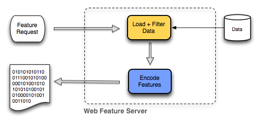

.. _geoserver.wfs:

Web Feature Service (WFS)
=========================

A web mapping server can also return the actual geographic data that comprise the map images. This allows users to create their own maps and applications from the data, to convert data between certain formats, and be able to do raw geographic manipulations of served data. The protocol used to return geographic feature data is called **Web Feature Service (WFS)**.

   *A diagram showing how a WFS turns a request into a response*

Sample WFS request
------------------

The following is a sample WFS request, rendered as a HTTP GET request (with line breaks added for clarity) to a hosted GeoServer instance::

   http://suite.opengeo.org/geoserver/wfs?
      SERVICE=wfs&
      VERSION=1.1.0&
      REQUEST=GetFeature&
      TYPENAME=usa:states&
      FEATUREID=states.39

While the details of the WFS protocol are beyond the scope of this course, a quick scan of this request shows that the following information is being requested:

   * Server details (WFS 1.1.0 request)
   * Request type (GetFeature)
   * Layer name (usa:states)
   * Feature ID (states.39)

This particular request polls the WFS for a single feature in a specific layer.

.. note:: A feature is a single unit of geographic data, such as a polygon or point. The above feature requested is the multipolygon for the state of New York.

Paste the request into a browser to see the result. The response contains the coordinates for each vertex in the feature in question, along with the attributes associated with this feature.  Scroll down to the bottom to see the feature attributes.

.. figure:: img/wfs-response.png
   :align: center

   *XML generated by a WFS request*

While XML is difficult for us to read, it is easy for computers to parse, which makes WFS responses ideal for use in software. GeoServer offers other output formats as well, such as JSON, CSV, and zipped shapefile.

Other WFS requests
------------------

A WFS request can ask for more than just feature data. An example of another request is to request information about the WFS server. The request is called **GetCapabilities**, and the response is known as the **capabilities document**. The capabilities document is an XML response that details the supported data layers, projections, bounding boxes, and functions available on the server.

The following is a sample WFS GetCapabilities request::

   http://suite.opengeo.org/geoserver/wfs?
      SERVICE=WFS&
      VERSION=1.1.0&
      REQUEST=GetCapabilities

You can paste this request into a browser to see the result.

More Information
----------------

Please see the OGC site on the Web Feature Service protocol at `<http://www.opengeospatial.org/standards/wfs>`_.