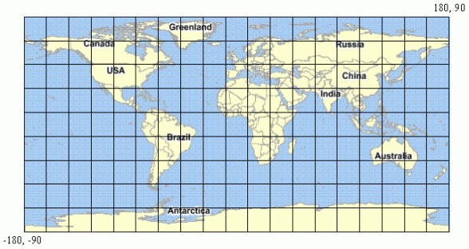
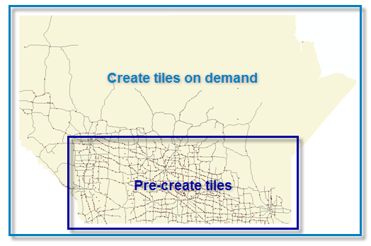

.. _geowebcache.basics:

Caching concepts
================

In this section we'll review three concepts that are crucial to understanding map caching in general:

* **Tile proxying** - How GeoWebCache integrates with GeoServer's WMS rendering process.
* **Tile generation** - How GeoWebCache saves pre-rendered map images. 
* **Tiling strategies** - How you can configure the areas are that are cached and when to do so.

Tile proxying
-------------

GeoWebCache acts like a proxy between clients and one (or more) WMS servers. It sits between the client requesting the image and the server creating the image. When the client (e.g. an OpenLayers map) makes a request, GeoWebCache first checks to see whether it already has the corresponding image. If GeoWebCache has the image in its cache, it sends it to the client immediately, without communicating with the upstream WMS. Otherwise, the request is forwarded to the appropriate WMS server for generating. When the WMS response comes back, GeoWebCache saves a copy (caches) and sends it on to the client. 

.. figure:: img/cache_workflow.png
    
   Workflow of GeoWebCache

Simply delivering a cached image is much faster than:

* Polling the data
* Interpreting styling instructions
* Drawing the image

And then delivering the image.

Not only is this faster, it requires fewer resources on the WMS server. Under specific situations, one could disconnect the WMS entirely!

Tile generation 
---------------

Map tiling describes the way images are pre-rendered and saved in the tile cache.

Maps are cached as small rectangular image tiles, which combine to form larger maps.

    
   Tiling in a Longitude/Latitude coordinate system

Map tiles are not just cached at a single resolution. They're cached at more than one scale so that users can zoom in and out of tile levels without resampling.
   
.. figure:: img/training-tiling.png

   Tiles and zoom levels
    
.. note:: The cache is stored in your server cache, which is this case is inside the GeoServer data directory in a directory named ``gwc``.

Tiling strategies
-----------------

A tiling strategy controls when your tiles are created and for what areas (geographic extents) they are created. Tile sets can be created **proactively** (by "seeding"), or **on-demand**

Seeding
~~~~~~~

Seeding creates tiles prior to requests from clients, so that they will already be available when the first users start navigating the map. Because the images exist on the server, there is never any wait time for the tile to be rendered, and is sent immediately to the client.

While seeding is very responsive to the end-user, there are some disadvantages to the administrator:

* Planning the tile strategy takes time
* Creating the tiles takes computing power
* Storing the tiles takes disk space

On-Demand caching 
~~~~~~~~~~~~~~~~~

If planning, seeding, and storing cached tiles proactively isn't desired, GeoWebCache can create map cache tiles "on-demand". In this case, the first user/client to navigate to an uncached area will wait while the corresponding tiles are drawn by the server, and then delivered to the browser. Once rendered, the tiles are added to the service's cache folder and remain on the server until updated or deleted by the server administrator. Subsequent visitors to that same area will not have to wait for the tiles to be rendered, because they'll already exist.

The main advantage to on-demand caching is that it requires no preprocessing, and because only the data requested will be cached it can potentially save disk space. The disadvantage of on-demand caching is that because viewing will be slower and then intermittently accelerated it can effect the quality of the user experience.

Which one do I choose?
~~~~~~~~~~~~~~~~~~~~~~

Usually, the answer is "both." A combination of both strategies is not uncommon:

* Certain areas / zoom levels will be seeded (such as heavily requested areas or low zoom levels)
* Others will be rendered on-demand (such as rarely requested areas, or high zoom levels)

Some will pre-cache tiles for heavily visited areas of their map, and create tiles on-demand for rarely visited areas.

   A viable tiling strategy

Disk space
----------

Every zoom level generally adds ``4^[zoom level]`` additional tiles. So the first zoom level will be one tile, the second will add four, the third will add 16, the fourth will add 64, etc. If you assume that a map has 12 zoom levels, that's over 22,000,000 tiles!  If you assume that an average tile is 20kB in size, that is over 420GB!  Adding in another zoom level adds more than a terabyte! It is easy to see why a disk space strategy is needed.

Bonus
~~~~~

* What happens if the data contributing to a pre-rendred tile changes? How can we get around this?
