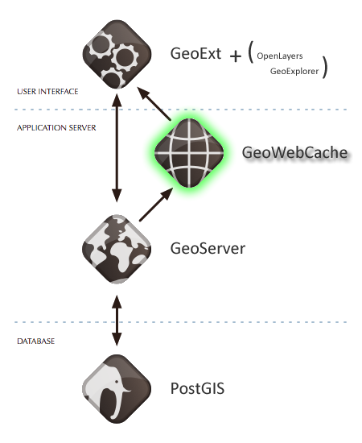

.. _geowebcache:

Part 5: GeoWebCache
===================

GeoWebCache is a tool that boosts the performance of a WMS by pre-drawing and saving map images for faster responses to client requests. 

In our evolving diagram of OpenGeo Suite architecture, GeoWebCache sits atop GeoServer's map services brokering map tiles to web-mapping applications in the client tier.

   GeoWebCache in OpenGeo Suite stack

.. todo:: Update figure.

GeoWebCache can operate in one of two ways: as a separate "map proxy" to GeoServer and other map servers, and directly integrated with GeoServer.

.. toctree::
   :maxdepth: 2

   basics
   seeding
   publishing
