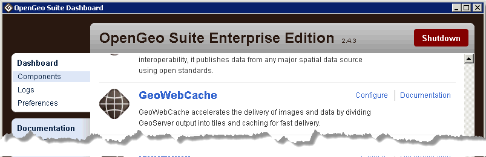

.. _geowebcache.seeding:

Seeding
=======

There are two steps in proactively seeding a tile cache:

#. Configuring the cache properties
#. Creating the tiles   

Let's set the cache properties of our tiling schema for our ``earth`` base map. 

#. To start, open GeoWebCache from the Dashboard:

    
   Linking to GeoWebCache from the Dashboard
       
#. The interface of GeoWebCache lists all configured GeoServer feature types currently being served by GeoServer. You'll see our ``earth`` layers along with others that ship by default.  

   .. figure:: img/gwc_screen_welcome.png

#. Locate our ``earthmap`` group layer in the list and click the :guilabel:`OpenLayers [png]` preview

   .. figure:: img/gwc_screen_cachedemo.png
    
   OpenLayers preview of the cache in EPSG:4326 with PNG image format

#. Go back to the GeoWebCache main page and locate our ``earthmap`` layer group.  Click :guilabel:`Seed this layer`.

   .. figure:: img/gwc-screen_seedprops.png
    
#. On the next page, we can set our tiling strategy, including the scale levels, tile boundaries, and image format for our ``earthmap`` cache.  Make your values look like these:

   * **Number of threads**: This should not be set any higher than the number of cores on your GeoServer machine, so that you don't bog down the server with too much load. If you're working locally, leave the number of threads at :guilabel:`1`.

   * **Type of operation**: Set this to :guilabel:`Reseed`.

      .. note::

         * *Reseed* generates all the tiles.
         * *Seed* fills in the gaps where tiles don't already exist.
         * *Truncate* empties the cache.
    
   * **SRS**: You need to choose the SRS into which to render your tiles. :guilabel:`EPSG:4326` will do. 

   * **Format**: This setting determines what output image format the map service will use when it creates the tiles. This determines:
   
       * The size on disk of the tiles
       * The image quality, and 
       * The ability to make the tile background transparent.
      
     This can be left as :guilabel:`image/png`.

   * **Zoom start**: The top zoom level, generally seeding everything from the highest zoom level down is a good idea. Leave this at :guilabel:`00`.

   * **Zoom stop**: The lowest zoom level. The further down you go, the longer the process takes. Leave this at :guilabel:`8`.
 
   * **Bounding box**: As noted previously, you can choose to only pre-create only a a portion of your total area. We will seed the entire area, so leave these fields blank.

   Your final properties should look like:

   * **Number of threads**: ``1``
   * **Type of operation**: ``Reseed``
   * **Grid Set**: ``EPSG:4326``
   * **Format**: ``png``
   * **Zoom Start**: ``0``
   * **Zoom Stop**: ``8``
   * **Bounding Box**: ``[empty]``

#. The :guilabel:`Submit` button kicks off the seeding process. Your computer will grind away for a while as the tiles are generated and placed in the cache directory.

   .. figure:: img/gwc_screen_seedstatus.png
    
#. Click :guilabel:`Refresh List` to see the count down for estimated time remaining. When the layer is fully cached, you will be redirected to the properties page.  

We've successfully seeded our first map!

Further details for how to configure your own tiling schema, including custom projections, can be found in the `GeoWebCache documentation <http://geowebcache.org/docs/current/configuration/index.html>`_.

Bonus / Discussion
~~~~~~~~~~~~~~~~~~

* Have a look in the cache folder ``<user>\.opengeo\data_dir\gwc`` at the directory structure / file names of the cached images.