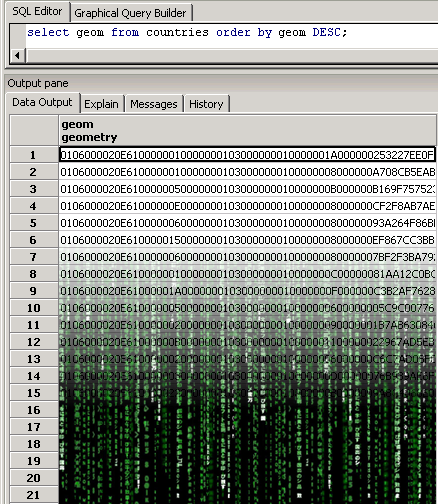
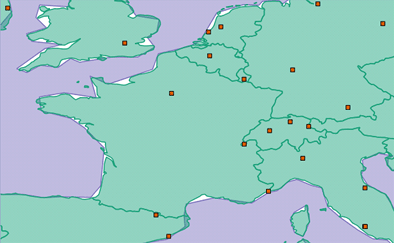

.. _postgis.dataload:

Loading data into PostGIS
=========================

This section focuses on the basic task of loading shapefiles into our database using the graphical PostGIS shapefile loading tool, **pgShapeloader**.  PostGIS is supported by a wide variety of libraries and applications, and provides many other options for loading data in a variety of formats.

#. First, return to the :ref:`suite.dashboard`, and click on the :guilabel:`Import Shapefiles` link in the PostGIS section. The pgShapeLoader application will launch.

   .. note:: The PostGIS Shapefile (and DBF) loader can also be launched from within pgAdmin. From the :guilabel:`Plugins` menu, select :guilabel:`PostGIS Shapefile and DBF Loader`.

#. Next, open the *Shape File* browser and navigate to the :file:`data` directory in the workshop package. Select the :file:`cities.shp` file. 

#. Fill in the details for the :guilabel:`PostGIS Connection` section.

   .. list-table::
      :header-rows: 1

      * - Option
        - Value
      * - **Username**
        - ``postgres``
      * - **Password**
        - ``postgres``
      * - **Server Host**
        - ``localhost`` ``54321``
      * - **Database**
        - ``SuiteWorkshop``

#. When finished, click on the :guilabel:`Test Connection...` button to verify that the settings are correct.

   .. warning:: Setting the port number to **54321** is very important! The OpenGeo PostGIS runs on port 54321, not the default PostgreSQL port of 5432.  If you encounter errors, verify this setting first.

#. Next, fill in the details for the :guilabel:`Configuration` section.

   .. list-table::
      :header-rows: 1

      * - Option
        - Value
      * - **Destination Schema**
        - ``public``
      * - **SRID**
        - ``4326``
      * - **Destination Table**
        - ``cities``
      * - **Geometry Column**
        - ``the_geom``

#. Click the :guilabel:`Options` button and select :guilabel:`Load data using COPY rather than INSERT`. This will make the data load process a slightly faster.

   .. figure:: img/pgshapeloader_options.png
      :align: center

      *pgShapeloader options*

#. Finally, click the :guilabel:`Import` button to launch the import process.

   .. figure:: img/pgshapeloader_main.png
      :align: center

      *Loading a shapefile into PostGIS*

#. Repeat the import process for the 2 remaining shapefiles in the workshop data directory.

     * ``countries.shp``
     * ``ocean.shp``

   Except for the input file and output table name (which is automatically updated), all the other fields in pgShapeLoader should remain the same.

#. When all of the files are loaded, go back to pgAdmin and click the :guilabel:`Refresh` button to update the tree view. You should see your three new tables show up in the :guilabel:`Tables` section of the tree.

   .. figure:: img/pgadmin_refreshed.png
      :align: center

      *pgAdmin view with newly-loaded tables*

Bonus: Visualizing PostGIS data
-------------------------------

Geometries in PostGIS look a little something like this ...

   *Geometries in PostGIS a.k.a. "The Red Pill"*

.. code-block:: sql

   SELECT the_geom FROM countries ORDER BY the_geom DESC;

This binary code isn't readable by humans!  So we need help in order to allow us to visualize our PostGIS data.  Unfortunately, there is no utility inside PostGIS or pgAdmin themselves to display data.  Fortunately, though, there are many other applications that can connect to a PostGIS database, and display and edit data in a more appealing manner.

Installing a fresh GIS client on your workstations is a bit beyond the scope of this workshop, but if you do have something handy you can load this data. 

   
   *Vive la France!*

Some viewers of PostGIS data:

* uDig
* QGIS
* GeoServer + OpenLayers

If you have a client capable of connecting to PostGIS, go ahead and give it a quick try. Recall the connection parameters from earlier:

   .. list-table::

      * - **Username**
        - ``postgres``
      * - **Password**
        - ``postgres``
      * - **Server Host**
        - ``localhost`` ``54321``
      * - **Database**
        - ``SuiteWorkshop``

.. note:: Desktop GIS tools we recommend are `uDig <udig.org>`_ and `Quantum GIS <qgis.org>`_.  Both of these are available for free download.