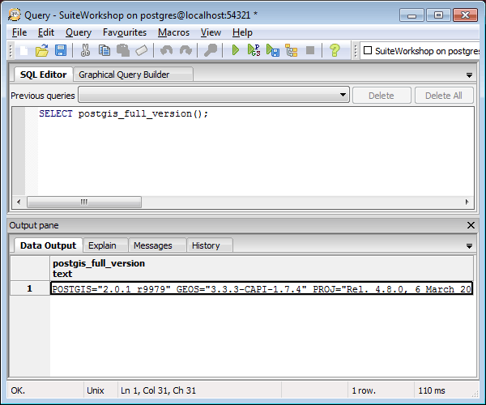
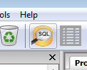
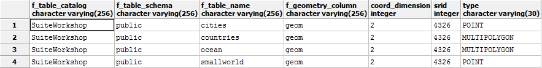
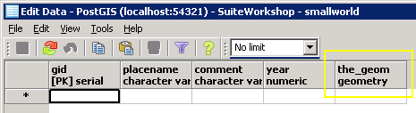
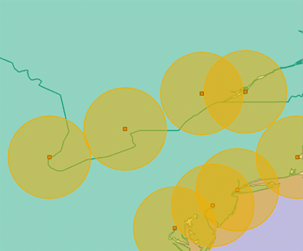

.. _postgis.functions:

Spatial functions and queries
=============================

.. todo:: Most figures should be updated.

PostGIS adds several hundred geometry-specific functions to PostgreSQL. Discussing all of them is far beyond the scope of this workshop! However, in this section, we'll work through a short example to introduce function syntax, and add another table to our ``SuiteWorkshop`` database.

Accessing spatial functions
---------------------------

Accessing spatial functions in PostGIS is no different than accessing other string, number, or date functions in an ordinary database. 

Functions are expressed in Structured Query Language (SQL) statements. For example:

.. code-block:: sql
   
   SELECT postgis_full_version();

   Running a SQL command in pgAdmin

Creating a spatially-enabled table
----------------------------------

This short example will show how to spatially enable a newly-created table in our PostGIS database using the :command:`AddGeometryColumn` function.

#. If it isn't already, open up your pgAdmin SQL Query Tool. (:menuselection:`Tools --> Query Tool`)

   Loading the SQL Query tool

#. Open the file :file:`<workshop>\\sql\\smallworld_create.sql`, or copy and paste the following block into the SQL Editor.

   .. note:: Make sure to delete any text already in the SQL Editor, if any.

   .. code-block:: sql

      CREATE TABLE "smallworld" (
        gid serial PRIMARY KEY, 
        "placename" varchar(50), 
        "comment" varchar(255), 
        "year" numeric,
        "geom" geometry(Point,4326)
        );
      
            
#. Click the :guilabel:`Play` button to execute the commands.

The first line in the code-block :command:`CREATE TABLE ...`, created a table with the specified columns and keys. This is stock SQL with no spatial component until the end: the last line defines a ``geom`` column for a ``Point`` geometry with SRID of ``4326``.

If we have a look at the entries in the ``geometry_columns`` view, we can see the row for the spatially enabled ``smallworld`` table.

   The geometry_columns view with an entry for the smallworld table

Furthermore if we have another look at our ``smallworld`` table, we can see the newly created geometry column ``geom``, and in the table properties the constraints.

   It's a spatially-enabled small world after all
   
Finally, let's add some features to the ``smallworld`` table.

#. From within the SQL Query Tool window, open the file :file:`<workshop>\\sql\\smallworld_insert.sql`, or copy and paste the following block into the SQL Query Editor.

   .. code-block:: sql

      INSERT INTO smallworld (
        geom, 
        placename, 
        comment, 
        year)
      VALUES (
        ST_GeomFromText('POINT(-147.68920897258 64.8302537436281)', 4326),
        'Fairbanks', 
        'Into the Wild ...', 
        1992);

      INSERT INTO smallworld (
        geom, 
        placename, 
        comment, 
        year)
      VALUES (
        ST_GeomFromText('POINT(174.807586609872 -41.2530324129332)', 4326),
        'Wellington', 
        'Discovery', 
        2011);

      INSERT INTO smallworld (
        geom, 
        placename, 
        comment, 
        year)
      VALUES (
        ST_GeomFromText('POINT(-104.856605515189 39.6411238434471)',4326), 
        'Denver', 
        'Colorado', 
        2211);

#. Click the :guilabel:`Play` button to execute the commands.

#. Have a look at the newly created ``smallworld`` table back in pgAdmin. Right-click on :guilabel:`Tables` and go to :guilabel:`Refresh`, then right-click on the ``smallworld`` table, then go to :guilabel:`View Data`, then :guilabel:`View All Rows`.

   .. figure:: img/pg_smallworld_newdata.png

      Data table

Function examples
-----------------

Now let's take a look at some of the different kinds of spatial functions available to PostGIS. 

Conversion functions
~~~~~~~~~~~~~~~~~~~~

Conversion functions allow data to be converted between geometries and external data formats.

The following example uses the ``ST_AsText`` function to demystify the binary geometry representations.

#. Select raw binary geometry from your smallworld table:

   .. code-block:: sql
   
      SELECT geom FROM smallworld;
      
   ::
   
      0101000020E6100000E8AAF9FF0D7662C0EA1099E022355040
      0101000020E6100000CFC2DFBFD7D965402330B95D63A044C0
      0101000020E6100000D753F09FD2365AC043259A5810D24340

#. Use the function ``ST_AsText()`` to make the geometry a bit more approachable:

   .. code-block:: sql
   
      SELECT ST_AsText(geom) from smallworld;
      
   ::
   
      POINT(-147.68920897258 64.8302537436281)
      POINT(174.807586609872 -41.2530324129332)
      POINT(-104.856605515189 39.6411238434471)
      
Better, right?
   
Converting geometries to/from other formats, is what allows PostGIS to share data with a growing number of client applications.

Retrieval functions
~~~~~~~~~~~~~~~~~~~

Retrieval functions expose properties or measures from a geometry.

#. Let's use the function ``ST_Perimeter`` to determine the outer length of some features in our *countries* table:

   .. code-block:: sql
   
      SELECT Name, ST_Perimeter(geom) FROM countries LIMIT 5;
      
   ::
   
      "Aruba" ; 0.534111478028311
      "Afghanistan" ; 48.4555439234347
      "Angola" ; 56.3041942788958
      "Anguilla" ; 0.436150640401324
      "Albania" ; 8.70897648956512

More on what those numbers mean in a bit.

Comparison functions
~~~~~~~~~~~~~~~~~~~~

Comparison functions evaluate spatial relationships between two geometries. 

#. This example uses the :command:`ST_Distance` to figure out how far Denver, CO is away from the OpenGeo office (in New York).

   .. code-block:: sql
   
      SELECT ST_Distance(
         ST_GeomFromText('POINT(-104.8566 39.6411)'), -- Denver
         ST_GeomFromText('POINT(-73.9991 40.7217)') -- New York
      ); 
      
   ::
   
      30.8764149896001

We're about ~31 away from New York. 31 what?  Stay tuned.

Generation functions
~~~~~~~~~~~~~~~~~~~~

Generation functions create new geometries from others. 

We'll use the :command:`ST_Buffer` function to create a buffer zone around the cities in the ``cities`` layer. We'll call this layer ``citybuffers``.

#. To create the buffer zone, we first create a table to hold our geometries:

   .. code-block:: sql

      CREATE TABLE citybuffers (
        id serial primary key,
        geom geometry(Polygon,4326)
      );
    
#. Next, insert into our :command:`buffer` table new geometries generated from the :command:`ST_Buffer` function.
    
   .. code-block:: sql

      INSERT INTO citybuffers (geom)
      SELECT ST_Buffer(geom,2) FROM cities;

Buffers. It's what every spatial analyst dreams about. 

   Visualizing buffers

We buffered with a value of 2, but 2 what?

Bonus
~~~~~

* What are the units we're dealing with and why are they problematic. Why are we using them?
* Try this ...

  .. code-block:: sql

    SELECT ST_Distance(
       ST_GeographyFromText('POINT(-104.8566 39.6411)'), -- Denver
       ST_GeographyFromText('POINT(-73.9991 40.7217)') -- New York
    ); 
  
  ::
   
      2617254.72493923

  What does this value mean?
