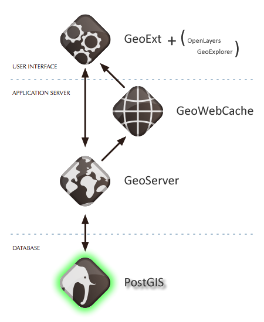

.. _postgis.introduction:

Introducing PostGIS
===================

PostGIS is a spatial database. More accurately, PostGIS is an extension that turns the `PostgreSQL <http://postgresql.org>`_ database system into a spatial database. PostGIS is very similar in functionality to spatial support in Microsoft SQL Server, Oracle Spatial, and DB2 Spatial Extender.

Providing optimized access to large amounts of spatial data, PostGIS is a fundamental component of OpenGeo Suite. To reinforce this notion, we'll put it down near the bottom of our architecture diagram, and build the rest of the stack out on top of it.

   PostGIS in OpenGeo Suite stack

.. todo:: Update figure

PostgreSQL
----------

PostgreSQL is a powerful, object-relational database management system (ORDBMS). It is released under a BSD-style license and is thus free and open source software. As with many other open source programs, PostgreSQL is not controlled by any single company, but has a global community of developers and companies to develop it.

PostgreSQL was designed from the very start with type extension in mind: the ability to add new data types, functions and access methods at runtime.  Because of this, the PostGIS extension can be developed by a separate development team, yet still integrate very tightly into the core PostgreSQL database.

Why PostgreSQL?
---------------

PostgreSQL has:

* Proven reliability and transactional integrity by default (ACID)
* Careful support for SQL standards (full SQL92)
* Pluggable type extension and function extension
* Community-oriented development model
* No limit on column sizes ("TOAST"-able tuples) to support big GIS objects
* Generic index structure (GiST) to allow R-Tree index
* Easy to add custom functions

Combined, PostgreSQL provides a very easy development path to add new spatial types. Because the development path for adding types to PostgreSQL was so straightforward, it made sense to start there.

A common question from people familiar with open source databases is, "Why wasn't PostGIS built on MySQL?". MySQL spatial objects are spread over the entire code base, as they were hacked on the string type as a special case, making it less ideal for development. Often, when administrators talk about using MySQL for spatial, they merely have database tables with x/y columns. But one gets no benefit from the spatial nature of the data, and it doesn't scale to higher dimensional geometries like lines and polygons. As such, these are not true spatial implementations.

Why not just use Shapefiles?
----------------------------

The `shapefile <http://en.wikipedia.org/wiki/Shapefile>`_ (and other file formats) have been the standard way of storing and interacting with spatial data since GIS software was first written. However, these "flat" files have the following disadvantages:

* **Files require special software to read and write.**  SQL is an abstraction for random data access and analysis. Without that abstraction, you will need to write all the access and analysis code yourself.
* **Concurrent users can cause corruption.** While it's possible to write extra code to ensure that multiple writes to the same file do not corrupt the data, by the time you have solved the problem and also solved the associated performance problem, you will have written the better part of a database system. Why not just use a standard database?
* **Complicated questions require complicated software to answer.** Complicated and interesting questions (spatial joins, aggregations, etc) that are expressible in one line of SQL in the database take hundreds of lines of specialized code to answer when programming against files. Most users of PostGIS are setting up systems where multiple applications will be expected to access the data, so having a standard SQL access method simplifies deployment and development. Some users are working with large data sets; with files, they might be segmented into multiple files, but in a database they can be stored as a single large table.

In summation, the combination of support for multiple users, complex ad hoc queries, and performance on large data sets are what sets spatial databases apart from file-based systems.
