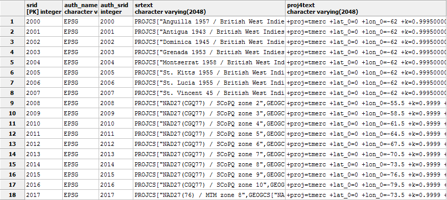
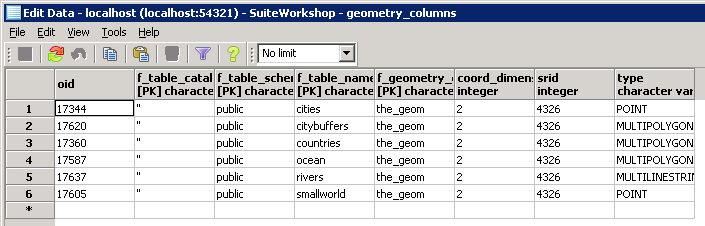

.. _postgis.metatables:

PostGIS metatables and views
============================

.. todo:: Screenshots all don't need to be fixed, but show XP chrome.

When our new PostGIS database was created via the ``template_postgis`` database, it received all all 700+ PostGIS functions, as well as one table (``spatial_ref_sys``) and two views (``geometry_columns`` and ``geography_columns``).

spatial_ref_sys
---------------

The ``spatial_ref_sys`` table defines the spatial reference systems known to the database.  They are known by an ID number, such as 4326 (for WGS 84 Lat/Lon).

   Contents of spatial_ref_sys table

geometry_columns
----------------

The ``geometry_columns`` view defines the dimension, geometry, and spatial reference system for each spatial table in the PostGIS database that contains a geometry type.

Here is an example of the ``geometry_columns`` table. (Our table is currently empty.)

   Contents of geometry_columns view

geography_columns
-----------------

The ``geography_columns`` view defines the dimension, geometry, each spatial table in the PostGIS database that contains a geography type.

Geography and Geometry are similar in that they can both represent the same type of spatial data, but differ in a few crucial ways:

The Geometry column type can hold geometric data of any type and in any (or no) projection and CRS. It is not optimized for dealing with geodetic measurements (distances on the sphere).

The Geography type, while able to handle geodetic measurements, are much more limited, in that all coordinates are assumed to be WGS84 (4326) and there are fewer compatible functions when compared to Geometry.

Bonus
-----

* Expand the ``Functions`` tree in our new database's objects, and look at the contents.
* Which of the three tenets of a spatial database was not created from the template database? Why not?
